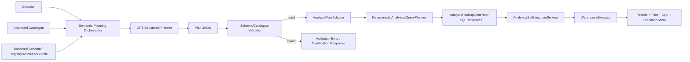

# GPT Semantic Planner — Production Architecture Review

**Status:** Architecture analysis only (no implementation)  
**Context:** Phase-1 benchmarks show GPT + approved catalogue significantly outperforms the current deterministic semantic planner on generated benchmarks, cross-dataset benchmarks, and unseen human questions.

**Constraints:**
- No alias dictionaries
- No regex intent detection
- No synonym generators
- No hardcoded mappings

**Target:** GPT becomes the semantic planner. Backend validates, generates SQL deterministically, executes, and returns results.

---

## Target Contract

**Input:** Question + Approved Catalogue + Schema

**GPT output (structured JSON):**

```json
{
  "intent": "...",
  "metric": "...",
  "dimensions": ["..."],
  "filters": [{ "column": "...", "operator": "=", "value": "..." }],
  "aggregations": "...",
  "ordering": { "column": "...", "direction": "ASC|DESC" },
  "limit": 10,
  "confidence": 0.0,
  "reasoning": "..."
}
```

**Backend responsibilities only:**
1. Validate against schema/catalogue
2. Generate SQL deterministically
3. Execute SQL
4. Return results

---

## 1. Current Architecture

Today the backend has **two semantic paths**:

### A. Rule/heuristic semantic pipeline (the one Phase-1 beat)

```mermaid
flowchart LR
Q[Question] --> S1[QuestionSemanticExtractor]
S1 --> S2[MetricResolutionEngine]
S2 --> S3[QuestionInvestigationPlanner]
S3 --> S4[UniversalAnalysisPlanner]
S4 --> S5[DeterministicAnalyticalQueryPlanner]
S5 --> S6[AnalysisPlanSqlGenerator + SQL Templates]
S6 --> E1[AnalyticalSqlExecutionService]
E1 --> E2[WarehouseExecutor BigQuery/Snowflake/JDBC]
E2 --> R[Results]
```



**Key components:**
- `QuestionSemanticExtractor` — regex patterns, dictionary matching, catalog matchers
- `MetricResolutionEngine` — schema-driven metric resolution with thresholds
- `QuestionInvestigationPlanner` — entity extraction, dimension resolution
- `UniversalAnalysisPlanner` — intent classification, `AnalysisPlan` emission
- `DeterministicAnalyticalQueryPlanner` — SQL from `AnalysisPlan`
- `AnalyticalSqlExecutionService` + `WarehouseExecutor` — execution

**Entry orchestration:** `AnalyticalQuestionResolver` chains extractor → resolution → investigation → universal planner.

### B. Direct LLM-to-SQL chat path (separate stack)


**Key components:**
- `CatalogueQueryService` — LLM generates raw SQL, then many post-hoc fixes (`injectMissingCategoryFilters`, `fixSemanticColumnMapping`, etc.)
- `GeneralDataChatService` / `ChatOrchestratorService` — analyst chat (reasoning, not structured planning)

This split causes inconsistent semantic behavior across endpoints.

### Legacy path (separate product surface)

`AnalyticsQueryController` still uses `EnglishQueryParser` → `CqlIntentBuilder` → `SqlQueryBuilder` for canonical analytics entities. Out of scope for catalogue-driven analytical queries but remains a third path.

---

## 2. Proposed Architecture

**Single semantic architecture:** GPT returns structured plan JSON; backend validates; deterministic SQL + execution.



**Design principle:** GPT chooses semantics; backend enforces contract, safety, and deterministic SQL generation.

**Proposed production packages (conceptual):**
- `catalogue.semantic.GptStructuredSemanticPlanner` — OpenAI structured output client
- `catalogue.semantic.SemanticPlanValidator` — schema/catalogue binding checks
- `catalogue.semantic.AnalysisPlanAdapter` — GPT JSON → `AnalysisPlan` (reuse Phase-1 adapter pattern)
- `catalogue.semantic.SemanticPlanningOrchestrator` — validate → SQL → execute → respond

---

## 3. Components That Can Be Deleted

After GPT planner is primary and stable, remove from the **production runtime path**:

| Component | Package / path | Reason |
|-----------|----------------|--------|
| `QuestionSemanticExtractor` | `decision.semantics` | Replaced by GPT semantic planning |
| `MetricResolutionEngine` | `decision.semantics` | Replaced by GPT + validator |
| `QuestionInvestigationPlanner` | `decision.investigation` | Replaced by GPT plan |
| `QueryEntityResolver` | `decision.semantic` | Entity resolution moves to GPT |
| `SemanticDictionary` | `decision.semantic` | No dictionary-based matching |
| `CatalogQuestionMatcher` | `decision.semantics.catalog` | No catalog phrase matching |
| `SchemaDrivenQuestionResolver` | `decision.semantics.catalog` | No schema-driven question sniffing |
| `SchemaDrivenMetricResolver` | `decision.semantics.catalog` | No heuristic metric winner |
| `RelationshipIntentDetector` | `decision.semantics` | Intent from GPT (validator enforces) |
| `AnalyticalQuestionResolver` | `decision.clarification` | Replace with thin GPT orchestrator |
| Heuristic SQL patch layer in `CatalogueQueryService` | `catalogue.query` | SQL from templates, not LLM text |

**CatalogueQueryService post-processors to retire:**
- `injectMissingCategoryFilters`
- `enforceExplicitIntentFilters`
- `fixSemanticColumnMapping`
- Date/category normalizers that repair LLM-generated SQL

**Phase-1 experiment code** (`experiment.phase1`) can be absorbed into production semantic package or deleted after migration; it is not a long-term parallel stack.

---

## 4. Components That Become Validators Only

Role changes from **decide semantics** → **enforce contract**:

| Component | New role |
|-----------|----------|
| **Plan Validator** (new) | Metric/dimension/filter column existence; type compatibility; operator validity; intent constraints |
| `UniversalAnalysisPlanner` | Optional: shrink to `AnalysisPlan` builder from validated GPT JSON only (no question sniffing) |
| `Phase1ColumnValidator` pattern | Production validator: catalogue column allow-list, filter shape |
| Confidence policy | Reject or clarify when `confidence < threshold` |
| Clarification layer | Return structured errors instead of silent fallback |

**Validator outcomes (recommended):**
- `VALID` — proceed to SQL generation
- `INVALID_SCHEMA_BINDING` — column not in catalogue/schema
- `LOW_CONFIDENCE` — GPT uncertain; ask user to clarify
- `UNSUPPORTED_INTENT` — intent not supported by SQL templates (or route to relationship template if valid)

---

## 5. Components That Remain Unchanged

Deterministic execution core stays as-is:

| Component | Role |
|-----------|------|
| `DeterministicAnalyticalQueryPlanner` | SQL generation gate from `AnalysisPlan` |
| `AnalysisPlanSqlGenerator` | Intent → SQL via templates |
| `AnalyticalSqlTemplateEngine` | Ranking, trend, contribution, comparison, distribution, relationship templates |
| `SemanticTransformationEngine` | Temporal/bucket transforms on schema-bound plans |
| `AnalyticalSqlExecutionService` | Execute with fallbacks |
| `BigQueryWarehouseExecutor` / Snowflake / JDBC | Warehouse execution |
| `ChatSqlScaleGuard` | SELECT-only, scan limits |
| `RegistryResolutionBundle`, `QuerySpec`, `AnalysisPlan` | Contracts between planner and SQL layer |
| `CatalogueApprovalService` | Approved catalogue snapshot per tenant |
| Schema discovery / approval APIs | Catalogue lifecycle unchanged |

Backend still owns **correctness, safety, and deterministic SQL**.

---

## 6. Migration Plan

### Phase 0 — Architecture boundary
- Define `SemanticPlanner.plan(question, catalogue, schema) → StructuredPlan`
- Feature flag: `semantic.planner=gpt|legacy`
- Keep legacy path for rollback

### Phase 1 — Shadow mode
- Run GPT planner in parallel with current pipeline (no user impact)
- Log side-by-side: plan JSON, validation, SQL, execution, latency, confidence
- Reuse runtime comparison harness pattern from Phase-1 experiments

### Phase 2 — Validator hardening
- Strict validator with no fallback to regex/alias/synonym layers
- Reject or clarify on invalid plans
- Wire relationship intent to existing `RelationshipSqlTemplate` (production already supports CORR)

### Phase 3 — Controlled traffic shift
- Route small % of production traffic to GPT-primary path
- Monitor: execution success, empty results, latency, cost, sample semantic review
- Rollback flag ready

### Phase 4 — GPT primary
- Default all analytical catalogue queries to GPT semantic planner
- Legacy semantic chain disabled by default
- Deprecate `CatalogueQueryService` LLM-direct-SQL path for analytical questions

### Phase 5 — Decommission legacy semantic stack
- Delete components listed in Section 3
- Single runtime path: Question → GPT plan → validate → SQL → execute

### Phase 6 — Governance
- Version prompts, JSON schema, validator rules
- Audit log per request: prompt version, plan JSON, validation decision, SQL, execution metadata
- Regression suite: Phase-1 factual bank + human question bank + tenant catalogues

---

## Benchmark Evidence (summary)

| Benchmark | Production | GPT + Catalogue | Delta |
|-----------|------------|-----------------|-------|
| 50-Q factual (Phase-1) | ~49/50 metric | ~48/50 metric | Comparable |
| 600-Q A/B (descriptions) | 577/600 exec | 589/600 exec | +12 metric, +12 exec |
| 100 human unseen questions | 55/100 exec | 89/100 exec | **+34 exec** |

Remaining GPT failures (11/100) are primarily **prompt over-rejection** of relationship/ranking phrasing and **planner-architecture gaps** (relationship intent, NPE on edge cases), not catalogue insufficiency.

---

## Bottom Line

| Layer | Owner |
|-------|-------|
| Semantic planning (intent, metric, dimension, filters) | **GPT** + approved catalogue descriptions |
| Validation | **Backend** (schema/catalogue contract) |
| SQL generation | **Backend** (deterministic templates) |
| Execution | **Backend** (warehouse connectors, guards) |

Converge to **one architecture, one contract, one runtime path**. Do not maintain parallel rule-based semantic inference alongside GPT planning.

---

## Related Code Paths (reference)

```
catalogue/decision/semantics/QuestionSemanticExtractor.java
catalogue/decision/semantics/MetricResolutionEngine.java
catalogue/decision/investigation/QuestionInvestigationPlanner.java
catalogue/decision/planning/UniversalAnalysisPlanner.java
catalogue/decision/planning/AnalysisPlanSqlGenerator.java
catalogue/decision/execution/sqltemplates/DeterministicAnalyticalQueryPlanner.java
catalogue/decision/execution/sqltemplates/AnalyticalSqlExecutionService.java
catalogue/decision/clarification/AnalyticalQuestionResolver.java
catalogue/query/CatalogueQueryService.java
experiment/phase1/  (Phase-1 GPT planner prototype)
```

## Related Artifacts

- `target/phase1-ab-benchmark.log` — 600-Q A/B benchmark
- `target/runtime-planner-comparison.log` — 100 human-question side-by-side comparison
