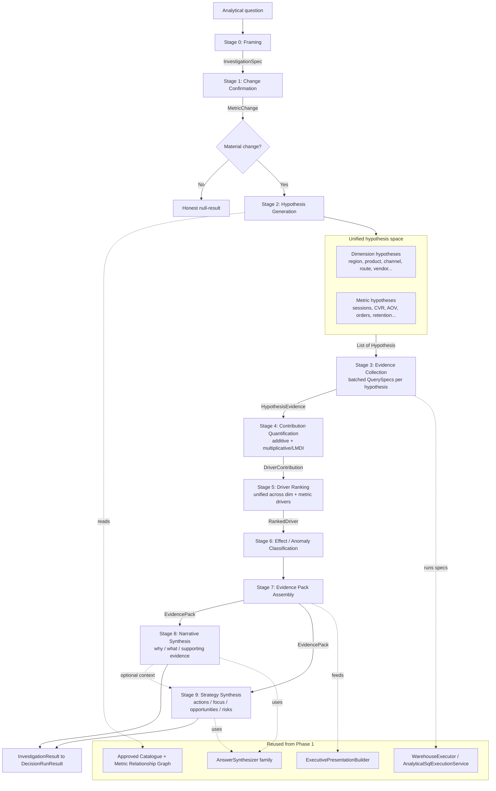

# Investigation Runtime — Phase 2 Design & Design Validation

> Status: **Design approved with revisions. NOT yet implemented.**
> Scope: framework design only. No code. No query-specific heuristics.
> This document consolidates: (1) the architecture, (2) the approved revisions
> (Hypothesis layer, Narrative/Strategy split, conceptual rename, playbooks),
> and (3) the design-validation walkthrough + smallest viable slice.

---

## Table of contents
1. Core principle
2. Conceptual model (Investigation Runtime)
3. High-level architecture
4. Runtime stages
5. The unified hypothesis abstraction (dimension + metric drivers)
6. Data structures
7. Evidence Pack contract
8. Planner responsibilities
9. Playbook model + capability matrix
10. Avoiding query-specific heuristics
11. Integration with the existing Decision Runtime
12. Design validation — 22 question walkthrough
13. Architectural gaps
14. Focused findings (Metric Relationship Graph, decomposition, LMDI, pack sufficiency)
15. Smallest viable implementation slice (V1)
16. Open decisions

---

## 1. Core principle: evidence-first, not reasoning-first

GPT never reasons from a single SQL result. The runtime *manufactures quantified evidence*
first, then GPT reasons **only** over a structured **Evidence Pack**. The runtime is
metric-agnostic and dimension-agnostic: it knows how to detect change, decompose it, and
rank drivers for *any* measure over *any* dimension or related metric. The question never
branches the code — it only parameterizes a declarative spec.

This generalizes a pattern already present in `catalogue/agent/SignalDetectionService`
(generic `METRIC_SHIFT` / `DISTRIBUTION_CHANGE` / `TIME_TREND` detection) into the Decision
Runtime contracts (`QuerySpec` / `WarehouseExecutor` / `extractCanonicalRows` / `AnswerSynthesizer`).

---

## 2. Conceptual model

The framework is the **Investigation Runtime**: a generic engine that investigates *why a
metric behaved a certain way* and *what to do about it*. "Driver Analysis" is the first
**Investigation Strategy** within it, not the whole system.

- Conceptual: Investigation Runtime → runs an *Investigation* → composed of *Investigators*
  (Dimension-driver, Metric-driver, …) → produces an Evidence Pack → Narrative → Strategy.
- Implementation: the orchestrator class may remain `DriverAnalysisRuntime` for now, but it
  implements the Investigation Runtime contract and will host multiple investigators.
  (Recommended rename to `InvestigationRuntime` when convenient.)

The decisive shift: **the goal is business-driver investigation, not dimension
decomposition.** Dimensions are one source of drivers; metric-to-metric relationships are a
first-class second source.

---

## 3. High-level architecture

Three layers:
- **Orchestration** — `DriverAnalysisRuntime` (Investigation Runtime), a sibling branch to the
  canonical path in `DecisionRuntime.execute`. Sequences stages, enforces budgets, emits a
  `DecisionRunResult`.
- **Stage layer** — each stage is independent, stateless, generic, with typed input/output.
  Stages never know which metric they analyze.
- **Capability layer (reused from Phase 1)** — warehouse execution, catalogue snapshot,
  presentation, answer synthesis. No execution-tier changes required.

---

## 4. Runtime stages

| # | Stage | Input | Output | Notes |
|---|-------|-------|--------|-------|
| 0 | Framing | question + catalogue | `InvestigationSpec` | Also resolves the Metric Relationship Graph for the target. |
| 1 | Change Confirmation | `InvestigationSpec` | `MetricChange` (+ gate) | Proves the change exists; immaterial → honest null-result. |
| 2 | Hypothesis Generation ⭐ | `MetricChange` + catalogue + relationship graph + budget | `List<Hypothesis>` | Frames candidate explanations of BOTH kinds, each with a testable evidence plan. |
| 3 | Evidence Collection | `List<Hypothesis>` | `List<HypothesisEvidence>` | Each hypothesis carries its own `QuerySpec`s; batch-executed. |
| 4 | Contribution Quantification | `HypothesisEvidence` + `MetricChange` | `List<DriverContribution>` | Additive (dimensions / additive identities) + multiplicative/LMDI (metric identities) + mix/rate (averages). |
| 5 | Driver Ranking | `DriverContribution` | `List<RankedDriver>` | One common signed contribution scale across dim + metric drivers; cumulative coverage. |
| 6 | Effect / Anomaly Classification | ranked drivers + baselines | annotated drivers | Tags: CONCENTRATED/BROAD/COMPOSITIONAL, VOLUME/RATE/MIX, IDENTITY/ASSOCIATIVE, ANOMALOUS/EXPECTED. |
| 7 | Evidence Pack Assembly | all above | `EvidencePack` | Single immutable, provenance-tagged bundle. Only artifact GPT sees. |
| 8 | Narrative Synthesis ⭐ | `EvidencePack` | `NarrativeOutput` | Explanation ONLY: why, main drivers, supporting evidence. No recommendations. |
| 9 | Strategy Synthesis ⭐ | `EvidencePack` (+ `NarrativeOutput`) | `StrategyOutput` | Action ONLY: what to do, focus, opportunities, risks. Strictly grounded in pack. |

Stages 8 and 9 are independently switchable per playbook. Stage 1 gate is the only hard stop;
other stages are fail-soft (degrade coverage/confidence rather than abort).

---

## 5. The unified hypothesis abstraction (how metric drivers stay generic)

Both driver categories collapse into one generic `Hypothesis` contract so Stages 3–7 never
branch on "dimension vs metric".

**A. Dimension hypotheses** — "the change in `target` is attributable to composition across
dimension `D`." Source: catalogue dimensions eligible for the metric (type, cardinality,
joinability). Tested by aggregating the metric by `D` across B/O windows. Quantified by
**additive decomposition** (members sum to headline delta).

**B. Metric hypotheses** — "the change in `target` is attributable to component metric `M`."
Driven by a **Metric Relationship Graph** derived from the catalogue, with two classes:

- **Identity relationships (exact):**
  - Additive identity: `Revenue = Σ segment_revenue`; `total_amount = fare + tip + airport_fee + …`.
  - Multiplicative identity: `Revenue = Sessions × CVR × AOV`; `Revenue = Orders × AOV`;
    `Churn = 1 − Retention`.
  Multiplicative changes are attributed per factor with a residual-free, order-independent
  method (LMDI) — or, in V1, a simple 2-factor interaction split.
- **Associative relationships (inexact):** correlation/elasticity between target and other
  catalogue metrics when no identity exists; tagged `ASSOCIATIVE` (correlational, lower prior
  confidence), never presented as causal.

The Metric Relationship Graph is the single source that makes metric drivers generic:
identities and component links come from **catalogue metric definitions**, not from question
text or hardcoded formulas. Datasets without metric algebra degrade gracefully to dimension +
associative hypotheses.

Stage 4 therefore has one decomposition engine with three modes (additive,
multiplicative-factor, mix/rate-for-averages), all emitting `DriverContribution` on the same
signed scale so ranking is apples-to-apples.

---

## 6. Data structures (conceptual — no code)

**InvestigationSpec**
- target metric (measure column + aggregation), time dimension + grain
- observation window (O) + baseline window (B), direction (increase/decrease/any), filters
- `investigationType` (RootCause / Growth / Churn / Strategy / ForecastExplanation)
- `investigationMode` (CHANGE | STATE)  ← added per validation (G1)
- `metricRelationshipGraphRef`
- `enabledInvestigators` (DIMENSION, METRIC_IDENTITY, METRIC_ASSOCIATIVE)
- `synthesisStages` (NARRATIVE, STRATEGY, or both)
- `budget` (max hypotheses, members/factors, queries)

**MetricRelationship / MetricRelationshipGraph**
- node: metric (column + aggregation + label)
- edge: ADDITIVE_IDENTITY | MULTIPLICATIVE_IDENTITY | ASSOCIATIVE; factor/term roles
- associative: correlation/elasticity estimate + sample window
- provenance: catalogue definition id or "statistical"

**Hypothesis** (unifies both categories)
- id, type = DIMENSION_CONTRIBUTION | METRIC_FACTOR | METRIC_ASSOCIATION
- statement (generic template), subject (dimension column OR component metric)
- evidencePlan (the `QuerySpec`(s) required), relationshipSource, priorConfidence, budgetCost

**HypothesisEvidence**
- hypothesis ref
- dimension type: per-member baseline/observation/share + **base size / denominator** (G5)
- metric-factor type: per-factor baseline/observation values
- complete row provenance (`QuerySpec.key`), never truncated

**DriverContribution**
- subject + driverCategory (DIMENSION | METRIC)
- signed absoluteContribution, contributionPct of total change
- decomposition detail (additive term / LMDI factor / mix-rate-volume)
- attributionMethod = ADDITIVE | LMDI | ASSOCIATIVE

**RankedDriver**
- contribution + rank, score, cumulativeCoveragePct
- tags: CONCENTRATED|BROAD|COMPOSITIONAL, VOLUME|RATE|MIX, IDENTITY|ASSOCIATIVE, ANOMALOUS|EXPECTED

**NarrativeOutput** — why it happened, main drivers, supporting evidence, confidence, limitations.

**StrategyOutput** — recommended actions, focus areas, opportunities, risks; each item carries
`groundedInDriverIds` (no ungrounded recommendations).

**InvestigationResult** → maps onto the existing `DecisionRunResult` (narrative → insight /
answer-synthesis; strategy → actions / strategic implications / operational risks).

---

## 7. Evidence Pack contract

Single immutable bundle consumed by BOTH synthesis stages; GPT reads nothing else.

- Investigation framing: `InvestigationSpec` echo + investigationType + investigationMode.
- Confirmed change: `MetricChange` (delta, %, significance, change-type) — for CHANGE mode.
  For STATE mode: a concentration/distribution summary instead (G1).
- Hypothesis ledger: every hypothesis tested, status (supported/refuted/inconclusive) +
  quantified result, for both categories.
- Ranked drivers (unified): dimension members and metric factors on one signed scale, with
  category + method + effect/anomaly tags, **and base sizes/denominators** (G5).
- Sub-period series where relevant (trend/consistency) (G2).
- Metric relationship provenance: identities/associations used + algebraic roles.
- Counter-evidence: drivers opposing the headline; "what did NOT move".
- Coverage & residual: % explained, unexplained residual %, residual nature.
- Statistics block + full provenance map (every number → `QuerySpec.key`).
- Confidence & limitations (identity-based high; associative explicitly correlational).
- For strategy: opportunity-surface signals derived from existing pack quantities (V2: true headroom).

---

## 8. Planner responsibilities (Framing, extends `GptSemanticPlanningOrchestrator`)

From the **catalogue only**:
1. Target metric + windows + direction → `InvestigationSpec`.
2. Investigation type + mode → selects playbook (structured field, NOT keyword-matched).
3. Metric Relationship Graph resolution for the target metric (which identities/components exist).
4. Candidate subject seeds: eligible dimensions AND candidate component metrics (Stage 2 finalizes/budgets).

The planner does NOT rank drivers, compute contributions, decide causation, or write
recommendations. It frames; the runtime quantifies; GPT narrates and strategizes over the pack.

---

## 9. Playbook model + capability matrix

A **Playbook** is declarative config selecting: enabled investigators, hypothesis sources,
decomposition modes, ranking weights, which synthesis stages run, and narrative/strategy
templates + guardrails. All capabilities are one pipeline with different config.

| Playbook | Dimension drivers | Metric drivers | Synthesis | Playbook-specific config |
|----------|-------------------|----------------|-----------|--------------------------|
| Root Cause Analysis | Yes (which segments drove decline) | Yes (e.g. decline because AOV↓ / Retention↓) | Narrative (+Strategy optional) | direction=decline; emphasize CONCENTRATED/ANOMALOUS + counter-evidence. |
| Growth Driver Analysis | Yes (which regions/products grew) | Yes (Sessions↑ / CVR↑ via factor split) | Narrative (+Strategy optional) | direction=increase; rank positive contributors; high coverage target. |
| Strategy Recommendation | Yes (where to focus) | Yes (which lever has headroom) | Narrative + Strategy | runs RCA/Growth first; Strategy maps drivers→actions grounded in driver ids. |
| Churn Analysis | Yes (by cohort/segment/plan) | Yes (`Churn=1−Retention`) | Narrative + Strategy | target = retention/cohort metric; cohort windows; optional cohort stage. |
| Forecast Explanation | Yes (segments deviating from forecast) | Yes (factor deviating, via identity) | Narrative (+Strategy optional) | adds Forecast stage; Change Confirmation = actual vs forecast. |

Generic core (Stages 1–7) is identical across all; only config and which synthesis stages run differ.

---

## 10. Avoiding query-specific heuristics

1. No keyword routing. Routing is on the structured planner output (investigationType/mode flags),
   not regex on the question.
2. Catalogue-driven, not question-driven, dimensions and metric relationships.
3. Metric-agnostic math: change detection, decomposition, ranking, classification operate on
   numbers and column roles only; no metric/dimension name ever appears in a conditional.
4. Playbooks are config, not code paths.
5. GPT bounded to two roles: framing (structured spec from catalogue) and narration/strategy over
   the pack — it cannot invent drivers, numbers, identities, or facts absent from the pack.
6. Provenance everywhere: every fact carries its originating `QuerySpec.key`.
7. Datasets lacking metric algebra degrade to dimension + associative hypotheses (no failure).

---

## 11. Integration with the existing Decision Runtime

- Entry: new generic branch in `DecisionRuntime.execute`, parallel to the canonical short-circuit,
  gated by a planner-emitted flag — or a sibling finisher analogous to `CanonicalRuntimeFinisher`.
- Planning: extend `GptSemanticPlanningOrchestrator` to emit an `InvestigationSpec` alongside the
  `CanonicalQueryModel`.
- Execution: Stage 3 emits N `QuerySpec`s, run through the existing
  `AnalyticalSqlExecutionService.executeTemplateBatch` (+ `SqlFallbackExecutionChain`); rows via the
  already-list-aware `AnswerSynthesisInputBuilder.extractCanonicalRows`. Tenant safety via the
  existing `TenantAccessGuard`. No execution-tier changes.
- Output: Stage 8/9 feed `AnswerSynthesizer` (extended to accept a pack) and
  `ExecutivePresentationBuilder`; result is a standard `DecisionRunResult` → `DecisionResponseMapper`.
  Frontend contract unchanged.
- Reuse the `catalogue/agent` stack patterns (signal detection, root-cause drill-down, budgeting)
  but operate on `DecisionModels` contracts so it serves interactive questions.

Note: the runtime executes a *list* of specs per run today, but the canonical planner emits exactly
one spec — a clean seam for multi-spec investigations.

---

## 12. Design validation — 22 question walkthrough

Conventions: **B** = baseline, **O** = observation, Δ = O−B. Investigator types: DIM
(dimension), MID (metric identity), MAS (metric associative). ⚠ = exposes a gap (see §13).

1. **Why did revenue drop last quarter?** Spec: Revenue SUM, decline, RootCause, [DIM,MID].
   Hyp: MID Revenue=Sessions×CVR×AOV; DIM by region/product/channel. Evidence: factor totals B/O;
   revenue by dim B/O. Drivers: CVR −8% (MID, ~60%), West (DIM, ~25%), AOV flat (counter).
   Narrative: "Revenue −9%, dominant driver conversion decline, concentrated West." Strategy: fix
   West funnel; AOV healthy.
2. **What drove the increase in revenue this month?** Spec: increase, Growth, [MID,DIM].
   Drivers: Sessions +12% (MID ~70%), Paid Search (DIM ~40%). Narrative: traffic-led growth.
   Strategy: scale Paid Search; watch CVR dilution.
3. **Why did AOV drop even though list prices rose?** Spec: AOV AVG, decline, [DIM,MID].
   Drivers: COMPOSITIONAL — mix shift to low-price category (MIX dominant); per-category AOV rose
   (RATE positive, counter). Narrative: mix shift, not price cuts. Strategy: promote high-AOV
   categories. ⚠ needs mix/rate decomposition for averages.
4. **Why did conversion rate fall?** Spec: CVR ratio, decline, [DIM,MAS]. Drivers: Mobile (DIM),
   load-time↑ (MAS, correlational). Strategy: mobile perf audit. ⚠ associative must be labeled non-causal.
5. **Why did churn increase?** Spec: Churn, increase, Churn, [MID,DIM]. MID Churn=1−Retention.
   Drivers: Retention −5pp (MID); Basic plan + Q1 cohort (DIM). Strategy: Basic retention; Q1 onboarding.
   ⚠ needs cohort windows.
6. **Which customer segments are driving churn?** Spec: Churn, Churn, [DIM]. Drivers: SMB (concentrated).
   ⚠ ranking must weight by segment size (base sizes needed).
7. **Why did revenue miss forecast this month?** Spec: B=forecast, O=actual, ForecastExplanation,
   [MID,DIM]. Drivers: Sessions below forecast (MID); East (DIM). ⚠ needs forecast baseline source.
8. **Where should we focus to grow revenue next quarter?** Spec: increase, Strategy,
   synthesis=[NARRATIVE,STRATEGY]. Drivers ranked by opportunity (contribution × headroom).
   ⚠ needs headroom signal not derivable from contribution alone.
9. **What risks exist in our revenue base?** Spec: Strategy, [DIM], synthesis=[STRATEGY].
   Drivers: concentration (top 3 customers = 60%). Strategy: diversify. ⚠ STATE question, not a change —
   the change gate would wrongly short-circuit.
10. **Why did airport revenue increase?** (taxi) Spec: airport_fee SUM, increase, [MID,DIM]. MID additive
    total_amount=fare+tip+airport_fee+…; DIM by PULocationID. Drivers: airport_fee component↑ (MID),
    JFK zones (DIM). ✅ additive identity + dimensions, no LMDI.
11. **What explains the trend in active users?** Spec: trend, [DIM,MID,MAS]. MID Active=New+Returning;
    DIM by channel; MAS vs spend. Drivers: returning-user decline (MID), organic (DIM). ⚠ needs
    multi-sub-period series + slope.
12. **Why did revenue drop? (but it didn't)** Stage 1 Δ within noise → gate stops. Narrative: honest
    null-result. ✅ validates the gate.
13. **Why did delivery cost increase?** (logistics) Spec: delivery_cost SUM, increase, [DIM,MID].
    MID cost=shipments×cost_per_shipment; DIM by route/vendor. Drivers: cost_per_shipment↑ (MID),
    Vendor X (DIM). Strategy: renegotiate Vendor X. ✅
14. **Why did our customer mix change?** Spec: composition, [DIM]. Drivers: Enterprise share↑/SMB↓.
    ⚠ target is a distribution, not a scalar metric.
15. **Which products drive most of our revenue decline?** Spec: decline, [DIM by product]. Drivers:
    top products to ~80% cumulative coverage. Strategy: prioritize those. ✅ validates coverage ranking.
16. **Why did tips go up?** (taxi) Spec: tip, increase, [DIM,MAS]. Drivers: card payment (DIM,
    concentrated), fare↑ (MAS). ✅
17. **What drove growth — volume or price?** Spec: Revenue, increase, [MID]. Revenue=Volume×Price.
    Drivers: Volume +X%, Price +Y%, interaction. ✅ 2-factor → simple split, no LMDI.
18. **Why are we trending below target this month?** Spec: B=target/run-rate, O=MTD,
    ForecastExplanation. ⚠ partial-period normalization (pace/annualization).
19. **What should we do about rising churn?** Spec: Strategy, target=Churn, synthesis=[NARRATIVE,STRATEGY];
    runs Churn first. Strategy items each cite a driver id. ✅ validates split + grounding.
20. **Why did support tickets spike?** Spec: Tickets, spike, [DIM,MAS]. No identity → MID empty; DIM by
    category, MAS vs releases. Drivers: Billing (DIM), May release (MAS). ⚠ events aren't catalogue metrics.
21. **Why did revenue fall in the West region specifically?** Spec: filter=West, decline, [DIM,MID].
    Within West: by city/store; factors within West. ✅ validates scoped/filtered investigations.
22. **Compare this quarter's drivers to last quarter's.** ⚠ requires two investigations + diffing driver
    sets — higher-order; out of V1.

---

## 13. Architectural gaps

| ID | Gap | Severity | Implication |
|----|-----|----------|-------------|
| G1 | Pipeline assumes a *change* exists; STATE/risk questions (Q9) and "where to focus" have no delta. | High | Add `investigationMode` CHANGE vs STATE; gate only applies to CHANGE. |
| G2 | Trend (Q11) needs multi-sub-period series + slope, not a single B-vs-O comparison. | Med | Change Confirmation + Evidence support N-bucket series. |
| G3 | Target assumed scalar; "mix change" (Q14) targets a distribution. | Med | Separate distribution-shift investigator, or out of V1. |
| G4 | Cohort windows (Q5/Q6) differ from calendar windows. | Med | Spec window model allows cohort/relative grains. |
| G5 | Ranking/Evidence lacks base sizes/exposure → high rates on tiny segments over-rank (Q6). | High | Pack carries denominators; ranking weights by materiality/size. |
| G6 | Forecast baseline (Q7, Q18) named but unspecified in data terms. | Med | Defer Forecast playbook; needs forecast/target source contract. |
| G7 | Strategy needs a headroom/opportunity signal (Q8) not derivable from contribution alone. | Med | Define opportunity = f(contribution, share, ceiling). V1: top realized drivers + concentration risk only. |
| G8 | Partial-period normalization (Q18). | Low | Defer with Forecast. |
| G9 | Event/release correlates (Q20) aren't catalogue metrics. | Low | Out of V1; associative-with-metrics only. |
| G10 | Investigation-to-investigation comparison (Q22). | Low | Roadmap; not V1. |

---

## 14. Focused findings

**Metric Relationship Graph ownership (highest-risk gap).** The catalogue today has no metric
algebra. Options: (a) curated (authored at catalogue approval), (b) derived (inferred — error-prone,
itself a heuristic risk), (c) hybrid. **Recommendation:** owned by the approved-catalogue layer
(curated, versioned with the snapshot), associative links computed at runtime. V1 uses a small,
explicitly-registered identity set per tenant; do not auto-derive identities in V1.

**Metric-driver decomposition approach.** Three mechanics: additive identities (Q10, Q16 — trivial,
exact), multiplicative identities (Q1, Q2, Q17 — factor products), and mix/rate for averages (Q3 —
a dimensional mechanic). Stage 4 needs all three; all are generic arithmetic.

**Is LMDI required in V1? — No.** Every multiplicative case in the 22 questions is 2–3 factors.
For 2 factors a simple interaction split / sequential substitution is sufficient and explainable.
LMDI's advantages (residual-free, order-independent, clean for ≥4 factors) don't pay off yet.
**V1 = additive identities + 2-factor multiplicative with a simple split; defer LMDI to V2.**

**Evidence Pack sufficiency.** Four additions required: base sizes/denominators (G5), sub-period
series (G2), investigation mode + STATE distribution summary (G1), and a strategy headroom signal
(G7; V1 substitutes top drivers + concentration risk). Otherwise the §7 contract is sufficient.

---

## 15. Smallest viable implementation slice (V1)

Objective: prove the architecture end-to-end on real data with the least surface area.

In scope:
1. One `DriverAnalysis` investigator handling decline (RCA) and increase (Growth) via a `direction` flag.
2. CHANGE mode only, two-window (B vs O) comparison.
3. Dimension drivers (additive) — generic, catalogue-driven (answers Q10, Q13, Q15, Q16, Q21).
4. Metric drivers via explicitly-registered identities only; additive + 2-factor multiplicative
   (simple split, no LMDI) (answers Q1, Q2, Q17 where an identity is registered).
5. Evidence Pack v1: minimal contract + base sizes + existing provenance/coverage/counter-evidence.
6. Narrative Synthesis only. Strategy stage defined but stubbed (proves the split).
7. BigQuery only, reusing `executeTemplateBatch` + `extractCanonicalRows` + `AnswerSynthesizer` +
   `ExecutivePresentationBuilder`. No execution-tier changes.
8. Routing via planner-emitted structured flag (`requiresInvestigation` + `direction`), not keywords.

Out of V1: LMDI, associative drivers, churn/cohort windows, forecast explanation, STATE/risk
questions, trend slope, distribution-target questions, mix/rate for averages, strategy grounding,
multi-investigation compare.

Proof criteria (architecture validated when V1 can):
- Answer Q10, Q13, Q15, Q16, Q21 (dimension-driver, additive) end-to-end on live data.
- Answer Q1/Q2/Q17 when a metric identity is registered — a metric driver co-ranking with dimension
  drivers on one scale.
- Correctly null-result Q12 (gate).
- Produce an auditable Evidence Pack (drivers, coverage, residual, provenance) + a Narrative citing
  only pack facts.
- Show the Strategy stage seam exists (stub invoked, separable from Narrative).

Dependency to unblock first: decide Metric Relationship Graph ownership (§14). Recommend curated
identities stored with the approved catalogue, seeded with 1–2 identities per pilot tenant
(`Revenue = Orders × AOV`; taxi additive `total_amount = fare + tip + airport_fee + …`).

---

## 16. Open decisions

1. Integration shape: branch inside `DecisionRuntime.execute` vs standalone `DriverAnalysisRuntime`
   delegate (lean standalone for testability).
2. Routing trigger: planner `requiresInvestigation` flag vs new `AnalysisIntent`/`objectiveKey`
   (lean planner flag, to avoid keyword heuristics).
3. Investigator naming: keep `DriverAnalysisRuntime` for Phase 2, or rename to `InvestigationRuntime`
   now with `DriverAnalysis` as the first investigator.
4. Metric Relationship Graph source of truth: extend approved-catalogue snapshot with curated metric
   algebra vs statistical association first vs phased (identities later, associative first).
5. Strategy grounding strictness: hard requirement that every strategy item cite ≥1 driver id vs
   allow flagged non-evidence-backed "general guidance".
6. LMDI vs sequential-substitution as default multiplicative attribution (defer LMDI to V2).
7. Warehouse breadth: BigQuery-first acceptable for V1, or build Snowflake/Postgres
   `WarehouseExecutor` implementations for the decision runtime up front.
