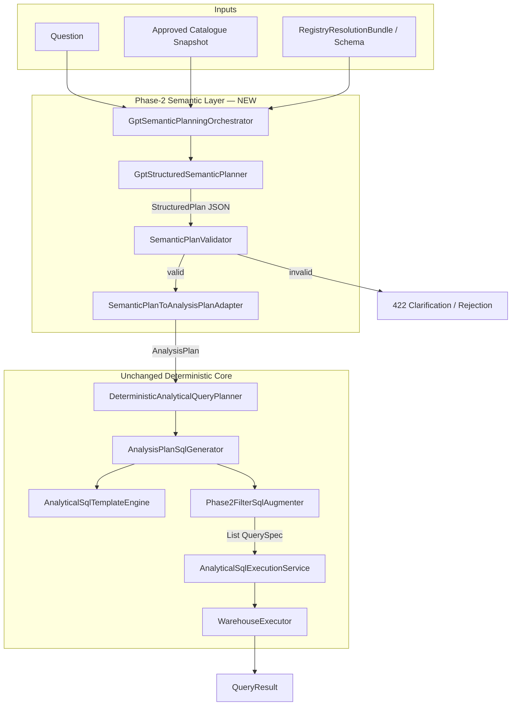

# Phase-2 Design: GPT as the Only Semantic Planner

**Status:** Design only — no production code changes in this document  
**Prerequisite:** Phase-1 benchmarks validated GPT + approved catalogue over rule-based semantics  
**Constraints:** No aliases, regex intent detection, synonym dictionaries, or hardcoded phrase matching

---

## 1. Objective

Replace all catalogue-driven **semantic inference** with a single path:

```
Question + Approved Catalogue + Schema
        ↓
GPT Structured Plan (JSON)
        ↓
Validator (schema/catalogue contract only)
        ↓
AnalysisPlan adapter
        ↓
Deterministic SQL (existing templates)
        ↓
Execute → Results
```

GPT decides **what** to query. Backend decides **whether it is allowed** and **how SQL is built**.

---

## 2. Phase-2 Architecture



### New package (proposed)

```
com.example.BACKEND.catalogue.semantic.phase2
  GptStructuredSemanticPlanner      — OpenAI structured output
  SemanticPlanValidator             — catalogue/schema binding checks
  SemanticPlanToAnalysisPlanAdapter — JSON → AnalysisPlan
  GptSemanticPlanningOrchestrator   — plan → validate → SQL → execute
  StructuredSemanticPlan            — Java record mirroring JSON contract
  SemanticPlanningConfig            — feature flags, model, thresholds
```

Phase-1 experiment code (`experiment.phase1`) is the reference implementation, not a parallel runtime.

---

## 3. Exact JSON Contract

### 3.1 Primary response schema

GPT must return **strict JSON** matching this contract. Column names must be copied exactly from the catalogue payload (no invented names).

```json
{
  "intent": "RANKING",
  "metric": "payment_total",
  "secondary_metric": null,
  "dimensions": ["plan_tier"],
  "filters": [
    {
      "column": "billing_region",
      "operator": "=",
      "value": "APAC"
    }
  ],
  "aggregations": {
    "primary": "SUM",
    "secondary": null
  },
  "ordering": {
    "column": "payment_total",
    "direction": "DESC"
  },
  "limit": 10,
  "relationship_variable": null,
  "confidence": 0.92,
  "reasoning": "User asks for top plan tiers by total payments in APAC.",
  "alternatives": []
}
```

### 3.2 Field definitions

| Field | Type | Required | Rules |
|-------|------|----------|-------|
| `intent` | enum | yes | See §3.3 |
| `metric` | string \| null | yes | Must be a catalogue `metric` column when executable |
| `secondary_metric` | string \| null | yes | Second metric for `RELATIONSHIP` or share `CONTRIBUTION` |
| `dimensions` | string[] | yes | 0–1 primary grouping column from catalogue `dimension` columns |
| `filters` | Filter[] | yes | 0+ predicates; columns must exist in catalogue |
| `aggregations` | object | yes | `primary` required when `metric` set; `secondary` when `secondary_metric` set |
| `ordering` | object \| null | yes | `column` + `direction` (`ASC` \| `DESC`) for ranking/extreme |
| `limit` | integer \| null | yes | Top/bottom N; null = no limit |
| `relationship_variable` | string \| null | yes | Second numeric column for `RELATIONSHIP` (alias of `secondary_metric` when intent is RELATIONSHIP) |
| `confidence` | number | yes | 0.0–1.0 |
| `reasoning` | string | yes | Short audit trail; not used for execution |
| `alternatives` | Plan[] | yes | Populated when `confidence < 0.7`; same shape minus `alternatives` |

**Filter object:**

```json
{
  "column": "care_unit",
  "operator": "=",
  "value": "ICU"
}
```

**Allowed `operator` values:** `=`, `!=`, `>`, `>=`, `<`, `<=`, `IN`, `LIKE`  
(Validator rejects operators incompatible with column type.)

**Aggregations object:**

```json
{
  "primary": "SUM",
  "secondary": "AVG"
}
```

**Allowed aggregation values:** `SUM`, `AVG`, `COUNT`, `MIN`, `MAX`

### 3.3 Intent enum (maps 1:1 to `AnalysisIntent`)

| JSON `intent` | `AnalysisIntent` | SQL template |
|---------------|------------------|--------------|
| `RANKING` | `RANKING` | `RankingSqlTemplate` |
| `CONTRIBUTION` | `CONTRIBUTION` | `ContributionSqlTemplate` |
| `TREND` | `TREND` | `TrendSqlTemplate` |
| `COMPARISON` | `COMPARISON` | `ComparisonSqlTemplate` |
| `DISTRIBUTION` | `DISTRIBUTION` | `DistributionSqlTemplate` |
| `RELATIONSHIP` | `RELATIONSHIP` | `RelationshipSqlTemplate` (CORR) |
| `SCALAR` | `CONTRIBUTION` (no dimension) | Scalar aggregate + filters |

**Phase-2 fix vs Phase-1:** `RELATIONSHIP` is first-class (not rejected). Colloquial phrasing ("correlate", "versus", "pattern") is classified by GPT using catalogue descriptions — not regex.

### 3.4 Non-executable plan (clarification)

When GPT cannot produce a valid plan:

```json
{
  "intent": "DISTRIBUTION",
  "metric": null,
  "secondary_metric": null,
  "dimensions": [],
  "filters": [],
  "aggregations": { "primary": null, "secondary": null },
  "ordering": null,
  "limit": null,
  "relationship_variable": null,
  "confidence": 0.25,
  "reasoning": "Question is ambiguous: could mean revenue or units.",
  "alternatives": [
    {
      "intent": "RANKING",
      "metric": "amount",
      "secondary_metric": null,
      "dimensions": ["category"],
      "filters": [],
      "aggregations": { "primary": "SUM", "secondary": null },
      "ordering": { "column": "amount", "direction": "DESC" },
      "limit": 10,
      "relationship_variable": null,
      "confidence": 0.55,
      "reasoning": "Interpret as top categories by spend."
    }
  ]
}
```

Validator returns `LOW_CONFIDENCE` or `AMBIGUOUS` → API responds with clarification, not SQL.

### 3.5 OpenAI JSON Schema (strict mode)

Use as `response_format.json_schema` (same shape as Phase-1 `Phase1LlmPlannerPrompt.responseSchema()`, extended):

- Add `RELATIONSHIP` to `intent` enum
- Add `secondary_metric`, `relationship_variable`, `aggregations` object
- Remove prompt rule that rejects relationship/causal questions
- Replace with: *"Use RELATIONSHIP intent when the question compares two numeric columns. Use catalogue descriptions only. Never invent column names."*

---

## 4. GPT Prompt Inputs (no heuristics)

**System prompt responsibilities:**
- Role: factual analytics planner
- Use approved catalogue descriptions to select columns
- Output only allowed JSON schema
- Never invent columns, tables, or aliases

**User prompt payload:**

```
QUESTION:
{question}

CATALOGUE (table={tableRef}):
[
  {"column":"unit_cost","description":"Manufacturing cost incurred per unit produced on a factory line","role":"metric","data_type":"FLOAT","default_aggregation":"SUM"},
  {"column":"line_code","description":"Identifier for a specific factory production line","role":"dimension","data_type":"STRING","sample_values":["L1","L2"]},
  ...
]

SCHEMA:
- unit_cost : FLOAT
- line_code : STRING
- ...
```

**Catalogue source:** `CatalogueApprovalService.getApprovedSnapshot(clientId)` — same approved business descriptions PMs already curate. No alias tables, no `SemanticDictionary`, no `CatalogQuestionMatcher`.

**Schema source:** `RegistryResolver.resolve(intent)` → `RegistryResolutionBundle` (existing).

---

## 5. Validator (contract enforcement only)

`SemanticPlanValidator` performs **structural and binding checks only** — no phrase matching.

| Check | Action on failure |
|-------|-------------------|
| `metric` ∈ catalogue metrics | `INVALID_METRIC` |
| `dimensions[]` ∈ catalogue dimensions | `INVALID_DIMENSION` |
| `filters[].column` ∈ catalogue | `INVALID_FILTER_COLUMN` |
| `operator` compatible with column type | `INVALID_FILTER_OPERATOR` |
| `filter.value` ∈ `sample_values` when catalogue provides enum samples | `INVALID_FILTER_VALUE` |
| `intent` requires dimension → `dimensions` non-empty | `MISSING_DIMENSION` |
| `intent=RELATIONSHIP` → `metric` + `relationship_variable` both numeric metrics | `MISSING_RELATIONSHIP_METRIC` |
| `intent=SCALAR` → `metric` set, `dimensions` empty | `INVALID_SCALAR_SHAPE` |
| `confidence < 0.4` | `LOW_CONFIDENCE` |
| `confidence < 0.7` and empty `alternatives` | `NEEDS_ALTERNATIVES` |

Validator **does not** reinterpret the question. It only accepts or rejects GPT output.

---

## 6. Reusing `AnalysisPlan`, `QuerySpec`, and SQL Generator

### 6.1 Mapping: StructuredPlan → AnalysisPlan

Extend the Phase-1 adapter pattern (`Phase1AnalysisPlanAdapter`) into production `SemanticPlanToAnalysisPlanAdapter`:

| StructuredPlan field | AnalysisPlan field |
|--------------------|-------------------|
| `question` | `question` |
| `bundle.entities[0].tableRef` | `tableRef` |
| `intent` | `intent` |
| `metric` | `primaryMetric` |
| catalogue description or column name | `primaryMetricLabel` |
| `dimensions[0]` | `dimension`, `dimensionLabel`, `groupingAlias` |
| `relationship_variable` or `secondary_metric` | `relationshipVariable`, `relationshipVariableLabel` |
| `secondary_metric` (CONTRIBUTION share) | `secondaryMetric`, `secondaryMetricLabel` |
| validator pass | `executable = true`, `blockingReasons = []` |
| validator fail | `AnalysisPlan.blocked(question, reason)` |

```java
// Conceptual — not implemented here
AnalysisPlan plan = SemanticPlanToAnalysisPlanAdapter.toAnalysisPlan(
    question, tableRef, validatedPlan);

List<QuerySpec> specs = deterministicPlanner.plan(plan, bundle);
specs = FilterSqlAugmenter.applyFilters(specs, validatedPlan.filters());
```

### 6.2 Unchanged SQL pipeline

```
AnalysisPlan
  → DeterministicAnalyticalQueryPlanner.plan()
  → AnalysisPlanSqlGenerator.generate()
  → AnalyticalSqlTemplateEngine (Ranking / Trend / Contribution / Comparison / Distribution / Relationship)
  → QuerySpec { key, sql, params }
```

**Relationship example (reuses existing template):**

```
Question: "Do prize pools correlate with audience peaks?"
GPT plan: intent=RELATIONSHIP, metric=viewer_peak, relationship_variable=prize_payout
AnalysisPlan: primaryMetric=viewer_peak, relationshipVariable=prize_payout
SQL: SELECT CORR(prize_payout, viewer_peak) ...  (RelationshipSqlTemplate)
```

**Scalar filtered example:**

```
Question: "Enterprise tier only — what did we bill?"
GPT plan: intent=SCALAR, metric=payment_total, filters=[plan_tier=Enterprise]
→ Scalar SQL path (no GROUP BY): SELECT SUM(payment_total) ... WHERE plan_tier = 'Enterprise'
```

### 6.3 Execution (unchanged)

```
List<QuerySpec>
  → AnalyticalSqlExecutionService.executeTemplateBatch()
  → WarehouseExecutor (BigQuery / Snowflake / JDBC)
  → QueryResult { key, rows, elapsedMs }
```

### 6.4 What is NOT reused for semantics

These remain in codebase during migration but are **not called** when Phase-2 is active:

- `QuestionSemanticExtractor`
- `MetricResolutionEngine`
- `QuestionInvestigationPlanner`
- `UniversalAnalysisPlanner` (as semantic inferencer)
- `AnalyticalQuestionResolver` (replace with thin wrapper around `GptSemanticPlanningOrchestrator`)
- `CatalogueQueryService.ask()` LLM-direct-SQL path

---

## 7. Production Endpoints → Phase-2 Planner

### 7.1 Primary integration points

| Endpoint | Controller / Service | Current semantic path | Phase-2 change |
|----------|----------------------|----------------------|----------------|
| `POST /api/decision/v1/run` | `DecisionController` → `DecisionRuntime` | `AnalyticalQuestionResolver` → `UniversalAnalysisPlanner` → `deterministicPlanner` | **Replace Stage 2b** with `GptSemanticPlanningOrchestrator.plan()`. Keep downstream evidence, synthesis, governance. |
| `POST /api/query/ask` | `CatalogueQueryController` → `ChatOrchestratorService` | `GeneralDataChatService` (LLM prose, no SQL) | **Add data-question branch:** detect analytical intent via GPT plan attempt; execute SQL path; wrap rows in chat response. |
| `CatalogueQueryService.ask()` | Called by `DynamicChartService` | LLM generates raw SQL + patch layer | **Replace** with `GptSemanticPlanningOrchestrator` → deterministic SQL. |
| `POST /api/agent/charts/generate` | `AgentDashboardController` → `DynamicChartService` | Chart planner LLM emits SQL string | **Phase-2b:** chart planner calls semantic orchestrator for SQL; LLM only chooses chart type/title/keys. |

### 7.2 Secondary / dev endpoints (no Phase-2 requirement)

| Endpoint | Notes |
|----------|-------|
| `POST /api/analytics/query` | Legacy `EnglishQueryParser` / CQL — separate product surface, not catalogue-driven |
| `GET /api/decision/validate/*` | Regression harness — update to benchmark GPT planner |
| `POST /api/debug/run` | Debug only |

### 7.3 Internal call graph after Phase-2

```
POST /api/decision/v1/run
  DecisionRuntime.execute()
    registryResolver.resolve()
    gptSemanticOrchestrator.planAndExecute(question, catalogue, bundle)  ← NEW
      ├── gptStructuredPlanner.plan()
      ├── semanticPlanValidator.validate()
      ├── adapter.toAnalysisPlan()
      ├── deterministicPlanner.plan()
      └── sqlExecutionService.executeTemplateBatch()
    ... evidence / synthesis unchanged ...

POST /api/query/ask
  ChatOrchestratorService.handle()
    gptSemanticOrchestrator.tryPlan()  ← NEW branch
      if executable → execute → ChatResponse(type=sql, rows=...)
      else → GeneralDataChatService (prose reasoning fallback)

POST /api/agent/charts/generate
  DynamicChartService.generate()
    gptSemanticOrchestrator.planAndExecute()  ← replaces CatalogueQueryService.ask()
    chartMapper.map(rows → chart spec)
```

---

## 8. Rollback Strategy

### 8.1 Feature flag (primary control)

```yaml
semantic:
  planner:
    mode: gpt          # gpt | legacy | shadow
    min-confidence: 0.4
    model: gpt-4o-mini
    per-tenant-overrides:
      acme-corp: legacy   # optional per-tenant rollback
```

| Mode | Behavior |
|------|----------|
| `gpt` | GPT planner only; legacy semantic chain not invoked |
| `legacy` | Current `AnalyticalQuestionResolver` path; GPT not called |
| `shadow` | Both run; GPT result logged but legacy result served |

### 8.2 Rollback triggers

Automatic flip `gpt → legacy` if rolling window shows:
- Execution success rate drops > 10% vs baseline
- GPT API error rate > 5%
- P95 latency > 2× baseline

Manual rollback: set `semantic.planner.mode=legacy` in config — **no redeploy required** if using external config.

### 8.3 Deployment rollback sequence

1. **Instant (config):** `mode=legacy` — restores rule-based semantics in < 1 minute
2. **Per-tenant:** override single tenant without affecting others
3. **Code rollback:** redeploy previous release if GPT orchestrator code is defective
4. **Data rollback:** none required — no schema migrations in Phase-2

### 8.4 Shadow mode audit log (pre-cutover)

For each request, log:

```json
{
  "requestId": "...",
  "question": "...",
  "legacy": { "metric": "...", "dimension": "...", "executable": true, "sql": "..." },
  "gpt": { "metric": "...", "dimension": "...", "confidence": 0.91, "executable": true, "sql": "..." },
  "match": { "metric": true, "dimension": true, "sql_equivalent": false }
}
```

Cutover criteria (from Phase-1 benchmarks):
- GPT execution success ≥ legacy + 20% on human questions
- No increase in warehouse errors
- Relationship intent working (CORR path)

### 8.5 Safe deletion gate

Do **not** delete legacy semantic components until:
- `mode=gpt` for ≥ 30 days in production
- Rollback exercised successfully in staging
- Regression suite green: Phase-1 factual bank + 100 human questions + tenant catalogues

---

## 9. Migration Phases

| Phase | Scope | Risk |
|-------|-------|------|
| **2a** | Implement `GptStructuredSemanticPlanner` + validator + adapter in new package; wire `DecisionRuntime` behind flag | Low — shadow mode |
| **2b** | Replace `CatalogueQueryService` SQL path; chart service uses orchestrator | Medium |
| **2c** | `POST /api/query/ask` data branch with SQL execution | Medium |
| **2d** | Default `mode=gpt`; legacy on flag only | High — monitor |
| **2e** | Delete legacy semantic inferencers | Low after soak |

---

## 10. Explicit Non-Goals (Phase-2)

- No `MetricAliasGenerator`, `SemanticDictionary`, or `CatalogQuestionMatcher`
- No regex intent detectors (`RelationshipIntentDetector`, `QuestionSemanticExtractor` patterns)
- No synonym dictionaries or hardcoded phrase → column maps
- No LLM-generated SQL strings in production (GPT outputs **plan JSON only**)
- No changes to warehouse connectors, SQL templates, or catalogue approval workflow

---

## 11. Success Criteria

| Metric | Target |
|--------|--------|
| Human question execution success | ≥ 85% (baseline: 89% in Phase-1 experiment) |
| Relationship questions | CORR SQL generated via `RELATIONSHIP` intent |
| Metric/dimension binding errors | 0% (validator rejects before SQL) |
| Legacy semantic code in hot path | 0% when `mode=gpt` |
| Rollback time | < 1 minute via config |

---

## 12. Reference Implementation

| Artifact | Location |
|----------|----------|
| Phase-1 GPT planner | `experiment/phase1/Phase1LlmPlannerExperiment` |
| JSON schema (base) | `experiment/phase1/Phase1LlmPlannerPrompt.responseSchema()` |
| AnalysisPlan adapter (base) | `experiment/phase1/Phase1AnalysisPlanAdapter` |
| SQL pipeline | `decision/execution/sqltemplates/*` |
| Runtime comparison proof | `target/runtime-planner-comparison.log` |
| Architecture review | `docs/GPT_SEMANTIC_PLANNER_ARCHITECTURE.md` |
