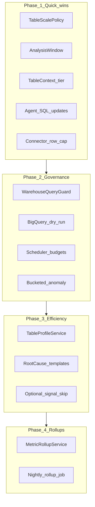

# Implementation Plan: Million-Row Scale for Kontexa Agents

| Field | Value |
|-------|--------|
| **Document ID** | KTX-SCALE-IMPL-001 |
| **Requirements** | [SCALE_REQUIREMENTS_SPEC.md](./SCALE_REQUIREMENTS_SPEC.md) |
| **Architecture reference** | [SCALE_MILLION_ROW_TABLES.md](./SCALE_MILLION_ROW_TABLES.md) |
| **Cursor plan** | `scale_million-row_tables_d17c9a59.plan.md` |
| **Recommended order** | Phase 1 → 2 → 3 → 4 (do not skip Phase 1 guardrails before parallel scheduler) |

---

## 1. Implementation overview



**Principle:** Every phase keeps **compute in warehouse, summaries to LLM**. No phase increases raw row export.

---

## 2. Phase 1 — Quick wins (estimate: 3–5 days)

**Goal:** Stop unbounded scans and tier-aware behaviour with minimal new infrastructure.

### 2.1 Tasks

| # | Task | Files | FR IDs |
|---|------|-------|--------|
| 1.1 | Create `ScaleTier` enum + `TableScalePolicy` (read `rowCount` from snapshot table node) | **New** `catalogue/agent/scale/TableScalePolicy.java` | FR-SCALE-01 |
| 1.2 | Create `AnalysisWindow` (start date, SQL `WHERE` fragment per provider) | **New** `catalogue/agent/scale/AnalysisWindow.java` | FR-SQL-02, FR-SQL-03 |
| 1.3 | Extend `TableContext` with `tier`, `rowCount`, `AnalysisWindow window` | `TableContext.java` | FR-SCALE-02 |
| 1.4 | Orchestrator: resolve tier per table; skip `buildRawSampleSql` for MEDIUM/LARGE | `AgentOrchestrator.java` | FR-SQL-01 |
| 1.5 | `TrendAgent`: apply window to breakdown + fallback trend; default window if no `dataMax` | `agents/TrendAgent.java` | FR-SQL-02, FR-SQL-03 |
| 1.6 | `DistributionAgent`: append window to all scans | `agents/DistributionAgent.java` | FR-SQL-02 |
| 1.7 | `KpiPerformanceAgent`: append window | `agents/KpiPerformanceAgent.java` | FR-SQL-02 |
| 1.8 | `AnomalyAgent`: append window to stats query (interim; full bucket fix in Phase 2) | `agents/AnomalyAgent.java` | FR-SQL-02 |
| 1.9 | `CrossTableAgent`: filter fact side by window | `agents/CrossTableAgent.java` | FR-SQL-02 |
| 1.10 | Connectors: hard cap rows returned (slice list after fetch) | `BigQueryConnectorService.java`, `SnowflakeConnectorService.java` | FR-SQL-07 |
| 1.11 | Add config properties + `@ConfigurationProperties` bean | **New** `ScaleProperties.java`, `application.properties` | §7 spec |
| 1.12 | Unit tests for tier boundaries and window SQL (BQ + SF + PG) | **New** `src/test/.../TableScalePolicyTest.java`, `AnalysisWindowTest.java` | Phase 1 gate |

### 2.2 `TableScalePolicy` sketch

```java
public enum ScaleTier { SMALL, MEDIUM, LARGE }

public final class TableScalePolicy {
  public ScaleTier tier(long rowCount) { ... }
  public int maxMetrics(ScaleTier t) { ... }
  public int maxDimensions(ScaleTier t) { ... }
  public boolean allowRawSample(ScaleTier t) { return t == SMALL; }
  public boolean allowRootCauseReAct(ScaleTier t) { return t == SMALL || t == MEDIUM; }
}
```

### 2.3 `AnalysisWindow` sketch

```java
public record AnalysisWindow(LocalDate start, LocalDate end, String dateColumn) {
  public String whereClause(String dateRef, String provider) { ... }
}
```

Resolve `end` from `dataMax` or `MAX(date)` query (SMALL/MEDIUM only if needed; LARGE may use fixed 90d without extra query if `dataMax` present).

### 2.4 Orchestrator integration point

```java
long rowCount = tableNode.path("rowCount").asLong(0);
ScaleTier tier = scalePolicy.tier(rowCount);
AnalysisWindow window = analysisWindowFactory.forTable(hints, enriched, tier);
TableContext ctx = new TableContext(..., tier, rowCount, window);

if (scalePolicy.allowRawSample(tier)) {
  safeExecute(buildRawSampleSql(...), ...);
}
```

### 2.5 Phase 1 exit checklist

- [ ] Manual `POST /api/agent/dashboard` on tenant with 10M-row table: logs show `LARGE` tier
- [ ] No `Sample rows` query in logs for LARGE
- [ ] Breakdown queries contain `WHERE` on date column
- [ ] `mvn test` passes new unit tests
- [ ] Update [SCALE_MILLION_ROW_TABLES.md](./SCALE_MILLION_ROW_TABLES.md) § Implementation status

---

## 3. Phase 2 — Governance (estimate: 5–7 days)

**Goal:** Enforce cost caps, scheduler fairness, and statistically sound anomaly at scale.

### 3.1 Tasks

| # | Task | Files | FR IDs |
|---|------|-------|--------|
| 2.1 | `WarehouseQueryGuard` — parse/normalize SQL, tier rules, inject window | **New** `catalogue/agent/scale/WarehouseQueryGuard.java` | FR-SQL-04, FR-SQL-05 |
| 2.2 | `GuardedWarehouseExecutor` facade used by all agents | **New** `catalogue/agent/scale/GuardedWarehouseExecutor.java` | FR-SQL-04 |
| 2.3 | Refactor agents to execute via executor (replace duplicate `execute()` methods) | All `agents/*.java`, `AgentOrchestrator.safeExecute` | FR-SQL-04 |
| 2.4 | BigQuery dry-run in guard; surface `estimatedBytes` | `BigQueryConnectorService.java` | FR-SQL-06, NFR-COST-01 |
| 2.5 | Per-run byte accumulator on `TableContext` or run-scoped `AnalysisRunContext` | **New** `AnalysisRunContext.java` | NFR-COST-02 |
| 2.6 | `AnomalyAgent`: LARGE uses monthly series from collected Trend data (Z-score on buckets) | `AnomalyAgent.java`, orchestrator pass-through | FR-ANOMALY-01, FR-ANOMALY-02 |
| 2.7 | `AgentScheduler`: `ExecutorService` (pool=3), per-tenant timeout, query budget | `AgentScheduler.java` | FR-SCHED-01–03, FR-SCHED-05 |
| 2.8 | `AnalysisRunContext` wired into orchestrator; increment query count per execution | `AgentOrchestrator.java` | FR-SCHED-02 |
| 2.9 | Migration `agent_runs` + entity + repository | **New** SQL, `AgentRunEntity`, `AgentRunRepository` | FR-SCHED-04, NFR-OBS-02 |
| 2.10 | Chat: route `executeSqlForChat` through guard | `CatalogueQueryService.java`, `GeneralDataChatService.java` | FR-SQL-09 |
| 2.11 | Integration test with mocked BQ dry-run over limit | **New** test class | Phase 2 gate |

### 3.2 `WarehouseQueryGuard` rules (implementation order)

1. Reject non-`SELECT`
2. If LARGE: reject `SELECT *` (regex with exceptions for `COUNT(*)`)
3. If non-aggregate and no `GROUP BY`: require `LIMIT` ≤ max
4. If MEDIUM/LARGE and date column known: inject `WHERE date >= start` if missing
5. BigQuery: dry-run; if bytes &gt; cap → `QueryRejectedException`
6. Return possibly modified SQL

### 3.3 Scheduler pseudocode

```java
ExecutorService pool = Executors.newFixedThreadPool(parallelTenants);
for (String clientId : clients) {
  pool.submit(() -> {
    try {
      runWithTimeout(() -> orchestrator.analyse(clientId), tenantTimeout);
    } catch (Exception e) { log; }
  });
}
pool.shutdown();
pool.awaitTermination(6, HOURS);
```

Use `Future.get(timeout)` or Spring `@Async` with timeout — prefer explicit executor for Phase 2.

### 3.4 Phase 2 exit checklist

- [ ] Deliberately bad SQL (no LIMIT) rejected in test
- [ ] 10M-row tenant completes or exits with budget message within 10 min
- [ ] `agent_runs` row written per scheduler invocation
- [ ] Anomaly log shows `bucketed` path for LARGE

---

## 4. Phase 3 — Efficiency (estimate: 4–6 days)

**Goal:** Replace expensive patterns with profiles and safe drill-downs.

### 4.1 Tasks

| # | Task | Files | FR IDs |
|---|------|-------|--------|
| 3.1 | `TableProfileService` — COUNT, date range, top-5 dims, windowed metric stats | **New** `TableProfileService.java` | FR-PROFILE-01–03 |
| 3.2 | Orchestrator: MEDIUM/LARGE call profile instead of raw sample | `AgentOrchestrator.java` | FR-PROFILE-01 |
| 3.3 | Synthesis prompt: exclude `Sample rows` for LARGE; prefer `PROFILE:` | `AgentOrchestrator.buildUserPrompt` | FR-LLM-01 |
| 3.4 | `RootCauseTemplateDrilldown` — fixed SQL per dimension for LARGE | **New** + `RootCauseAnalysisAgent.java` | FR-SQL-08 |
| 3.5 | Optional: skip table if `SignalDetectionService` shows no change since last run | `AgentOrchestrator`, `SignalDetectionService` | Plan Phase 3 optional |
| 3.6 | Reduce LARGE caps (metrics=2, dims=1) via `TableScalePolicy` | Already in policy from Phase 1 | FR-SCALE |

### 4.2 Profile query budget (per LARGE table)

| Query | Purpose |
|-------|---------|
| Q1 | `SELECT COUNT(*), MIN(date), MAX(date) FROM t WHERE window` |
| Q2 | `SELECT dim, COUNT(*) ... GROUP BY dim ORDER BY 2 DESC LIMIT 5` (one dim) |
| Q3 | `SELECT APPROX_QUANTILES(metric,4) ...` or monthly `GROUP BY` for metrics |

Max **3 queries** replacing 1× `SELECT *` + redundant scans.

### 4.3 Phase 3 exit checklist

- [ ] LARGE run: collected data contains `PROFILE:` not `Sample rows`
- [ ] RootCause on LARGE logs `template drill-down` only
- [ ] LLM prompt size stable (character count logged &lt; threshold)

---

## 5. Phase 4 — Metrics rollup layer (estimate: 8–12 days)

**Goal:** O(1) warehouse work for repeated LARGE FACT analysis.

### 5.1 Tasks

| # | Task | Files | FR IDs |
|---|------|-------|--------|
| 4.1 | Migration `daily_metric_rollups` | **New** `src/main/resources/rollup_migration.sql` | FR-ROLLUP-01 |
| 4.2 | `MetricRollupService.buildRollups(clientId, table)` — windowed GROUP BY in warehouse | **New** `MetricRollupService.java` | FR-ROLLUP-01 |
| 4.3 | Job: on approval + nightly `@Scheduled` | **New** `MetricRollupScheduler.java`, hook `CatalogueApprovalService` | FR-ROLLUP-03 |
| 4.4 | `RollupDataSource` adapter agents call instead of raw table ref | Trend/KPI/Distribution agents | FR-ROLLUP-02 |
| 4.5 | Freshness: if rollup age &gt; 36h, fallback to Phase 2 SQL | Policy in orchestrator | FR-ROLLUP-02 |
| 4.6 | Documentation + ops runbook | `docs/SCALE_ROLLUP_OPS.md` | — |

### 5.2 Rollup schema (draft)

```sql
CREATE TABLE daily_metric_rollups (
  id UUID PRIMARY KEY,
  client_id VARCHAR NOT NULL,
  table_name VARCHAR NOT NULL,
  metric_date DATE NOT NULL,
  dimension_key VARCHAR,
  dimension_value VARCHAR,
  metric_name VARCHAR NOT NULL,
  metric_value DOUBLE PRECISION NOT NULL,
  agg_type VARCHAR NOT NULL,  -- SUM, COUNT, AVG
  built_at TIMESTAMP NOT NULL
);
CREATE INDEX idx_rollup_client_table_date ON daily_metric_rollups(client_id, table_name, metric_date);
```

### 5.3 Phase 4 exit checklist

- [ ] Second consecutive scheduler run on same LARGE tenant: bytes scanned &lt; 10% of Phase 2 run
- [ ] Insights still generated from rollup-backed series
- [ ] Rollup rebuild idempotent (run twice, same row counts)

---

## 6. File change summary (all phases)

| Action | Path |
|--------|------|
| **New package** | `com.example.BACKEND.catalogue.agent.scale.*` |
| **New** | `TableScalePolicy`, `AnalysisWindow`, `AnalysisWindowFactory`, `ScaleProperties` |
| **New** | `WarehouseQueryGuard`, `GuardedWarehouseExecutor`, `QueryRejectedException` |
| **New** | `AnalysisRunContext`, `AgentRunEntity`, `AgentRunRepository` |
| **New** | `TableProfileService`, `RootCauseTemplateDrilldown` |
| **New** | `MetricRollupService`, `MetricRollupScheduler`, rollup migration |
| **Modify** | `TableContext`, `AgentOrchestrator`, `AgentScheduler` |
| **Modify** | `TrendAgent`, `DistributionAgent`, `KpiPerformanceAgent`, `AnomalyAgent`, `CrossTableAgent`, `RootCauseAnalysisAgent` |
| **Modify** | `BigQueryConnectorService`, `SnowflakeConnectorService` |
| **Modify** | `CatalogueQueryService`, `GeneralDataChatService` (Phase 2) |
| **Tests** | `src/test/java/.../scale/*` |

---

## 7. Testing strategy

| Level | Phase | What to test |
|-------|-------|----------------|
| Unit | 1 | Tier boundaries; window SQL for BQ/SF/PG; inject WHERE |
| Unit | 2 | Guard rejects `SELECT *`, missing LIMIT; dry-run mock |
| Integration | 2 | Orchestrator with H2 or testcontainers PG (SMALL data) |
| Manual | 1–2 | Real BQ tenant with partitioned 10M table; compare bytes billed |
| Manual | 3 | Profile output shape in `CollectedData` |
| Performance | 2 | Scheduler 3 tenants parallel; wall-clock &lt; 10 min each |
| Regression | All | Insight cards still persist; API contract unchanged |

---

## 8. Rollout plan

| Step | Action |
|------|--------|
| 1 | Ship Phase 1 behind feature flag `kontexa.scale.enabled=true` (default true after bake-in) |
| 2 | Deploy to staging; run scheduler once; compare BQ bytes vs baseline |
| 3 | Ship Phase 2; enable dry-run only in staging first |
| 4 | Production: monitor `agent_runs`; alert if p95 duration &gt; 15 min |
| 5 | Phase 3–4 opt-in per tenant flag `kontexa.scale.rollup.enabled` |

**Rollback:** Set `kontexa.scale.enabled=false` to restore legacy SQL paths (keep connector row cap).

---

## 9. Milestone timeline (suggested)

| Week | Deliverable |
|------|-------------|
| 1 | Phase 1 complete + unit tests + staging validation |
| 2 | Phase 2 guard + scheduler + anomaly buckets |
| 3 | Phase 3 profiles + root cause templates |
| 4+ | Phase 4 rollups (if product prioritizes cost at scale) |

---

## 10. Open decisions (resolve before coding)

| # | Question | Recommendation |
|---|----------|----------------|
| D1 | Exact LARGE window: 90d vs 180d? | **90d** default; config override |
| D2 | Skip DIMENSION tables on LARGE? | **Yes** if star schema role = DIMENSION |
| D3 | Feature flag per tenant or global? | **Global flag** first; tenant override in Phase 4 |
| D4 | Snowflake bytes cap without dry-run? | Use **warehouse query history** or LIMIT-only until SF API wired |
| D5 | Refresh `rowCount` every run vs weekly? | **Weekly** + on approval; force on first LARGE hit |

---

## 11. Definition of done (program)

- All **Phase 1–2** acceptance criteria in [SCALE_REQUIREMENTS_SPEC.md](./SCALE_REQUIREMENTS_SPEC.md) §8 are met
- [SCALE_MILLION_ROW_TABLES.md](./SCALE_MILLION_ROW_TABLES.md) updated with “Implemented” sections per phase
- No regression in `POST /api/agent/dashboard` and `GET /api/agent/insights` contracts
- Ops can answer “why was this tenant slow?” via `agent_runs` within 5 minutes

---

## 12. Document history

| Version | Date | Change |
|---------|------|--------|
| 1.0 | 2026-05-21 | Initial implementation plan from Cursor scale plan |
