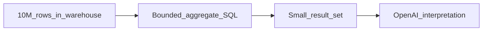
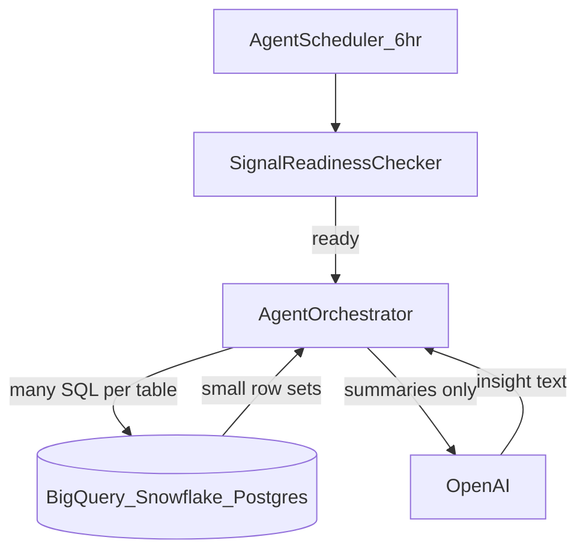
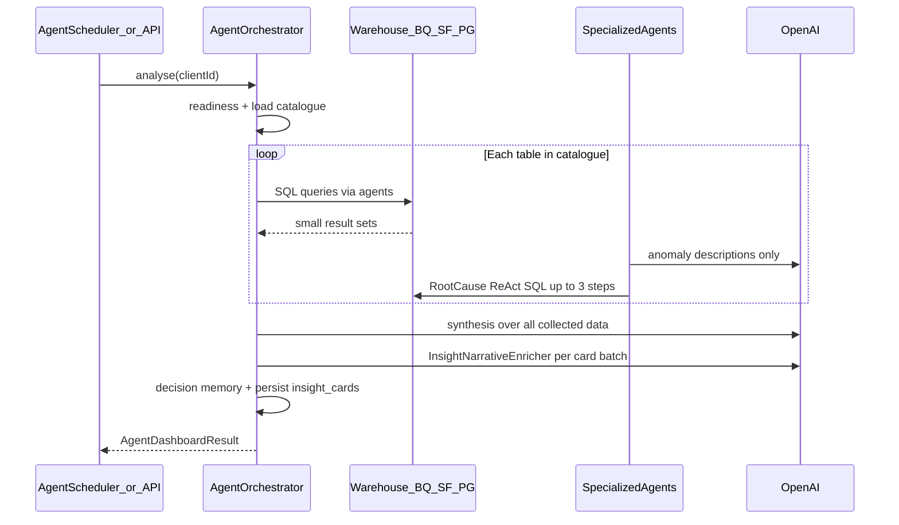
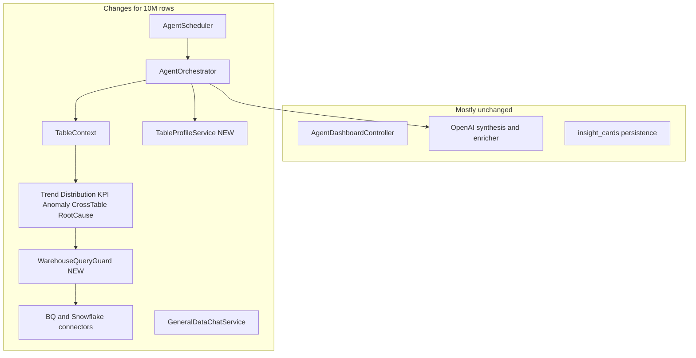

# Kontexa: Handling Millions of Rows — Architecture & Implementation Guide

This document consolidates how the agent system works today, what happens at ~10M rows, and what must change in the codebase. It covers scheduled runs (6-hour timer), manual refresh, and chat.

**Formal docs (use for implementation):**

- **[SCALE_REQUIREMENTS_SPEC.md](./SCALE_REQUIREMENTS_SPEC.md)** — functional/non-functional requirements, acceptance gates, config
- **[SCALE_IMPLEMENTATION_PLAN.md](./SCALE_IMPLEMENTATION_PLAN.md)** — phased tasks, file list, estimates, rollout
- **[SCALE_ROLLUP_HOW_IT_WORKS.md](./SCALE_ROLLUP_HOW_IT_WORKS.md)** — how rollups work for 10M+ tables (rules, example, readiness)

**Last updated:** May 2026

---

## Table of contents

1. [Core principle](#core-principle)
2. [How the system works today](#how-the-system-works-today)
3. [Are we sending the entire table to OpenAI?](#are-we-sending-the-entire-table-to-openai)
4. [What breaks at 10M rows](#what-breaks-at-10m-rows)
5. [Strategies for scale](#strategies-for-scale)
6. [What will change in the codebase](#what-will-change-in-the-codebase)
7. [Implementation phases](#implementation-phases)
8. [Example: one 10M-row table after Phase 1–2](#example-one-10m-row-table-after-phase-12)
9. [Success criteria](#success-criteria)
10. [File reference index](#file-reference-index)

---

## Core principle

**Compute in the database. Reason on summaries.**

OpenAI should only ever see: aggregated metrics, top-N categories, time-bucketed series, anomaly statistics, and schema metadata — never row-level exports of large tables.

---

## How the system works today

### Two ways analysis starts

Both paths call the **same** pipeline: `AgentOrchestrator.analyse(clientId)`.

| Trigger | Entry point |
|--------|-------------|
| **Automatic (every 6 hours)** | `AgentScheduler.runScheduledAnalysis()` |
| **Manual** | `POST /api/agent/dashboard` via `AgentDashboardController` |

The scheduler loads every `clientId` from approved catalogue snapshots, runs a readiness check per tenant, then calls `analyse()` for each ready tenant **one after another** (`fixedDelay` — the next 6-hour cycle only starts after the previous run finishes).

### Prerequisites (before any agent runs)

1. **Tenant connects** BigQuery, Snowflake, or Postgres.
2. **Catalogue is discovered and approved** — schema, column types, sample values, `rowCount`, semantic enrichment stored in snapshot JSON.
3. **Readiness gate** — `SignalReadinessChecker` scores the tenant (catalogue exists, DB reachable, at least one table has rows). Score ≥ 60 → proceed; otherwise skip.

**Note:** `SignalDetectionService` exists but is **not** wired into the scheduler today. The timer runs full `analyse()` when ready, not “only when signals fire.”

### Full process inside `AgentOrchestrator.analyse()`

#### Step 1 — Load context

- Approved catalogue JSON from Postgres.
- Cloud provider + credentials (BigQuery / Snowflake / local JDBC).

#### Step 2 — Per table: classify columns, then run agents

`KpiDetectorService` classifies each table: date column, numeric metrics, string dimensions.

| Agent / step | What it does in the warehouse | What comes back |
|--------------|--------------------------------|-----------------|
| **Raw sample** | `SELECT * … LIMIT 100` (often `ORDER BY date DESC`) | ≤100 rows |
| **TrendAgent** | Time-series + breakdowns (`GROUP BY`, `LIMIT` 60 / 10) | Small aggregates |
| **DistributionAgent** | Category counts, monthly volume | Small aggregates |
| **KpiPerformanceAgent** | Current vs prior period KPIs | Small aggregates + KPI cards |
| **AnomalyAgent** | `AVG, STDDEV, MIN, MAX, COUNT` over column | 1 row per metric; Z-score in Java; short LLM sentence |
| **RootCauseAnalysisAgent** | If anomaly change ≥ 15%: ReAct (max 3 steps) | ≤10 rows per step |

All SQL runs through warehouse connectors — **not** through OpenAI.

#### Step 3 — Cross-table and forecast

- **CrossTableAgent** — JOIN fact × dimension, `GROUP BY`, `LIMIT 15`.
- **ForecastingAgent** — Java math on collected time series (no new warehouse scan).

#### Step 4 — Guard: empty data?

If nothing collected → return error, **no LLM synthesis**.

#### Step 5 — OpenAI (interpretation only)

1. **Synthesis** — one `openAiClient.chat()` with schema + formatted `CollectedData` (sample: max 40 rows shown; others: max 30 per dataset).
2. **InsightNarrativeEnricher** — second call; capped at 18 datasets × 8 rows.
3. **DecisionMemoryService** — adjusts confidence from past user actions.

#### Step 6 — Persist

- Retires old `AWAITING_CONFIRMATION` cards.
- Saves new cards to `insight_cards`.
- Returns `AgentDashboardResult`.

### Per-table query volume (today)

Roughly per table:

- ~1 raw sample
- Up to 4 metrics × (1 trend + 3 breakdowns)
- Distribution queries
- KPI queries
- Up to 6 anomaly stats
- Optional RootCause (3 LLM-driven SQL per high anomaly)

**10 tables × ~15–25 queries ≈ 150–250 warehouse jobs per tenant per run.**

### Frontend / API (unchanged by scale work)

| Action | API | Behavior |
|--------|-----|----------|
| Load feed | `GET /api/agent/insights` | Persisted cards only |
| Refresh | `POST /api/agent/dashboard` | Full pipeline |
| Mark read / Dismiss | `PATCH /api/agent/insights/{id}/status` | Status update |
| Chat | `GeneralDataChatService` | LLM SQL → execute → answer from ≤25 rows/step |

### Chat (separate from scheduled agents)

`GeneralDataChatService`: user question → OpenAI plans SQL (up to 4 steps) → `CatalogueQueryService.executeSqlForChat()` with `LIMIT 1000` enforced → formats **25 rows** max per step → OpenAI answer.

---

## Are we sending the entire table to OpenAI?

**No.** OpenAI never receives your full table — not even on a 10M-row dataset.

### What runs in the warehouse

- Raw peek: `SELECT * … LIMIT 100`
- Trends: `GROUP BY` + `LIMIT 60`
- Breakdowns: `GROUP BY` + `LIMIT 10`
- Anomaly: one stats row per metric
- Cross-table: `LIMIT 15`

The warehouse may **scan** a large table to compute those queries, but only **small result sets** return to the JVM.

### What gets sent to OpenAI

| Step | What OpenAI sees |
|------|------------------|
| Main synthesis (`AgentOrchestrator.buildUserPrompt`) | Schema + datasets as text — sample capped at **40**, others at **30** rows |
| Narrative enricher | Up to **18 × 8** rows |
| Anomaly descriptions | Numbers + one sentence |
| Root cause | ≤10 rows × 3 steps |

### Important distinction

| | |
|--|--|
| **Not sent to OpenAI** | Full table |
| **Can still be expensive** | SQL that full-scans or sorts 10M rows in the warehouse |

Scale work targets **warehouse query cost and runtime**, not LLM token limits (already bounded).

---

## What breaks at 10M rows

### 1. Full-table scans despite small `LIMIT`

`AgentOrchestrator.buildRawSampleSql()` uses `SELECT * … ORDER BY date DESC LIMIT 100`. Without partition predicates, engines may read a large fraction of the table to sort.

### 2. Aggregates without time windows

- `TrendAgent.buildBreakdownSql()`: `GROUP BY dimension` on the **full table**.
- `AnomalyAgent.queryStats()`: global `MIN/MAX/AVG` — one row returned, **full column scan**.
- `lookbackFilter()` returns `""` if no `dataMax` → queries hit full history.

### 3. Query volume scales with catalogue size

Sequential per-tenant, per-table queries with no budget.

### 4. No scale-aware policy

`rowCount` is stored at catalogue approval but **agents never read it**.

### 5. No execution guardrails

`BigQueryConnectorService.executeSelect()` runs any SQL and loads all rows. RootCause only checks `SELECT` prefix.

### 6. Scheduler coupling

`fixedDelay` + sequential tenants: one slow 10M-table tenant delays everyone; run may exceed 6 hours.

---

## Strategies for scale

### Strategy A — Table scale tiers (use existing `rowCount`)

| Tier | Rows | Agent behavior |
|------|------|----------------|
| **Small** | < 100K | Current behavior |
| **Medium** | 100K – 1M | Mandatory date lookback; drop raw `SELECT *`; cap metrics/dims |
| **Large** | > 1M | Aggregates only; no raw sample; no/simplified RootCause; strict query budget; optional `TABLESAMPLE` |

Wire in `AgentOrchestrator` → pass `ScaleTier` on `TableContext`.

### Strategy B — Replace raw sample with statistical profiles

`TableProfileService` per table:

- `COUNT(*)`, min/max date
- Top-5 per dimension (`GROUP BY … LIMIT 5`)
- Percentiles / `AVG` over **windowed** data

LLM gets JSON profile (~2KB), not 100 wide rows.

### Strategy C — Mandatory time windows on large tables

`AnalysisWindow` helper for all agents:

- Default: last 24 months (or 90 days for very large)
- Anchor on `dataMax` or `MAX(date_col)`
- Apply `WHERE date >= @start` to **every** query including breakdowns and anomaly stats
- Default window even when `dataMax` is missing

### Strategy D — Query safety and cost governance

`WarehouseQueryGuard` before every `executeSelect`:

1. Reject `SELECT *` on Large tier
2. Require `LIMIT ≤ 500` on non-aggregate queries
3. Auto-inject date window on Medium/Large FACT tables
4. BigQuery dry-run → reject if bytes > cap (e.g. 5 GB/query, 50 GB/run)
5. Truncate connector results (e.g. 500 rows max)
6. RootCause: template drill-downs on Large, not free-form LLM SQL

### Strategy E — Scheduler and run budgeting

- Per-tenant query budget and wall-clock timeout
- Parallel tenant execution (thread pool)
- FACT tables first (`StarSchemaDetector`)
- Optional `agent_runs` table for observability

### Strategy F — Cheaper anomaly detection at scale

- Medium/Large: Z-score on **monthly aggregates** (reuse TrendAgent output)
- Large: `APPROX_QUANTILES` on windowed data
- Template-only anomaly text on Large (optional)

### Strategy G — Pre-aggregated metrics layer (long-term)

Nightly or on-approval rollups in Postgres or tenant summary dataset:

- `daily_metrics` keyed by tenant, table, date, dimensions
- Agents query rollups instead of raw 10M fact table

### Strategy H — LLM payload budget (defense in depth)

- Stricter synthesis/enricher caps for LARGE runs
- Never include raw sample in Large-tier prompts
- Max 1 RootCause investigation per table per run on Large
- Share `WarehouseQueryGuard` with chat path

---

## What will change in the codebase

### What stays the same

- OpenAI never gets full tables
- Agent split and API contracts
- Chat as separate path
- `insight_cards` persistence and decision memory

### New files to add

| File | Purpose |
|------|---------|
| `catalogue/agent/TableScalePolicy.java` | `rowCount` → SMALL / MEDIUM / LARGE |
| `catalogue/agent/AnalysisWindow.java` | Default `WHERE date >= …` |
| `catalogue/agent/WarehouseQueryGuard.java` | SQL validation + bytes cap + row truncation |
| `catalogue/agent/TableProfileService.java` | Replaces raw `SELECT *` sample |
| `agent_runs` migration + entity (optional) | Run telemetry |
| `catalogue/rollup/*` (Phase 4) | Daily metric rollups |

### Files to modify

#### Orchestrator

**`AgentOrchestrator.java`**

- Skip `buildRawSampleSql()` for MEDIUM/LARGE; use `TableProfileService`
- Read `rowCount` from catalogue; set tier on `TableContext`
- Per-tenant query budget
- Disable or limit RootCause on LARGE
- Tighter LLM prompt caps

#### Context

**`TableContext.java`** — add `ScaleTier`, `AnalysisWindow`, `rowCount`.

#### Agents

| File | Changes |
|------|---------|
| `TrendAgent.java` | Default window; windowed breakdowns; prefer `GROUP BY` on LARGE |
| `DistributionAgent.java` | Date window on all scans for MEDIUM/LARGE |
| `KpiPerformanceAgent.java` | Windowed period comparisons |
| `AnomalyAgent.java` | Bucketed Z-scores / approx quantiles on LARGE |
| `CrossTableAgent.java` | Filter fact by date; skip light dims on LARGE |
| `RootCauseAnalysisAgent.java` | Templates or disabled on LARGE; guard all SQL |

#### Connectors

**`BigQueryConnectorService.java`**, **`SnowflakeConnectorService.java`**

- Route through `WarehouseQueryGuard`
- Dry-run bytes check (BQ)
- Hard result row cap

#### Chat

**`CatalogueQueryService.executeSqlForChat()`**, **`GeneralDataChatService`**, **`CataloguePromptBuilder`**

- Same guard; prompts require aggregates + date filters on large tables

#### Scheduler

**`AgentScheduler.java`**

- Parallel tenants, per-tenant timeout and query budget

#### Catalogue / readiness

**`CatalogueApprovalService`**, snapshot JSON — agents **read** `rowCount`; optional refresh before LARGE runs.

**`SignalReadinessChecker.java`** — optional: LARGE FACT must have date column.

**`StarSchemaDetector`** — prioritize FACT tables in orchestrator loop.

#### LLM layer

**`InsightNarrativeEnricher.java`**, **`AgentOrchestrator.buildUserPrompt`** — stricter caps; skip raw sample for LARGE.

### What does not need to change (initially)

- `AgentDashboardController` API shapes
- `insight_cards` schema
- `DecisionMemoryService`
- `SignalDetectionService` (optional later wiring)

### Architecture: where changes land

---

## Implementation phases

### Phase 1 — Quick wins (low risk, high impact)

- [ ] `TableScalePolicy` using catalogue `rowCount`
- [ ] Skip raw `SELECT *` for MEDIUM/LARGE
- [ ] Default date window when `dataMax` missing
- [ ] `LIMIT` enforcement + connector result truncation
- [ ] Window on breakdown + anomaly queries

**Estimated touch:** ~8–12 files, 2 new classes.

### Phase 2 — Governance

- [ ] `WarehouseQueryGuard` + BigQuery dry-run bytes cap
- [ ] Scheduler: timeout, query budget, parallel tenants
- [ ] Anomaly on aggregated buckets for LARGE

### Phase 3 — Efficiency

- [ ] `TableProfileService` everywhere
- [ ] RootCause template drill-downs on LARGE
- [ ] Optional: wire `SignalDetectionService` to skip unchanged tables

### Phase 4 — Metrics store

- [ ] Rollup tables + nightly job
- [ ] LARGE FACT agents read rollups

---

## Example: one 10M-row `orders` table after Phase 1–2

Instead of ~20 full-scan queries + 100 raw rows:

1. Classify as **Large** (`rowCount = 10_000_000`)
2. Window: `order_date >= last 24 months`
3. ~8 queries: monthly revenue, top-5 regions/products, KPI MoM, volume — all `GROUP BY` + `LIMIT`
4. Anomaly on monthly series (12–24 points), not row-level MIN/MAX
5. Skip RootCause ReAct (or 1 templated drill-down)
6. OpenAI receives ~80 aggregate cells total

---

## Success criteria

- No agent query scans unbounded 10M-row tables without partition/window or aggregate-only SQL
- JVM never holds more than ~500 rows per query
- OpenAI prompts stay under a fixed token budget regardless of warehouse size
- Single-tenant scheduled run completes within configurable budget (e.g. 10 min)
- Full scheduler cycle for N tenants remains within 6 hours under expected load

---

## File reference index

| Area | Path |
|------|------|
| Scheduler | `src/main/java/com/example/BACKEND/catalogue/agent/AgentScheduler.java` |
| Orchestrator | `src/main/java/com/example/BACKEND/catalogue/agent/AgentOrchestrator.java` |
| Table context | `src/main/java/com/example/BACKEND/catalogue/agent/TableContext.java` |
| Readiness | `src/main/java/com/example/BACKEND/catalogue/agent/SignalReadinessChecker.java` |
| Trend | `src/main/java/com/example/BACKEND/catalogue/agent/agents/TrendAgent.java` |
| Distribution | `src/main/java/com/example/BACKEND/catalogue/agent/agents/DistributionAgent.java` |
| KPI | `src/main/java/com/example/BACKEND/catalogue/agent/agents/KpiPerformanceAgent.java` |
| Anomaly | `src/main/java/com/example/BACKEND/catalogue/agent/agents/AnomalyAgent.java` |
| Cross-table | `src/main/java/com/example/BACKEND/catalogue/agent/agents/CrossTableAgent.java` |
| Root cause | `src/main/java/com/example/BACKEND/catalogue/agent/agents/RootCauseAnalysisAgent.java` |
| Narrative enricher | `src/main/java/com/example/BACKEND/catalogue/agent/InsightNarrativeEnricher.java` |
| API | `src/main/java/com/example/BACKEND/catalogue/agent/AgentDashboardController.java` |
| BigQuery | `src/main/java/com/example/BACKEND/tenant/BigQueryConnectorService.java` |
| Snowflake | `src/main/java/com/example/BACKEND/tenant/SnowflakeConnectorService.java` |
| Chat | `src/main/java/com/example/BACKEND/catalogue/query/GeneralDataChatService.java` |
| Chat SQL | `src/main/java/com/example/BACKEND/catalogue/query/CatalogueQueryService.java` |
| Row count model | `src/main/java/com/example/BACKEND/catalogue/model/TableInfo.java` |
| Star schema | `src/main/java/com/example/BACKEND/catalogue/agent/StarSchemaDetector.java` |
| Signals (optional) | `src/main/java/com/example/BACKEND/catalogue/agent/SignalDetectionService.java` |

---

## One-line summary

**Today:** SQL in the warehouse → small results → OpenAI narrates. **At 10M rows:** same pattern, but add tier policy, mandatory windows, query guard, scheduler budgets, and optional rollups so the warehouse never does unbounded work — OpenAI payload stays small.
