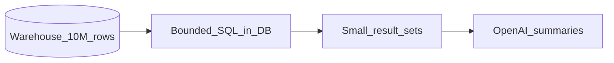

# Requirements Specification: Million-Row Scale for Kontexa Agents

| Field | Value |
|-------|--------|
| **Document ID** | KTX-SCALE-REQ-001 |
| **Status** | Draft — approved for implementation |
| **Source plan** | [scale_million-row_tables_d17c9a59.plan.md](file:///c:/Users/Parth's%20Lenovo/.cursor/plans/scale_million-row_tables_d17c9a59.plan.md) |
| **Scope** | Backend agent pipeline, warehouse connectors, scheduler, chat SQL path |
| **Out of scope (v1)** | Frontend changes, multi-region warehouse tuning, customer-facing billing for bytes scanned |

---

## 1. Purpose

Kontexa runs proactive analytics (6-hour `AgentScheduler` + manual `POST /api/agent/dashboard`) against tenant warehouses that may contain **10 million+ rows per table**. The system must remain **correct, cost-bounded, and timely** without sending raw bulk data to OpenAI.

This specification defines **what** must be true at scale. The companion [SCALE_IMPLEMENTATION_PLAN.md](./SCALE_IMPLEMENTATION_PLAN.md) defines **how** and **when** to build it.

---

## 2. Stakeholders and users

| Role | Need |
|------|------|
| **Platform / engineering** | Predictable warehouse cost, no OOM, scheduler finishes within 6h window |
| **Tenant admin** | Insights still generate on large datasets; no silent failures |
| **End user (executive inbox)** | Same API/UX; quality must not degrade because of scale shortcuts |
| **Finance / ops (future)** | Visibility into bytes scanned and run duration per tenant |

---

## 3. Definitions

| Term | Definition |
|------|------------|
| **Warehouse** | Tenant-connected BigQuery, Snowflake, or PostgreSQL |
| **Agent run** | One execution of `AgentOrchestrator.analyse(clientId)` |
| **Collected data** | Labelled SQL result sets (`CollectedData`) passed to LLM synthesis |
| **Scale tier** | `SMALL` / `MEDIUM` / `LARGE` derived from catalogue `rowCount` |
| **Bounded scan** | Query uses partition/date predicate and/or aggregation such that engine work scales with window or groups, not full table row export |
| **Query budget** | Max queries or wall-clock time allowed per tenant per run |

### 3.1 Scale tier thresholds (normative)

| Tier | `rowCount` | Notes |
|------|------------|--------|
| `SMALL` | &lt; 100,000 | Current behaviour permitted |
| `MEDIUM` | 100,000 – 1,000,000 | Stricter SQL; no raw `SELECT *` |
| `LARGE` | &gt; 1,000,000 | Aggregate-only agent path; heaviest guardrails |

Thresholds are **configurable** via `application.properties` (defaults above).

---

## 4. Current state summary (baseline)

### 4.1 Architecture (unchanged intent)



OpenAI **does not** receive millions of rows today. Risk is **warehouse scan cost**, **latency**, and **scheduler overrun**.

### 4.2 Known gaps (motivation)

| ID | Gap | Impact at 10M rows |
|----|-----|-------------------|
| G1 | `SELECT * … ORDER BY date LIMIT 100` without partition filter | Full or large sort scan |
| G2 | `GROUP BY` breakdowns without date `WHERE` | Full table aggregation |
| G3 | Anomaly `MIN/MAX/AVG` over entire column | Full column scan |
| G4 | `lookbackFilter` empty when `dataMax` missing | Unbounded history |
| G5 | `rowCount` in catalogue unused by agents | Same cost for 1K vs 10M |
| G6 | No query cost/row caps in connectors | Runaway SQL / memory |
| G7 | Sequential scheduler, no per-tenant budget | One tenant blocks all |
| G8 | RootCause free-form LLM SQL | Expensive exploratory scans |
| G9 | Chat path shares no scale guard | User-triggered full scans |

Reference: [SCALE_MILLION_ROW_TABLES.md](./SCALE_MILLION_ROW_TABLES.md).

---

## 5. Functional requirements

### 5.1 Scale classification (FR-SCALE)

| ID | Requirement | Priority |
|----|-------------|----------|
| **FR-SCALE-01** | System SHALL classify each catalogue table into `SMALL`, `MEDIUM`, or `LARGE` using stored `rowCount` at analysis time. | P0 |
| **FR-SCALE-02** | `TableContext` SHALL expose tier, `rowCount`, and resolved `AnalysisWindow` to all agents. | P0 |
| **FR-SCALE-03** | System SHOULD refresh `rowCount` from warehouse before LARGE-tier analysis when count is stale (&gt; 7 days) or zero. | P2 |
| **FR-SCALE-04** | LARGE `FACT` tables without a date column SHALL be skipped for time-series agents with a logged, non-fatal reason. | P1 |

### 5.2 SQL and warehouse execution (FR-SQL)

| ID | Requirement | Priority |
|----|-------------|----------|
| **FR-SQL-01** | MEDIUM and LARGE tiers SHALL NOT execute raw `SELECT *` sample queries. | P0 |
| **FR-SQL-02** | All MEDIUM/LARGE fact-table queries that scan metrics or dimensions SHALL include a date/window predicate when a date column exists. | P0 |
| **FR-SQL-03** | Default analysis window SHALL apply when catalogue `dataMax` is missing: 24 months (MEDIUM), 90 days (LARGE), configurable. | P0 |
| **FR-SQL-04** | Every agent-issued SQL SHALL pass through `WarehouseQueryGuard` before execution. | P1 |
| **FR-SQL-05** | Guard SHALL reject or rewrite queries that violate tier rules (e.g. `SELECT *` on LARGE, missing `LIMIT` on non-aggregate). | P1 |
| **FR-SQL-06** | BigQuery executions SHALL use dry-run; queries estimating above per-query byte cap SHALL be rejected. | P1 |
| **FR-SQL-07** | Connectors SHALL truncate result sets to a configurable max rows (default 500) regardless of SQL. | P0 |
| **FR-SQL-08** | LARGE tier RootCause SHALL use template drill-down SQL only, not LLM-generated arbitrary `SELECT`. | P2 |
| **FR-SQL-09** | Chat SQL (`CatalogueQueryService.executeSqlForChat`) SHALL use the same guard and caps as agents. | P1 |

### 5.3 Statistical profiles (FR-PROFILE)

| ID | Requirement | Priority |
|----|-------------|----------|
| **FR-PROFILE-01** | MEDIUM/LARGE tables SHALL use `TableProfileService` instead of 100-row raw samples. | P2 |
| **FR-PROFILE-02** | Profile SHALL include: row count, date range, top-N dimension counts, windowed metric aggregates (≤ 5 dims, ≤ 2 metrics per table per run). | P2 |
| **FR-PROFILE-03** | Profile output SHALL be labelled `PROFILE:` and included in LLM context in place of `Sample rows`. | P2 |

### 5.4 Anomaly detection (FR-ANOMALY)

| ID | Requirement | Priority |
|----|-------------|----------|
| **FR-ANOMALY-01** | MEDIUM/LARGE SHALL NOT use global row-level `MIN/MAX` over full columns for anomaly detection. | P1 |
| **FR-ANOMALY-02** | MEDIUM/LARGE SHALL detect anomalies on aggregated time buckets (e.g. monthly series from TrendAgent) or windowed approx percentiles. | P1 |
| **FR-ANOMALY-03** | LARGE tier MAY use template-only anomaly descriptions (no per-anomaly LLM call). | P3 |

### 5.5 Scheduler and multi-tenancy (FR-SCHED)

| ID | Requirement | Priority |
|----|-------------|----------|
| **FR-SCHED-01** | `AgentScheduler` SHALL enforce per-tenant wall-clock timeout (default 10 minutes). | P1 |
| **FR-SCHED-02** | Scheduler SHALL enforce per-tenant query budget (default 40 queries per run). | P1 |
| **FR-SCHED-03** | Scheduler SHOULD run tenant analysis concurrently with a bounded pool (default 3 workers). | P2 |
| **FR-SCHED-04** | System SHALL persist `agent_runs` metadata: clientId, startedAt, endedAt, queriesRun, bytesScanned (BQ), status, errorSummary. | P2 |
| **FR-SCHED-05** | On budget/timeout exceeded, run SHALL return partial insights with `errorMessage` explaining truncation. | P1 |
| **FR-SCHED-06** | FACT tables SHOULD be analysed before DIMENSION tables when star schema role is known. | P3 |

### 5.6 LLM payload (FR-LLM)

| ID | Requirement | Priority |
|----|-------------|----------|
| **FR-LLM-01** | LARGE tier synthesis prompts SHALL NOT include `Sample rows` datasets. | P1 |
| **FR-LLM-02** | Total formatted rows sent to synthesis SHALL NOT exceed configurable caps (default: 30 rows/dataset, 15 datasets). | P2 |
| **FR-LLM-03** | Insight quality rules (no invented categories, traceable numbers) SHALL remain unchanged. | P0 |

### 5.7 Metrics rollup layer (FR-ROLLUP) — Phase 4

| ID | Requirement | Priority |
|----|-------------|----------|
| **FR-ROLLUP-01** | System MAY maintain `daily_metric_rollups` in Kontexa DB per tenant/table/date/dimensions. | P3 |
| **FR-ROLLUP-02** | LARGE FACT agents SHALL prefer rollup source when available and fresh (&lt; 36h). | P3 |
| **FR-ROLLUP-03** | Rollup job SHALL be idempotent and safe to re-run. | P3 |

---

## 6. Non-functional requirements

### 6.1 Performance

| ID | Requirement | Target |
|----|-------------|--------|
| **NFR-PERF-01** | Single-tenant agent run on catalogue with one 10M-row FACT table | ≤ 10 min wall-clock (P95) after Phase 2 |
| **NFR-PERF-02** | Full scheduler cycle for 20 tenants, mixed sizes | Completes within 6h window (P95) |
| **NFR-PERF-03** | JVM heap per query result | ≤ 500 rows × column count; no unbounded lists |

### 6.2 Cost

| ID | Requirement | Target |
|----|-------------|--------|
| **NFR-COST-01** | BigQuery bytes scanned per query | ≤ 5 GB (configurable); reject over cap |
| **NFR-COST-02** | BigQuery bytes scanned per tenant run | ≤ 50 GB (configurable); stop run when exceeded |
| **NFR-COST-03** | No unbounded full-table scan for LARGE tier | 0 occurrences in logs/metrics |

### 6.3 Reliability

| ID | Requirement |
|----|-------------|
| **NFR-REL-01** | Failure of one tenant run SHALL NOT abort other tenants (when parallel). |
| **NFR-REL-02** | Guard rejection SHALL log SQL + reason; agent continues with other tables. |
| **NFR-REL-03** | Manual refresh and scheduled run SHALL use identical scale logic. |

### 6.4 Observability

| ID | Requirement |
|----|-------------|
| **NFR-OBS-01** | Logs SHALL include tier, tableName, query label, durationMs, rowsReturned, bytesScanned (if known). |
| **NFR-OBS-02** | `agent_runs` table SHALL be queryable for support/debugging. |

### 6.5 Security

| ID | Requirement |
|----|-------------|
| **NFR-SEC-01** | Guard SHALL only allow `SELECT` (no DML/DDL) from agents and chat. |
| **NFR-SEC-02** | SQL injection via LLM output remains mitigated by existing normalization + guard shape rules. |

---

## 7. Configuration parameters (defaults)

```properties
# Scale tiers
kontexa.scale.tier.medium-min-rows=100000
kontexa.scale.tier.large-min-rows=1000000

# Analysis windows (days)
kontexa.scale.window.medium-days=730
kontexa.scale.window.large-days=90

# Query guard
kontexa.scale.guard.max-result-rows=500
kontexa.scale.guard.max-limit-clause=500
kontexa.scale.guard.bigquery.max-bytes-per-query=5368709120
kontexa.scale.guard.bigquery.max-bytes-per-run=53687091200

# Scheduler
kontexa.scale.scheduler.tenant-timeout-minutes=10
kontexa.scale.scheduler.max-queries-per-tenant=40
kontexa.scale.scheduler.parallel-tenants=3

# Agent caps (LARGE)
kontexa.scale.large.max-metrics=2
kontexa.scale.large.max-dimensions=1
kontexa.scale.large.skip-root-cause=true
```

---

## 8. Acceptance criteria (release gates)

### Phase 1 gate

- [ ] LARGE table: zero `SELECT *` sample queries in logs for one full `analyse()` run
- [ ] Breakdown SQL on LARGE includes date `WHERE` in 100% of cases where date column exists
- [ ] Connector returns ≤ 500 rows even if SQL says `LIMIT 10000`
- [ ] Unit tests: `TableScalePolicy`, `AnalysisWindow` for BQ/SF/PG SQL fragments

### Phase 2 gate

- [ ] BigQuery dry-run rejects a synthetic 100GB-scan query
- [ ] Tenant run stops at query budget with partial result and clear `errorMessage`
- [ ] Anomaly on LARGE uses monthly bucket series only (no global MIN/MAX SQL)
- [ ] Scheduler processes 3 tenants concurrently without shared failure

### Phase 3 gate

- [ ] MEDIUM/LARGE use `PROFILE:` datasets; no `Sample rows` labels in collected data
- [ ] LARGE RootCause uses templates only

### Phase 4 gate

- [ ] Rollup-backed analysis on LARGE FACT completes with &lt; 10 warehouse queries
- [ ] Rollup refresh job documented and idempotent

---

## 9. Dependencies and assumptions

| Assumption | If false |
|------------|----------|
| Catalogue snapshot includes `rowCount` per table | Run COUNT at analysis time before tiering |
| Date column detectable via `KpiDetectorService` | LARGE FACT may be profile-only or skipped |
| BigQuery credentials allow dry-run API | Fall back to row/LIMIT guard only for BQ |
| Star schema roles populated for some tenants | Degrade to table order in catalogue JSON |
| OpenAI token limits remain &lt;&lt; warehouse size | No change required |

---

## 10. Risks and mitigations

| Risk | Mitigation |
|------|------------|
| Stricter windows miss long-term trends | MEDIUM uses 24mo; user can lower tier thresholds in config |
| Guard rejects valid LLM chat SQL | Clear error to user; prompt rules for aggregates |
| Parallel scheduler overloads warehouse | Configurable pool size; per-tenant query cap |
| Stale `rowCount` mis-classifies tier | Refresh on schedule; log effective tier |
| Phase 4 rollup drift | Freshness check; fallback to windowed SQL |

---

## 11. Traceability matrix (requirements → components)

| Requirement | Component |
|-------------|-----------|
| FR-SCALE-* | `TableScalePolicy`, `TableContext`, `AgentOrchestrator` |
| FR-SQL-* | `AnalysisWindow`, `WarehouseQueryGuard`, agents, connectors, chat |
| FR-PROFILE-* | `TableProfileService` |
| FR-ANOMALY-* | `AnomalyAgent`, `TrendAgent` integration |
| FR-SCHED-* | `AgentScheduler`, `agent_runs` entity/repo |
| FR-LLM-* | `AgentOrchestrator` prompt builders, `InsightNarrativeEnricher` |
| FR-ROLLUP-* | `MetricRollupService`, migration, agents |

---

## 12. Document history

| Version | Date | Author | Change |
|---------|------|--------|--------|
| 1.0 | 2026-05-21 | Kontexa engineering | Initial requirements from scale plan |
