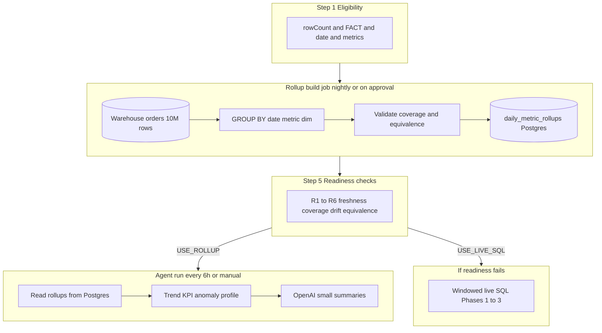
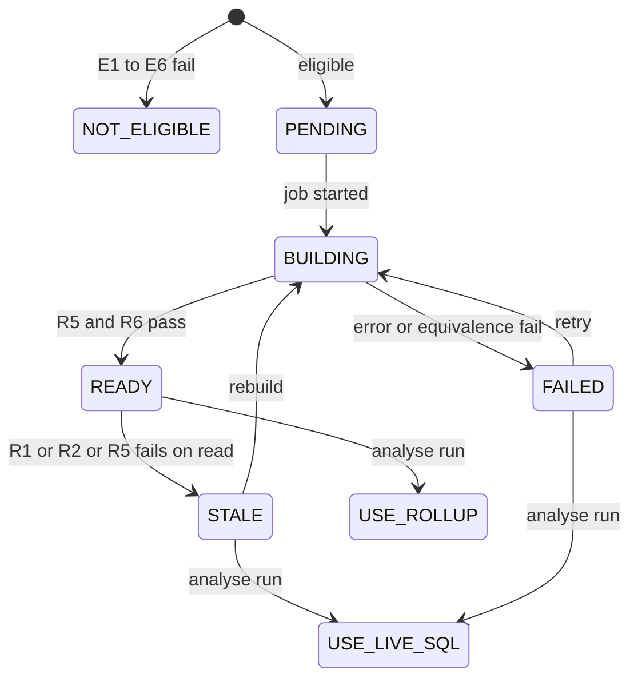

# How Rollups Work for Large Tables (10M+ Rows)

This document explains **what** rollups are, **on what rules** they are built, and **how** Kontexa analyzes huge tables without scanning millions of rows on every agent run.

**Related docs:**

- [SCALE_REQUIREMENTS_SPEC.md](./SCALE_REQUIREMENTS_SPEC.md) — formal requirements (§5.8 eligibility and readiness metrics)
- [SCALE_IMPLEMENTATION_PLAN.md](./SCALE_IMPLEMENTATION_PLAN.md) — phased build plan (Phase 4)
- [SCALE_MILLION_ROW_TABLES.md](./SCALE_MILLION_ROW_TABLES.md) — overall scale architecture

**Terminology:** **Rollup** = pre-aggregated metrics stored in Kontexa Postgres. This is **not** “rollback” (reverting deployments).

---

## Table of contents

1. [The problem we are solving](#1-the-problem-we-are-solving)
2. [What rollup is and is not](#2-what-rollup-is-and-is-not)
3. [End-to-end flow](#3-end-to-end-flow)
4. [Step 1 — When we decide to build rollups](#4-step-1--when-we-decide-to-build-rollups)
5. [Step 2 — What exactly we rollup](#5-step-2--what-exactly-we-rollup)
6. [Step 3 — What is not rolled up](#6-step-3--what-is-not-rolled-up)
7. [Step 4 — How the warehouse job touches 10M rows once](#7-step-4--how-the-warehouse-job-touches-10m-rows-once)
8. [Step 5 — When agents use rollups vs live SQL](#8-step-5--when-agents-use-rollups-vs-live-sql)
9. [Worked example: 10M orders table](#9-worked-example-10m-orders-table)
10. [How we avoid missing important data](#10-how-we-avoid-missing-important-data)
11. [Config knobs](#11-config-knobs)
12. [FAQ](#12-faq)

---

## 1. The problem we are solving

A tenant has `orders` with **10,000,000 rows**. Today:

- Each agent run issues many SQL queries against the warehouse.
- Some queries return only 10–100 rows to the JVM, but the **warehouse may still scan** a large part of the table (e.g. `SELECT * … ORDER BY date LIMIT 100`, `GROUP BY` without a date filter).
- OpenAI never sees 10M rows — but **cost, latency, and scheduler overrun** grow with table size.

**Goal:** Analyze the **full business picture** for a bounded time window **without** re-reading 10M rows every 6 hours.

---

## 2. What rollup is and is not

| Rollup is | Rollup is not |
|-----------|----------------|
| Pre-computed **daily (or weekly) aggregates** in Kontexa Postgres | A copy of 10M rows in our database |
| Built by a few **`GROUP BY`** queries in BigQuery/Snowflake/Postgres | Random sampling of 1% of rows |
| Read by agents as **thousands of summary rows** | Row-level export to OpenAI |
| Refreshed **daily or when stale** | Rebuilt on every “Refresh Insights” click |

**Core idea:**  
**All rows in the analysis window** contribute to `SUM` / `COUNT` / `AVG` during the **build** job.  
**Agent runs** read **summaries only** — they do not scan 10M rows again.

---

## 3. End-to-end flow



---

## 4. Step 1 — When we decide to build rollups

Rollups are **not** built for every table. **All** criteria must pass:

| ID | Criterion | Source | Threshold |
|----|-----------|--------|-----------|
| E1 | Scale tier | `TableScalePolicy` + catalogue `rowCount` | **LARGE** (≥ 1,000,000 rows) |
| E2 | Table role | Star schema / catalogue | **FACT** (not DIMENSION) |
| E3 | Date column | `KpiDetectorService` | Non-null (e.g. `order_date`) |
| E4 | Metric columns | Semantic enricher at approval | ≥ 1 column with `aggregationMethod` ∈ {SUM, COUNT, AVG} |
| E5 | Feature flag | Config | `kontexa.scale.rollup.enabled=true` |
| E6 | Warehouse reachable | `SignalReadinessChecker` | Same as agent run |

**If any fails:** do **not** build rollups; agents use **windowed live SQL** (Phases 1–3 of the scale plan).

---

## 5. Step 2 — What exactly we rollup

Selection is **deterministic** from the catalogue — not manual and not random.

### 5.1 Time

| Field | Rule |
|-------|------|
| **Window** | Last `kontexa.scale.window.large-days` days (default **90**), ending at `dataMax` or `MAX(date)` in warehouse |
| **Grain** | **Daily** by default; **weekly** or **monthly** if `dateGranularity` on the date column says so |

Only rows with `date` inside this window are included in aggregates.

### 5.2 Metrics (what we measure)

| Rule | Detail |
|------|--------|
| **Which columns** | Numeric columns where enricher set `aggregationMethod` to SUM, COUNT, or AVG |
| **How many** | Up to `kontexa.scale.large.max-metrics` (default **2**) |
| **Priority order** | `KpiDetectorService` keyword score (revenue, orders, units, etc.) |

Examples: `total_revenue` → SUM, `order_id` → COUNT.

### 5.3 Dimensions (how we slice)

| Rule | Detail |
|------|--------|
| **Which columns** | String/categorical columns matching dimension keywords (region, category, channel, …) |
| **How many** | Up to **3** dimensions (configurable cap in spec) |
| **Storage** | Each rollup row includes `dimension_key` + `dimension_value` (e.g. `product_category` = `Electronics`) |

### 5.4 One warehouse query per (metric × dimension)

For each selected metric and each selected dimension (plus optional **table-level** series with no dimension):

```sql
SELECT
  DATE(order_date) AS metric_date,
  product_category AS dimension_value,
  SUM(total_revenue) AS metric_value
FROM orders
WHERE order_date >= @window_start
  AND order_date <= @window_end
GROUP BY 1, 2
```

**Every row** in the window contributes to `SUM` / `COUNT` — nothing inside the window is excluded for that metric.

Result size: roughly  
`days_in_window × cardinality_of_dimension`  
(e.g. 90 × 50 categories ≈ thousands of rows, not millions).

### 5.5 Stored shape (Postgres)

One row per:

`(client_id, table_name, metric_date, dimension_key, dimension_value, metric_name, metric_value, agg_type, built_at)`

---

## 6. Step 3 — What is not rolled up

“No data left untouched” must be understood precisely:

| Statement | True? |
|-----------|-------|
| Every **row in the window** counts toward SUM/COUNT for **built metrics** | **Yes** |
| Every **column** in the table is rolled up | **No** |
| All **history** (entire 10M rows) is in the rollup window | **No** — only last N days (default 90) for LARGE |
| Row-level detail (single order_id, notes) is kept | **No** — by design |

**Intentionally out of scope:**

| Data | Reason | How insights still work |
|------|--------|-------------------------|
| Columns with `aggregationMethod = NONE` | IDs, flags, free text | Not KPIs; profile or rare live SQL |
| 4th+ dimension | Cardinality / cost | Top 3 only; optional live breakdown if query budget allows |
| Rows outside time window | Cost cap on LARGE | Widen window in config or use MEDIUM tier |
| DIMENSION tables | Usually small | Join or light live query |
| Rare edge segments | Sparse GROUP BY | Dominated by top-N in LLM context |

This matches how analytics teams build a **semantic layer**: full scan **once** per window, serve **aggregates** repeatedly.

---

## 7. Step 4 — How the warehouse job touches 10M rows once

The 10M table may span years. Typically only **part** of it falls in the 90-day window (e.g. 3M rows). The rollup job:

1. Applies `WHERE date >= window_start` (partition-friendly when the table is partitioned on date).
2. Runs **GROUP BY** — the engine aggregates all matching rows in one pass per query.
3. Writes **summary rows** to Postgres.
4. Runs **validation** (see §8).

**Agent runs after that:** read Postgres only — **0** full-table scans for trend/KPI/breakdown on the happy path.

**Steady-state warehouse queries per LARGE FACT table per agent run:** target **0–3** (validation only).  
**During rollup rebuild:** about **6–10** `GROUP BY` queries (see §9).  
Hard cap: `kontexa.scale.rollup.max-warehouse-queries-per-table` (default **10**).

---

## 8. Step 5 — When agents use rollups vs live SQL

`RollupReadinessEvaluator` returns **`USE_ROLLUP`** or **`USE_LIVE_SQL`**. All checks must pass for rollup:

| ID | Metric | Pass threshold (default) |
|----|--------|---------------------------|
| R1 | **Freshness** | Last build ≤ **36** hours ago |
| R2 | **Date coverage** | Rollup has rows for ≥ **85%** of days in window |
| R3 | **Metric coverage** | **100%** of required metrics present |
| R4 | **Build status** | `READY` (not `BUILDING`, `FAILED`, `STALE`) |
| R5 | **Volume sanity** | \|rollup-implied count − `COUNT(*)`\| / `COUNT(*)` ≤ **5%** |
| R6 | **Equivalence** (at build) | Monthly total from rollup within **0.1%** of one windowed warehouse query per metric |

| Outcome | Behaviour |
|---------|-----------|
| All pass | Agents read `daily_metric_rollups`; trends, KPIs, anomalies from summary series |
| Any fail | Log reason (`ROLLUP_STALE`, `ROLLUP_INCOMPLETE`, …); **fallback** to windowed live SQL (Phases 1–3) |



---

## 9. Worked example: 10M orders table

### Assumptions

| Field | Value |
|-------|--------|
| Total rows | 10,000,000 |
| Rows in last 90 days | ~3,000,000 |
| Date column | `order_date` |
| Metrics | `total_revenue` (SUM), `order_id` (COUNT) |
| Dimensions | `product_category` (~50 values), `region` (~10 values) |

### Rollup build (warehouse — once per day or when stale)

| # | Query purpose | Approx. rows stored |
|---|---------------|---------------------|
| 1 | SUM revenue by day (no dimension) | 90 |
| 2 | SUM revenue by day × category | ~2,000–4,000 (sparse) |
| 3 | SUM revenue by day × region | ~900 |
| 4 | COUNT orders by day | 90 |
| 5 | COUNT orders by day × category | ~2,000–4,000 |
| 6 | COUNT orders by day × region | ~900 |

**Warehouse:** ~6 `GROUP BY` passes over **~3M rows in window**, not 10M on every insight run.  
**Postgres:** low thousands of rows total.

### Agent run (every 6 hours — reads Postgres)

| Insight need | Source |
|--------------|--------|
| Revenue trend | 90 daily points from rollup |
| Revenue by category | Rollup rows → top 10 for LLM |
| MoM change | Compare last two months from rollup series |
| Anomaly | Z-score on **monthly** aggregates (12 points), not MIN/MAX over 10M |
| OpenAI input | Hundreds of cells, not millions |

---

## 10. How we avoid missing important data

| Risk | Mitigation |
|------|------------|
| Wrong metrics chosen | Semantic enricher + KPI detector; only SUM/COUNT/AVG |
| Window too short | Configurable `large-days`; MEDIUM tier uses longer window |
| Missing days in rollup | R2 coverage ≥ 85%; else live SQL |
| Rollup out of date | R1 freshness; nightly rebuild |
| Silent row loss | R5 compare to `COUNT(*)` in same window |
| Wrong math | R6 equivalence vs warehouse at build time |
| Need row-level detail | Phase 3 profile (COUNT, top-5 categories) or bounded live SQL |
| LLM invents categories | Unchanged fidelity rules; only rollup labels in prompts |

---

## 11. Config knobs

```properties
# Enable Phase 4 rollups (off until implemented)
kontexa.scale.rollup.enabled=false

# Analysis window for LARGE (used during build)
kontexa.scale.window.large-days=90

# Readiness thresholds (§8)
kontexa.scale.rollup.max-age-hours=36
kontexa.scale.rollup.min-coverage-pct=85
kontexa.scale.rollup.max-count-drift-pct=5
kontexa.scale.rollup.equivalence-max-relative-error=0.001

# Caps (aligned with LARGE agent caps)
kontexa.scale.large.max-metrics=2
kontexa.scale.large.max-dimensions=3

# Gate: max warehouse queries per table per run when using rollups
kontexa.scale.rollup.max-warehouse-queries-per-table=10
```

---

## 12. FAQ

### Does rollup send 10M rows to OpenAI?

**No.** OpenAI receives only aggregated summaries (trends, top segments, KPI deltas) — same principle as today, with cheaper reads from Postgres.

### If we only rollup 90 days, do we ignore older data?

For **LARGE** tier, yes — by policy (cost). Longer history requires config change or MEDIUM tier behaviour. Insights focus on **recent** business decisions.

### How is this different from Phase 1–3 without rollups?

| | Phase 1–3 (live SQL) | Phase 4 (rollups) |
|--|----------------------|-------------------|
| When warehouse scans | Every agent run | Mainly rollup build job |
| Queries per run | ~15–25 per table | 0–3 on steady state |
| Window | 90-day `WHERE` on each query | Same window, baked into rollup once |

Phases 1–3 must be in place first so **fallback** live SQL is safe.

### What if rollup and live SQL disagree?

Build fails R6 → status `FAILED` → agents use **live SQL** until rebuild succeeds. Runtime R5 drift → mark `STALE`, rebuild, use live SQL for that run.

### Implementation order

1. **Phase 1** — tiers, date windows, no raw `SELECT *` on LARGE  
2. **Phase 2** — query guard, scheduler budgets, bucketed anomaly  
3. **Phase 3** — table profiles, template root cause  
4. **Phase 4** — this rollup layer (this document)

---

## Document history

| Version | Date | Change |
|---------|------|--------|
| 1.0 | 2026-05-21 | Initial doc: rules, flow, 10M orders example, readiness metrics |
