# Architecture B Elimination: Runtime Dependency Graph & Deletion Plan

Analysis only — no code changes. Based on current `DecisionRuntime` wiring and static reference tracing across `src/main/java`.

**Target end state:**

```
Question → RegistryResolutionBundle → SemanticCatalog → AnalysisPlan
        → AnalysisPlanSqlGenerator → Warehouse → Materialization → Narrative
```

**Architecture B (legacy NYC path) to eliminate:**

```
SemanticDictionary → DomainOntology → HardMetricMappings → MetricFallbackHierarchy
→ DatasetProfileRegistry → FallbackAnalyticalHeuristics → CandidateAnalysisGenerator
(+ satellites: QueryEntityResolver, ExploratoryAnalysisPlanner, MultiCandidateInterpretationEngine, etc.)
```

---

## 1. Runtime entry points into Architecture B

### Production (every user question)

| Entry | Path |
|-------|------|
| **Primary** | `POST /api/decision/v1/run` → `DecisionController.executeRun()` → `DecisionRuntime.execute()` |

There is no other production path that executes the full decision pipeline. `GET /api/decision/v1/run/{runId}` only polls status/trace.

### Secondary (dev / validation — not user-facing analytics)

| Entry | Path | B components touched |
|-------|------|------------------------|
| `ValidationController` | `SemanticParserValidationHarness.runAll()` | `SemanticAnalyticalParser` → `QueryEntityResolver` → `SemanticDictionary` |

### Important structural fact

Architecture A and B are **not mutually exclusive branches**. They run **in parallel inside Stage 2b** (`AnalyticalQuestionResolver.resolveFull`). SQL is generated from Architecture A (`AnalysisPlan`), but Architecture B still:

- Produces `ResolvedAnalyticalQuestion` (metric labels, grouping, exploratory flags)
- Feeds `InvestigationPlan` via `AnalyticalPlanningEngine`
- Generates parallel `AnalyticalCandidate` hypotheses
- Can **override materialized results** via `CandidateExecutionOrchestrator`
- Contaminates semantics upstream via `SemanticDictionary` before `UniversalAnalysisPlanner` runs

---

## 2. Exact call graph from `DecisionRuntime`

```mermaid
flowchart TD
    DR[DecisionRuntime.execute]

  subgraph stage1 [Stage 1]
    IR[IntentResolver]
    PR[PlaybookRouter]
  end

  subgraph stage2 [Stage 2]
    RR[RegistryResolver → RegistryResolutionBundle]
  end

  subgraph stage2b [Stage 2b — DUAL PATH]
    AQR[AnalyticalQuestionResolver.resolveFull]

    subgraph pathA [Architecture A]
      QIP[QuestionInvestigationPlanner]
      SCb[SemanticCatalogBuilder / SchemaDrivenQuestionResolver]
      UAP[UniversalAnalysisPlanner → AnalysisPlan]
      MRE[MetricResolutionEngine]
    end

    subgraph pathB [Architecture B]
      EAP[ExploratoryAnalysisPlanner]
      CAG[CandidateAnalysisGenerator]
      MCIE[MultiCandidateInterpretationEngine]
      FAH[FallbackAnalyticalHeuristics]
      SFD[SemanticFallbackDictionary]
      SAP[SemanticAnalyticalParser]
      AD[AmbiguityDetector]
      DO[DomainOntology]
      MFH[MetricFallbackHierarchy]
      SSV[SoftSemanticValidator]
      QVC[QueryViabilityChecker]
    end

    subgraph contam [B contamination of A inputs]
      QSE[QuestionSemanticExtractor]
      SD[SemanticDictionary]
      QER[QueryEntityResolver]
      MSR[MetricSemanticRegistry]
      DAD[DomainAnalyticalDefaults]
      SQR[SemanticQueryRewriter]
      STE[SemanticTransformationEngine]
      DPR[DatasetProfileRegistry]
    end

    ARP[AnalyticalReasoningPlanner]
    DDR[DerivedDimensionRegistry]
  end

  subgraph stage3 [Stage 3]
    APE[AnalyticalPlanningEngine]
    QDE[QueryDecompositionEngine — uses DAD + MSR]
    IP[InvestigationPlan — from ResolvedAnalyticalQuestion B output]
  end

  subgraph stage35 [Stage 3.5 — SQL fork]
    CAG2[CandidateAnalysisGenerator.generate — B again]
    DAQP[DeterministicAnalyticalQueryPlanner]
    APSG[AnalysisPlanSqlGenerator — A SQL]
    ASTE[AnalyticalSqlTemplateEngine.generate]
  end

  subgraph stage5 [Stage 5]
    ASE[AnalyticalSqlExecutionService]
    WE[WarehouseExecutor]
  end

  subgraph stage5a [Stage 5a — B override]
    CEO[CandidateExecutionOrchestrator]
    CME[CandidateMaterializationExecutor]
  end

  subgraph downstream [Stages 6–11 — B metadata persists]
    IDE[IntentDrivenComputationFramework]
    QRV[QuestionResultValidator]
    MGO[MetricGovernanceOrchestrator]
    ARA[AnalyticalResponseAssembler]
    HNF[HumanNarrativeFormatter / BusinessSemanticAliases]
  end

  DR --> IR --> PR
  DR --> RR
  DR --> AQR

  AQR --> QIP
  AQR --> QSE
  AQR --> MRE
  AQR --> ARP
  AQR --> SQR
  AQR --> UAP
  AQR --> EAP

  QSE --> QER --> SD
  QSE --> SCb
  QIP --> QSE
  QIP --> QER
  MRE --> MSR --> DAD
  ARP --> DDR
  SQR --> STE --> DPR

  EAP --> CAG
  EAP --> MCIE
  EAP --> MFH
  EAP --> MSR
  EAP --> SSV --> QVC --> MFH
  CAG --> SAP
  CAG --> MCIE
  CAG --> FAH
  CAG --> QER
  MCIE --> SAP
  MCIE --> FAH
  MCIE --> AD --> DO
  FAH --> SFD
  FAH --> QER
  DO --> DAD

  DR --> APE --> QDE
  DR --> CAG2
  DR --> DAQP --> APSG --> STE
  APSG --> ASTE
  DR --> ASE --> WE
  DR --> CEO --> CME
  DR --> IDE
  DR --> ARA --> HNF
```



### Stage-by-stage B touchpoints in `DecisionRuntime`

| Stage | Approx. lines | B involvement |
|-------|---------------|---------------|
| 2b | ~215 | `resolveFull` runs entire B subtree |
| 3 | ~239 | `InvestigationPlan` built from `ResolvedAnalyticalQuestion` (B output) |
| 3.5 | ~251 | `candidateGenerator.generate()` — full B candidate engine |
| 3.5 | ~283 | `deterministicPlanner.plan(analysisPlan)` — **A SQL** (but transforms may use `DatasetProfileRegistry`) |
| 5a | ~335 | `candidateOrchestrator.executeAndSelect()` — B can replace materialization |
| 6+ | ~363–566 | `resolvedQuestion`, `investigationPlan`, `analyticalCandidates` feed validation, governance, narrative |

### `AnalyticalQuestionResolver.resolveFull` internal order

```
investigationPlanner.plan()          → A shell, B via QueryEntityResolver
semanticExtractor.extract()          → hybrid: catalog + SemanticDictionary
overlayInvestigationSemantics()
metricResolutionEngine.resolve()     → A + MetricSemanticRegistry (NYC defaults)
reasoningPlanner.plan()              → DerivedDimensionRegistry (NYC concepts)
queryRewriter.collectTraceSteps()    → SemanticTransformationEngine → DatasetProfileRegistry
universalAnalysisPlanner.plan()      → AnalysisPlan (A)
exploratoryPlanner.plan()            → full B stack → ResolvedAnalyticalQuestion
```

---

## 3. Component classification

Legend:

- **REQ** — required for current behavior
- **OPT** — optional enrichment
- **FB** — fallback-only
- **DEAD** — no runtime callers on hot path
- **CRIT** — production-critical today (even if wrong architecturally)

### Core Architecture B (user-named)

| Component | Classification | Notes |
|-----------|----------------|-------|
| `SemanticDictionary` | **CRIT** (contamination) | Every question; poisons entity extraction before catalog overlay |
| `DomainOntology` | **FB** | Always returns `NYC_TAXI`; only via `AmbiguityDetector` |
| `HardMetricMappings` | **FB** | SQL template fallbacks + `DatasetProfileRegistry` + `SchemaColumnDetector` |
| `MetricFallbackHierarchy` | **CRIT** (B path) | `ExploratoryAnalysisPlanner`, `SoftSemanticValidator`, hard `total_amount` fallback |
| `DatasetProfileRegistry` | **CRIT** (A path too) | Activated when `tableRef != null` — contaminates **Architecture A SQL transforms** |
| `FallbackAnalyticalHeuristics` | **FB** | Weekend/tip/distance NYC heuristics |
| `CandidateAnalysisGenerator` | **CRIT** | Called twice per run; hardcoded `total_amount` impact templates |

### B satellites (part of the same system)

| Component | Classification |
|-----------|----------------|
| `QueryEntityResolver` | **CRIT** — thin wrapper over `SemanticDictionary` |
| `SemanticFallbackDictionary` | **FB** |
| `AmbiguityDetector` | **FB** |
| `MultiCandidateInterpretationEngine` | **CRIT** |
| `ExploratoryAnalysisPlanner` | **CRIT** |
| `SemanticAnalyticalParser` | **CRIT** |
| `ContributionQuestionParser` | **CRIT** (via parser) |
| `DimensionImpactParser` | **CRIT** (via parser) |
| `SoftSemanticValidator` | **CRIT** |
| `QueryViabilityChecker` | **CRIT** (via soft validator) |
| `HybridExecutionPolicy` | **CRIT** (via exploratory planner) |
| `CandidateExecutionOrchestrator` | **CRIT** — can override A results |
| `CandidateMaterializationExecutor` | **CRIT** (via orchestrator) |
| `AnalyticalExplorationPolicy` | **OPT** — constants used by B + presentation |
| `ProvisionalFindingBuilder` | **OPT** — exploratory presentation |
| `DomainAnalyticalDefaults` | **CRIT** — NYC profile inference; also feeds A governance |
| `MetricSemanticRegistry` | **CRIT** — hardcoded taxi metric contracts; used by A `MetricResolutionEngine` |
| `DerivedDimensionRegistry` | **FB** on A transform path — NYC weekend/distance/airport concepts |
| `BucketizationEngine` | **FB** — taxi distance/fare/tip buckets |
| `SchemaColumnDetector` | **FB** — `pickup_datetime` preference, `HardMetricMappings.DISTANCE_DIMENSION` |
| `SemanticTransformationEngine` | **REQ** (generic) + **FB** (NYC branches) |
| `DimensionBucketingSql` | **FB** — taxi bucket SQL expressions |
| `AnalyticalSqlTemplateEngine.detectIntent/detectDimension` | **DEAD** on hot path |
| `HumanNarrativeFormatter` | **CRIT** (presentation) |
| `BusinessSemanticAliases` | **CRIT** (presentation) |
| `RevenueCompositionAnalyzer` | **OPT** — taxi revenue narrative |

### Hybrid components (A shell, B inside)

| Component | Classification |
|-----------|----------------|
| `QuestionSemanticExtractor` | **CRIT** — catalog-first but dictionary fallback |
| `QuestionInvestigationPlanner` | **CRIT** — schema-driven but uses `QueryEntityResolver` |
| `AnalyticalQuestionResolver` | **CRIT** — orchestrates both paths |
| `QueryDecompositionEngine` | **CRIT** — `InvestigationPlan` uses B-resolved assumptions |
| `AnalysisPlanSqlGenerator` | **CRIT** (A) — but `buildGrouped()` calls `SemanticTransformationEngine` → `DatasetProfileRegistry` |

---

## 4. Per-class deletion plan

For each class: **Remove now?** / **What breaks?** / **Architecture A replacement**

### `SemanticDictionary`

- **Remove now?** No — not until `QueryEntityResolver` and all dictionary loops in `QuestionSemanticExtractor` are removed.
- **Breaks:** `QueryEntityResolver`, `QuestionSemanticExtractor.matchWithWordBoundaries()`, `matchFragment()` fallback, all parsers using entity resolver.
- **Replacement:** `SemanticCatalog` + `CatalogQuestionMatcher` + `SchemaDrivenMetricResolver` (already exist).

### `QueryEntityResolver`

- **Remove now?** No — still injected into 6+ classes.
- **Breaks:** `QuestionSemanticExtractor`, `QuestionInvestigationPlanner`, `SemanticAnalyticalParser`, `FallbackAnalyticalHeuristics`, `CandidateAnalysisGenerator`, `ContributionQuestionParser`, `DimensionImpactParser`.
- **Replacement:** Catalog column matching only (`SchemaDrivenQuestionResolver`, `CatalogQuestionMatcher`).

### `DomainOntology`

- **Remove now?** Yes, after `AmbiguityDetector` is removed.
- **Breaks:** `AmbiguityDetector.detect()` NYC candidate generation; `resolveGrouping()` taxi columns.
- **Replacement:** `AnalysisPlan.dimension()` / registry dimension descriptors.

### `HardMetricMappings`

- **Remove now?** No — still referenced by `ComparisonSqlTemplate`, `TrendSqlTemplate`, `DatasetProfileRegistry`, `SchemaColumnDetector`, dead `detectDimension()`.
- **Breaks:** SQL template temporal fallbacks (`pickup_datetime`), profile defaults (`total_amount`, `trip_distance`).
- **Replacement:** Registry bundle timestamp columns + `AnalysisPlan` metric/dimension fields; templates should use `TemplateContext` values only.

### `MetricFallbackHierarchy`

- **Remove now?** No — until `ExploratoryAnalysisPlanner` + `SoftSemanticValidator` removed.
- **Breaks:** Metric coercion to `total_amount`; `listAvailable()` in clarification options.
- **Replacement:** `RegistryResolutionBundle.metrics()` first-match or block with `AnalysisPlan.blocked()`.

### `DatasetProfileRegistry`

- **Remove now?** No — **blocks Architecture A** today via `SemanticTransformationEngine`.
- **Breaks:** All grouped SQL transforms; trace steps from `SemanticQueryRewriter`.
- **Replacement:** `RegistryResolutionBundle` entity profile (table ref + column roles from registry, not question keywords).

### `FallbackAnalyticalHeuristics`

- **Remove now?** Yes, with `CandidateAnalysisGenerator` / `MultiCandidateInterpretationEngine`.
- **Breaks:** Heuristic candidate hypotheses only.
- **Replacement:** None — single `AnalysisPlan` is the hypothesis.

### `SemanticFallbackDictionary`

- **Remove now?** Yes, with `FallbackAnalyticalHeuristics`.
- **Breaks:** Phrase→column fallback mappings.
- **Replacement:** `SemanticCatalog` token match.

### `CandidateAnalysisGenerator`

- **Remove now?** Yes, after `DecisionRuntime` stops calling it (~lines 251, and inside `ExploratoryAnalysisPlanner`).
- **Breaks:** Multi-hypothesis generation; NYC `total_amount` impact templates.
- **Replacement:** `AnalysisPlan` (one plan per question).

### `MultiCandidateInterpretationEngine`

- **Remove now?** Yes, with exploratory stack.
- **Breaks:** Ranked interpretation list, ambiguity alternatives.
- **Replacement:** `UniversalAnalysisPlanner` + optional clarification from blocked `AnalysisPlan`.

### `ExploratoryAnalysisPlanner`

- **Remove now?** No — not until `ResolvedAnalyticalQuestion` has a non-B producer.
- **Breaks:** `AnalyticalQuestionResolver.resolveFull()`; `ResolvedAnalyticalQuestion` (metric, grouping, exploratory flags); `InvestigationPlan` assumptions.
- **Replacement:** Derive presentation metadata from `AnalysisPlan` + `MetricResolution` directly.

### `AmbiguityDetector`

- **Remove now?** Yes, with multi-candidate engine.
- **Breaks:** Alternative NYC metric interpretations (`revenue_per_mile`, `fare_amount`, etc.).
- **Replacement:** Registry ambiguity → clarification response, not parallel plans.

### `SemanticAnalyticalParser` (+ `ContributionQuestionParser`, `DimensionImpactParser`)

- **Remove now?** Yes for runtime; keep only if validation harness is retained separately.
- **Breaks:** Exploratory parse path; `SemanticParserValidationHarness`.
- **Replacement:** `SchemaDrivenQuestionResolver` + `UniversalAnalysisPlanner`.

### `SoftSemanticValidator` / `QueryViabilityChecker` / `HybridExecutionPolicy`

- **Remove now?** Yes, with `ExploratoryAnalysisPlanner`.
- **Breaks:** Confidence penalties, hybrid execution mode, exploratory notes.
- **Replacement:** `AnalysisPlan.executable()` + `InsufficientEvidenceGuard`.

### `CandidateExecutionOrchestrator` (+ `CandidateMaterializationExecutor`, `CandidateResultScorer`)

- **Remove now?** Yes, after removing `DecisionRuntime` Stage 5a (~335–350).
- **Breaks:** Winner selection overriding `executionFindings.materializedResult()`.
- **Replacement:** `IntentDrivenComputationFramework` materializing **A SQL results only**.

### `DomainAnalyticalDefaults`

- **Remove now?** No — still used by `MetricSemanticRegistry`, `QueryDecompositionEngine`, `DomainOntology`.
- **Breaks:** Revenue column inference (`total_amount`), distance buckets, NYC domain key.
- **Replacement:** Registry metric descriptors (aggregation type, unit, display label per tenant dataset).

### `MetricSemanticRegistry`

- **Remove now?** No — used by A path (`MetricResolutionEngine`, governance).
- **Breaks:** Metric validation, contribution bindings, display labels.
- **Replacement:** Registry-driven `MetricDescriptor` semantics (partially exists in bundle); delete hardcoded `buildDefaults()` taxi entries.

### `DerivedDimensionRegistry` / `BucketizationEngine` / `DimensionBucketingSql`

- **Remove now?** Partial — delete NYC-specific concepts (`TRIP_DISTANCE_BUCKET`, `AIRPORT_RIDE`, `weekend_flag` derivations) before deleting classes.
- **Breaks:** Derived dimension SQL for taxi buckets/weekend/airport.
- **Replacement:** Schema-aware derivation from registry column types (timestamp → hour, numeric → generic quantile buckets) — **not yet built**; until then, identity column grouping from `AnalysisPlan.dimension()`.

### `SemanticTransformationEngine`

- **Remove now?** No — required by `AnalysisPlanSqlGenerator.buildGrouped()`.
- **Breaks:** Grouped SQL generation on Architecture A path.
- **Replacement:** Slim engine: identity column or registry-declared transforms only; no `DatasetProfileRegistry`, no `airport_fee` branch.

### `AnalyticalSqlTemplateEngine.detectIntent()` / `detectDimension()`

- **Remove now?** **Yes immediately** — zero production callers.
- **Breaks:** Nothing on hot path; diagnostic tests reference conceptually.
- **Replacement:** Already replaced by `UniversalAnalysisPlanner` + `AnalysisPlan.intent()`.

### `HumanNarrativeFormatter` / `BusinessSemanticAliases` / `RevenueCompositionAnalyzer`

- **Remove now?** No — presentation still depends on them.
- **Breaks:** Executive narrative, table headers, revenue composition blurbs.
- **Replacement:** Labels from `AnalysisPlan` + registry `MetricDescriptor.displayLabel()` + column humanization (`SemanticCatalogBuilder.humanize`).

---

## 5. Ordered deletion plan (implementation phases)

### Phase 0 — Stop parallel B execution (highest leverage, lowest risk to SQL)

1. Remove `candidateGenerator.generate()` call from `DecisionRuntime` (~251).
2. Remove `candidateOrchestrator.executeAndSelect()` block (~335–350).
3. Stop calling `exploratoryPlanner.plan()` in `AnalyticalQuestionResolver`; produce `ResolvedAnalyticalQuestion` from `AnalysisPlan` + `MetricResolution` instead.
4. Delete **DEAD**: `AnalyticalSqlTemplateEngine.detectIntent/detectDimension`.

**After Phase 0:** SQL path unchanged (A). B no longer overrides results or generates parallel hypotheses. Narrative may still show taxi labels until Phase 2–3.

### Phase 1 — Delete B interpretation stack (safe once Phase 0 done)

| Delete | Dependents already severed in Phase 0 |
|--------|--------------------------------------|
| `CandidateAnalysisGenerator` | `DecisionRuntime`, `ExploratoryAnalysisPlanner` |
| `MultiCandidateInterpretationEngine` | exploratory planner |
| `FallbackAnalyticalHeuristics` | candidate generator |
| `SemanticFallbackDictionary` | heuristics |
| `AmbiguityDetector` | multi-candidate engine |
| `DomainOntology` | ambiguity detector |
| `SemanticAnalyticalParser`, `ContributionQuestionParser`, `DimensionImpactParser` | candidate + multi-candidate |
| `SoftSemanticValidator`, `QueryViabilityChecker`, `HybridExecutionPolicy` | exploratory planner |
| `ExploratoryAnalysisPlanner` | `AnalyticalQuestionResolver` |
| `CandidateExecutionOrchestrator` + materialization/scorer | `DecisionRuntime` |
| `SemanticParserValidationHarness` + controller endpoint | optional dev tooling |

### Phase 2 — Remove dictionary contamination from A inputs

1. Gut `SemanticDictionary` usage from `QuestionSemanticExtractor` — catalog-only entity resolution.
2. Delete `QueryEntityResolver` + `SemanticDictionary`.
3. Remove `QueryEntityResolver` from `QuestionInvestigationPlanner` entity phrase extraction.
4. Refactor `MetricFallbackHierarchy` out of any remaining callers; delete class.

**Replacement wiring:** `SchemaDrivenQuestionResolver` becomes sole phrase→column resolver.

### Phase 3 — Purge NYC from SQL transform layer (A path cleanup)

1. Delete `DatasetProfileRegistry`.
2. Refactor `SemanticTransformationEngine` to use registry columns only (identity transform default).
3. Delete `HardMetricMappings`; fix `ComparisonSqlTemplate` / `TrendSqlTemplate` to require explicit timestamp from `TemplateContext` (from `AnalysisPlan`).
4. Delete or genericize `DerivedDimensionRegistry` NYC concepts, `BucketizationEngine` taxi buckets, `DimensionBucketingSql` taxi expressions, `SchemaColumnDetector` hardcoded fallbacks.

### Phase 4 — Collapse dual planning objects

1. `InvestigationPlan` should derive from `AnalysisPlan`, not `ResolvedAnalyticalQuestion.assumption()`.
2. Delete `QueryDecompositionEngine` NYC inference (`DomainAnalyticalDefaults` in `inferMetric`/`inferDimension`).
3. Replace `MetricSemanticRegistry.buildDefaults()` taxi contracts with registry bundle descriptors.

### Phase 5 — Narrative layer

1. Delete `BusinessSemanticAliases` taxi mappings.
2. Delete `RevenueCompositionAnalyzer` or make generic share-of-total from materialized rows.
3. Rewire `HumanNarrativeFormatter` to `AnalysisPlan` labels only.

### Phase 6 — Test & doc cleanup

- Update/delete: `NycTaxiAnalyticalSqlGoldenTest`, `PipelineFailurePathDiagnosticTest` legacy path assertions.
- Update `docs/dataset-agnostic-architecture-audit.md` once executed.

---

## 6. What can be removed immediately vs what blocks the goal

| Can remove immediately (no hot-path callers) | Cannot remove yet (still on A or presentation path) |
|---------------------------------------------|------------------------------------------------------|
| `AnalyticalSqlTemplateEngine.detectIntent/detectDimension` | `DatasetProfileRegistry` (A SQL transforms) |
| Nothing else safely without Phase 0 wiring | `SemanticTransformationEngine` (required by A) |
| | `MetricSemanticRegistry` / `DomainAnalyticalDefaults` (governance + resolution) |
| | `SemanticDictionary` (still poisons semantics) |
| | `ExploratoryAnalysisPlanner` (still produces `ResolvedAnalyticalQuestion`) |

---

## 7. Risk summary

| Risk if B deleted without replacements | Mitigation |
|----------------------------------------|------------|
| Empty `ResolvedAnalyticalQuestion` breaks `InvestigationPlan`, trace seeding, presentation | Phase 0: map from `AnalysisPlan` first |
| Grouped SQL loses bucket derivations | Phase 3: identity grouping from registry columns |
| Governance rejects findings | Phase 4: registry-driven metric contracts |
| NYC golden tests fail | Expected; replace with schema-driven golden tests (e.g. `StudentDatasetExecutionTraceTest` pattern) |

---

## 8. Target vs current SQL authority

| Concern | Current authority | After cleanup |
|---------|-------------------|---------------|
| Which SQL runs | `AnalysisPlan` → `AnalysisPlanSqlGenerator` | Same |
| Which metric/dimension labels reach UI | `ExploratoryAnalysisPlanner` → `ResolvedAnalyticalQuestion` | `AnalysisPlan` + registry |
| Which result gets materialized | A SQL rows, unless B candidate wins Stage 5a | A SQL rows only |
| Entity resolution for unseen datasets | Dictionary may hijack before catalog | Catalog only |

The student-dataset trace already proves Architecture A can answer ranking questions without new Java. Architecture B remains dangerous because it runs on **every** request and can override or mislabel results even when A SQL is correct.

---

## Related documents

- [dataset-agnostic-architecture-audit.md](./dataset-agnostic-architecture-audit.md) — full pipeline audit with per-class action tables
- [planner-architecture-diagnostic-report.md](./planner-architecture-diagnostic-report.md) — earlier dual-architecture diagnosis
