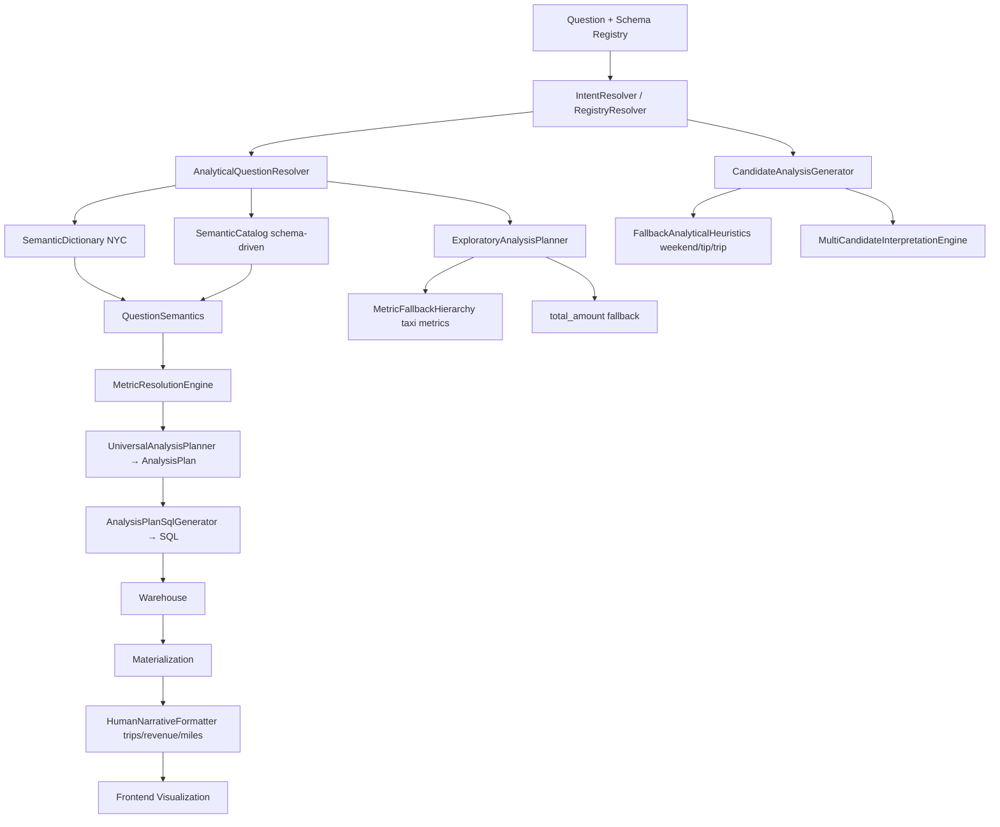
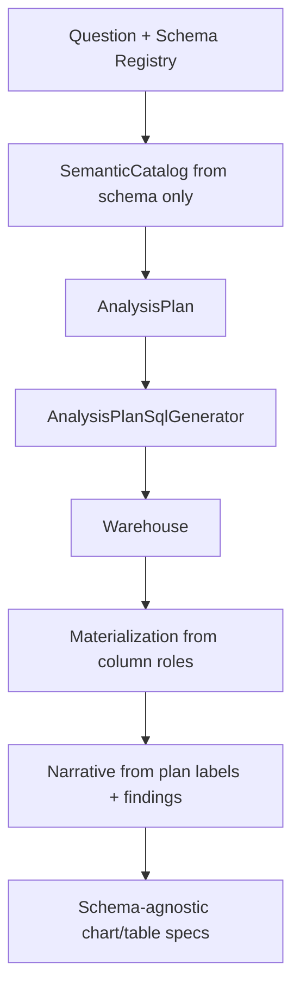

# System Audit: Dataset-Agnostic Architecture

**Date:** 2026-06-05  
**Scope:** Full analytical pipeline — Question → Semantic Resolution → Intent Classification → Analysis Planning → SQL Generation → Warehouse Execution → Materialization → Narrative Generation → Visualization  
**Principle under test:** *"New datasets should work without new code."*

---

## Executive Diagnosis

The pipeline is **not one architecture — it is two stacked on each other**.

| Architecture | Model | Status |
|---|---|---|
| **A — Schema-driven** | `RegistryResolutionBundle` → `SemanticCatalog` → `AnalysisPlan` → `AnalysisPlanSqlGenerator` | Partially built; **correct direction** |
| **B — NYC demo ontology** | `SemanticDictionary` → `DomainOntology` → `HardMetricMappings` → `DatasetProfileRegistry` → heuristic candidates | Still **wired into runtime** on every request |

`DecisionRuntime` executes **both**: it builds an `AnalysisPlan` (A) while also running `CandidateAnalysisGenerator`, `ExploratoryAnalysisPlanner`, and dictionary-backed extraction (B). NYC is not "a dataset" in this design — it is **embedded as default semantics** in fallbacks, profiles, dictionaries, and narrative templates.

**Principle violated:** *"New datasets should work without new code."*

That is false today because failure paths, parallel paths, and presentation paths still assume taxi/revenue vocabulary even when Architecture A succeeds.

---

## Current vs Target Architecture

### Current (Dual-Path)



### Target (Single-Path)



---

## Stage Audit (Question → Visualization)

For every class in each stage:

1. **Schema-driven?** — Does it read bindings from `RegistryResolutionBundle` / `SemanticCatalog`?
2. **Dataset-agnostic?** — Can it operate on any registered schema without dataset-specific branches?
3. **NYC taxi assumptions?** — Hardcoded taxi columns, phrases, or profiles?
4. **Hardcoded business concepts?** — Revenue, trip, airport, weekend, oil, etc.?
5. **Requires new code for new dataset?** — Would a brand-new schema force Java changes?

**Action codes:**

| Code | Meaning |
|---|---|
| **A** | Delete entirely |
| **B** | Replace with schema-driven implementation |
| **C** | Convert to tenant configuration |
| **D** | Keep unchanged |

---

### Stage 1: Semantic Resolution

| | |
|---|---|
| **Input** | Question string, `RegistryResolutionBundle` |
| **Output** | `QuestionSemantics`, `MetricResolution`, `QuestionInvestigation`, `SemanticResolution` |
| **Primary classes** | `AnalyticalQuestionResolver`, `QuestionSemanticExtractor`, `MetricResolutionEngine`, `QuestionInvestigationPlanner`, `SchemaDrivenQuestionResolver`, `SchemaDrivenMetricResolver`, `CatalogQuestionMatcher`, `SemanticCatalogBuilder`, `DimensionResolver` |

| Class | Schema-driven? | Dataset-agnostic? | NYC taxi? | Hardcoded concepts? | New code? | Action |
|---|---|---|---|---|---|---|
| `SemanticCatalogBuilder` | Yes | Yes | No | No | No | **D** |
| `CatalogQuestionMatcher` | Yes | Yes | No | No | No | **D** |
| `SchemaDrivenQuestionResolver` | Yes | Yes | No | No | No | **D** |
| `SchemaDrivenMetricResolver` | Yes | Yes | No | No | No | **D** |
| `QuestionSlotExtractor` | Yes | Yes | No | No | No | **D** |
| `MetricResolutionEngine` | Mostly | Mostly | `DISTANCE_HINTS` includes `trip_distance` | Distance substitution guard | No if catalog resolves | **B** |
| `QuestionSemanticExtractor` | Partial | No | Uses `SemanticDictionary` | Grouping rules for `trip_distance`, `pickup_zone`, `fare_amount`, `tip_amount` | Pollutes questions with "revenue", "distance", "tip" | **B** |
| `SemanticDictionary` | No | No | **Entire class is NYC taxi** | `tip_amount`, `trip_distance`, `airport_flag`, etc. | Yes — new phrases need entries | **A** |
| `QueryEntityResolver` | No | No | Depends on `SemanticDictionary` | Taxi phrases | Yes | **B** |
| `DimensionResolver` | Mostly | Mostly | No | Share path label "Revenue composition" | No for ranking | **B** |
| `AnalyticalReasoningPlanner` | Partial | No | `pickup_hour` default | `tip_amount` prose steps | Parallel path only | **B** |
| `ExploratoryAnalysisPlanner` | Partial | No | Hard fallback | `total_amount` / "Total Revenue" at 0.3 confidence | **Yes on resolution failure** | **B** |
| `MetricFallbackHierarchy` | No | No | Priority: `total_amount`, `fare_amount`, `tip_amount`, `trip_distance` | Taxi metrics | **Yes on fallback** | **A** |
| `DomainOntology` | No | No | `mappingsFor()` **always returns `NYC_TAXI`** | Revenue, fare, trips, tip, trip distance | Yes | **A** |
| `DomainAnalyticalDefaults` | No | No | `nyc_taxi` profile; `generic()` still uses `total_amount` | Revenue defaults | Yes | **A** or **C** |
| `AmbiguityDetector` | No | No | Injects taxi metrics | `total_amount`, `fare_amount`, `revenue_per_mile` | Yes for vague questions | **B** |
| `SemanticFallbackDictionary` | No | No | Yes | Taxi phrase → column map | Yes | **A** |
| `SemanticAnalyticalParser` | No | No | Yes | Taxi columns | Yes | **A** |
| `ContributionQuestionParser` | No | No | Yes | Tip/revenue parsing | Yes | **A** |
| `DimensionImpactParser` | No | No | Yes | Trip-distance patterns | Yes | **A** |

---

### Stage 2: Intent Classification

| | |
|---|---|
| **Input** | Question, investigation, `MetricResolution` |
| **Output** | `AnalysisIntent` (RANKING, CONTRIBUTION, COMPARISON, DISTRIBUTION, RELATIONSHIP, TREND) |
| **Primary classes** | `UniversalAnalysisPlanner`, `QuestionSemanticExtractor`, `SchemaDrivenQuestionResolver`, `RelationshipIntentDetector`, `AnalyticalIntentClassifier` |

| Class | Schema-driven? | Dataset-agnostic? | NYC taxi? | Hardcoded concepts? | New code? | Action |
|---|---|---|---|---|---|---|
| `UniversalAnalysisPlanner` | Yes | Yes | No | No | No | **D** |
| `AnalysisIntent` | Yes | Yes | No | No | No | **D** |
| `RelationshipIntentDetector` | N/A | Yes | No | Language patterns only | No | **D** |
| `AnalyticalIntentClassifier` | N/A | Mostly | No | "per mile", "per trip" keywords | No | **D** or merge |
| `AnalyticalIntentType` (legacy) | N/A | Mostly | No | Parallel enum vs `AnalysisIntent` | Confusion risk | **B** |
| `AnalyticalSqlTemplateEngine.detectIntent()` | No | No | `weekend`/`weekday` → COMPARISON | Keyword sniffing | If re-wired, yes | **A** |
| `AnalyticalSqlTemplateEngine.detectDimension()` | No | No | `weekend_flag`, `tip_amount` | Keyword sniffing | If re-wired, yes | **A** |
| `MultiCandidateInterpretationEngine` | No | No | Uses `FallbackAnalyticalHeuristics` | Taxi heuristics | Yes | **B** or **A** |

---

### Stage 3: Analysis Planning

| | |
|---|---|
| **Input** | Question, bundle, investigation, `MetricResolution`, transform steps |
| **Output** | `AnalysisPlan` |
| **Primary classes** | `UniversalAnalysisPlanner`, `AnalysisPlan` |

| Class | Schema-driven? | Dataset-agnostic? | NYC taxi? | Hardcoded concepts? | New code? | Action |
|---|---|---|---|---|---|---|
| `AnalysisPlan` | Yes | Yes | No | No | No | **D** |
| `UniversalAnalysisPlanner` | Yes | Yes | No | No | No | **D** |
| `AnalyticalPlanningEngine` | Partial | Mostly | No | Dual `InvestigationPlan` parallel to `AnalysisPlan` | Confusion | **B** |
| `QueryDecompositionEngine` | Partial | No | No | Revenue/fare keyword checks | Yes | **B** |
| `InvestigationPlanner` | Partial | Mostly | No | Legacy parallel plan | — | **B** |
| `CandidateAnalysisGenerator` | No | No | `inferDimension()` → `trip_distance`, `weekend_flag`, `pickup_hour` | Uses `FallbackAnalyticalHeuristics` | **Runs every request** | **A** (remove from hot path) |
| `FallbackAnalyticalHeuristics` | No | No | Yes | Weekend/tip/trip/revenue with `total_amount`, `weekend_flag` | Yes | **A** |

---

### Stage 4: SQL Generation

| | |
|---|---|
| **Input** | `AnalysisPlan`, `RegistryResolutionBundle` |
| **Output** | `QuerySpec` with rendered SQL |
| **Primary classes** | `DeterministicAnalyticalQueryPlanner` → `AnalysisPlanSqlGenerator` → `SemanticTransformationEngine` → intent SQL templates |

| Class | Schema-driven? | Dataset-agnostic? | NYC taxi? | Hardcoded concepts? | New code? | Action |
|---|---|---|---|---|---|---|
| `DeterministicAnalyticalQueryPlanner` | Yes | Yes | No | Delegates to `AnalysisPlan` only | No | **D** |
| `AnalysisPlanSqlGenerator` | Yes | Yes | No | No on happy path | No | **D** |
| `RankingSqlTemplate` | Yes | Yes | No | Generic SQL shape | No | **D** |
| `ComparisonSqlTemplate` | Partial | No | Falls back to `weekendFlag(pickup_datetime)` | `HardMetricMappings.TIME_DIMENSION` | Yes on fallback | **B** |
| `TrendSqlTemplate` | Partial | No | Falls back to `hourOfDay(pickup_datetime)` | `HardMetricMappings.TIME_DIMENSION` | Yes on fallback | **B** |
| `ContributionSqlTemplate` | Yes | Yes | No | Generic | No | **D** |
| `DistributionSqlTemplate` | Yes | Yes | No | Generic | No | **D** |
| `RelationshipSqlTemplate` | Yes | Yes | No | Generic CORR | No | **D** |
| `EfficiencySqlTemplate` | Yes | Mostly | No | Generic | No | **D** |
| `GroupedMetricSqlBuilder` | Partial | Mostly | No | SUM default; ignores registry AVG | Wrong agg semantics | **B** |
| `IntentAggregationStrategy` | Partial | Mostly | No | Intent-based SUM/AVG | Semantic errors | **B** |
| `SemanticTransformationEngine` | Partial | No | Injects `DatasetProfileRegistry` | `AIRPORT_RIDE` → `airport_fee`; trace `total_amount` | **Yes on transform fallback** | **B** |
| `DatasetProfileRegistry` | No | No | Only `nyc_taxi` profile; activates for **any** `tableRef != null` | `total_amount`, `trip_distance`, `weekend_flag` | **Contaminates all datasets** | **A** |
| `HardMetricMappings` | No | No | **Yes** | `total_amount`, `trip_distance`, `tip_amount`, `PULocationID`, `weekend_flag` | **Yes on any fallback** | **A** |
| `DimensionBucketingSql` | No | No | **Yes** | Trip-distance mile bins, `airport_fee`, `weekend_flag`, `PULocationID` | Yes for `*distance*` columns | **B** |
| `BucketizationEngine` | No | No | Yes | `TRIP_DISTANCE_HEURISTIC`, `fare_amount_bucket`, `tip_amount_bucket` | Yes | **B** |
| `DerivedDimensionRegistry` | No | No | Yes | `WEEKEND_DAY`, `AIRPORT_RIDE`, `TRIP_DISTANCE_BUCKET` | Yes | **B** |
| `SchemaColumnDetector` | Partial | No | `pickup_datetime` first | Distance → `HardMetricMappings.DISTANCE_DIMENSION` | Yes on fallback | **B** |
| `AnalyticalSqlTemplateEngine` | Partial | No | Legacy static API | Keyword sniffing | If re-wired, yes | **A** (remove static API) |
| `SqlFallbackExecutionChain` | Partial | No | Uses profiles + bucketing on repair | Taxi fallbacks | Yes on SQL repair | **B** |

---

### Stage 5: Warehouse Execution

| | |
|---|---|
| **Input** | `QuerySpec`, tenant ID |
| **Output** | `QueryResult` rows |
| **Primary classes** | `AnalyticalSqlExecutionService`, `BigQueryWarehouseExecutor`, `WarehouseExecutor` |

| Class | Schema-driven? | Dataset-agnostic? | NYC taxi? | Hardcoded concepts? | New code? | Action |
|---|---|---|---|---|---|---|
| `AnalyticalSqlExecutionService` | Yes | Yes | No | No | No | **D** |
| `BigQueryWarehouseExecutor` | Yes | Yes | No | No | No | **D** |
| `WarehouseExecutor` | Yes | Yes | No | No | No | **D** |
| `QueryExecutionDebugger` / repair loop | Yes | Mostly | No | Executes plan SQL | No | **D** |

**Note:** No NYC assumptions at the execution layer. Violations are already baked into SQL strings from Stage 4.

---

### Stage 6: Materialization

| | |
|---|---|
| **Input** | Warehouse rows, `InvestigationPlan`, schema profile |
| **Output** | `MaterializedQueryResult`, `ExecutionFindings` |
| **Primary classes** | `IntentDrivenComputationFramework`, `AnalyticalQueryMaterializer`, `AnalyticalWarehouseResultDetector`, `StructuredFindingsEngine` |

| Class | Schema-driven? | Dataset-agnostic? | NYC taxi? | Hardcoded concepts? | New code? | Action |
|---|---|---|---|---|---|---|
| `AnalyticalQueryMaterializer` | Yes | Yes | No | Column-role driven | No | **D** |
| `AnalyticalWarehouseResultDetector` | Yes | Yes | No | Shape detection | No | **D** |
| `GroupByExecutor` | Yes | Yes | No | Generic | No | **D** |
| `NumericDimensionBucketer` | Mostly | Mostly | Possible taxi-style bins | Edge cases | **B** |
| `PresentationLabelResolver` | No | No | `KNOWN_LABELS`: `trip_distance`, `total_amount`, `tip_amount`, `pulocationid` | Default label "Revenue" | Yes for labels | **B** |
| `GroupedWarehouseResultDetector` | Mostly | Mostly | Possible taxi shapes | — | Review | **B** |
| `StructuredFindingsEngine` | Mostly | Mostly | No | Default metric label "Revenue" | Presentation only | **B** |
| `CandidateMaterializationExecutor` | No | No | Taxi candidate path | Parallel only | With candidate gen | **A** |

---

### Stage 7: Narrative Generation

| | |
|---|---|
| **Input** | Findings, plan, materialized result, confidence |
| **Output** | `ExecutiveInsightCard`, narratives, takeaways |
| **Primary classes** | `ExecutivePresentationLayer`, `StructuredFindingsEngine`, `HumanNarrativeFormatter`, `ExecutiveNarrativeEngine`, `CorrelationExecutivePresenter` |

| Class | Schema-driven? | Dataset-agnostic? | NYC taxi? | Hardcoded concepts? | New code? | Action |
|---|---|---|---|---|---|---|
| `ExecutivePresentationLayer` | Partial | Mostly | No | Calls `RevenueCompositionAnalyzer` for revenue-like Qs | Narrative wrong, not SQL | **B** |
| `CorrelationExecutivePresenter` | Yes | Yes | No | Generic | No | **D** |
| `HumanNarrativeFormatter` | No | No | **Yes** | "Trips", "miles", "revenue", "weekends", short-distance trip prose | **Yes for correct narrative** | **B** |
| `BusinessSemanticAliases` | No | No | **Yes** | `total_amount`, `fare_amount`, `tip_amount`, `trip_distance`, `pickup_zone` | Yes | **A** |
| `RevenueCompositionAnalyzer` | No | No | **Yes** | `fare_amount`, `tip_amount`, `airport_fee`, `cbd_congestion_fee` | Yes for composition Qs | **A** |
| `InsightTemplateEngine` | Mostly | Mostly | Soft domain words | — | **B** |
| `NarrativeIntelligenceEngine` | Mostly | Mostly | — | — | **B** (audit) |
| `RevenueDriverPlaybook` | No | No | No | Revenue-centric playbook text | Soft | **C** |
| `GrowthMomentumPlaybook` | No | No | No | Revenue language | Soft | **C** |
| `MetricSemanticRegistry` | Partial | No | Built-in entries | `total_amount`, `revenue_per_mile`, `trip_distance` | Yes for governance | **C** |

---

### Stage 8: Visualization

| | |
|---|---|
| **Input** | `ChartSpec`, `TableSpec`, `correlation_analysis`, `executive_card` |
| **Output** | Rendered UI (charts, tables, correlation card) |
| **Backend classes** | `VisualizationPlanner`, `VisualizationStrategyEngine`, `TableSpecBuilder`, `DecisionResponseMapper` |
| **Frontend classes** | `ChartRenderer`, `UserDashboardPage`, `CorrelationAnalysisCard`, `TableRenderer` |

| Class | Schema-driven? | Dataset-agnostic? | NYC taxi? | Hardcoded concepts? | New code? | Action |
|---|---|---|---|---|---|---|
| `VisualizationPlanner` | Yes | Yes | No | No | No | **D** |
| `VisualizationStrategyEngine` | Mostly | Yes | No | No | No | **D** |
| `TableSpecBuilder` | Yes | Yes | No | No | No | **D** |
| `DecisionResponseMapper` | Yes | Yes | No | No | No | **D** |
| `ChartRenderer` (frontend) | Yes | Yes | No | USD formatting (product choice) | No | **D** |
| `UserDashboardPage` (frontend) | Yes | Yes | No | No | No | **D** |
| `CorrelationAnalysisCard` (frontend) | Yes | Yes | No | No | No | **D** |

**Note:** Visualization is the cleanest stage. Failures originate upstream in narrative labels and chart titles fed from taxi prose.

---

## Violation Classification Summary

### A — Delete Entirely (Architectural Blockers)

These encode NYC/taxi as platform semantics. They should not exist in a dataset-agnostic pipeline.

| Class | Why |
|---|---|
| `SemanticDictionary` | NYC phrase → column map; wired into hot-path extractors |
| `DomainOntology` | `mappingsFor()` always returns NYC mappings |
| `SemanticFallbackDictionary` | Taxi fallback phrases |
| `HardMetricMappings` | Taxi column constants used in fallbacks |
| `DatasetProfileRegistry` | Single `nyc_taxi` profile; activates for all tables |
| `MetricFallbackHierarchy` | Taxi metric priority chain |
| `FallbackAnalyticalHeuristics` | Weekend/tip/trip/revenue heuristics |
| `BusinessSemanticAliases` | Taxi metric labels |
| `RevenueCompositionAnalyzer` | Taxi fare/tip/airport decomposition |
| `AnalyticalSqlTemplateEngine.detectIntent()` / `detectDimension()` | Keyword sniffing |
| `CandidateAnalysisGenerator` (from hot path) | Parallel taxi hypothesis engine on every request |
| `ContributionQuestionParser` | Domain-specific tip/revenue parser |
| `DimensionImpactParser` | Trip-distance impact parser |
| `CandidateMaterializationExecutor` | Tied to candidate generator path |

**Test-only (keep in test scope, not production):** `SyntheticBenchmarkDatasets`, `GoldenTestSuite` taxi fixtures, `MockRegistryBuilder` taxi defaults.

---

### B — Replace with Schema-Driven Implementation

| Class | Replace With |
|---|---|
| `QuestionSemanticExtractor` | Catalog-only extraction via `SchemaDrivenQuestionResolver` + `CatalogQuestionMatcher` |
| `QueryEntityResolver` | `CatalogQuestionMatcher` |
| `SemanticTransformationEngine` | Transform from `AnalysisPlan` fields only; no profile registry |
| `DimensionBucketingSql` | Numeric bucketing from column type + distribution metadata in registry |
| `BucketizationEngine` | Generic numeric bucketing from schema metadata |
| `DerivedDimensionRegistry` | Schema-declared derived dimensions (e.g. `TEMPORAL`, `BUCKET`) |
| `SchemaColumnDetector` | Registry column roles only |
| `ExploratoryAnalysisPlanner` | Block when `AnalysisPlan` not executable; no `total_amount` fallback |
| `HumanNarrativeFormatter` | Templates parameterized by `AnalysisPlan.primaryMetricLabel`, `dimensionLabel` |
| `PresentationLabelResolver` | `SemanticCatalog` labels |
| `StructuredFindingsEngine` | Plan labels instead of "Revenue" default |
| `GroupedMetricSqlBuilder` / `IntentAggregationStrategy` | Aggregation from `MetricDescriptor` |
| `ComparisonSqlTemplate`, `TrendSqlTemplate` | No `pickup_datetime` / `weekend_flag` fallbacks |
| `AnalyticalReasoningPlanner` | Read from `AnalysisPlan`; remove from SQL hot path |
| `AmbiguityDetector` | Rank registry metrics, not `fare_amount` |
| `MetricResolutionEngine` | Remove `DISTANCE_HINTS` / taxi distance guards |
| `DimensionResolver` | Schema labels for share analysis |
| `AnalyticalPlanningEngine` | Consume `AnalysisPlan` only |
| `QueryDecompositionEngine` | Schema-driven decomposition |
| `SqlFallbackExecutionChain` | Plan-bound repair only |

---

### C — Convert to Tenant Configuration

| Class | Configuration Source |
|---|---|
| `DomainAnalyticalDefaults` | Per-tenant domain profile in catalogue (if needed at all) |
| `MetricSemanticRegistry` | Loaded from approved registry, not hardcoded entries |
| `RevenueDriverPlaybook` | Generic "driver analysis" playbook keyed by `AnalysisIntent` |
| `GrowthMomentumPlaybook` | Generic momentum playbook |
| `StrategicValueRankingPlaybook` | Generic ranking playbook |

---

### D — Keep Unchanged (Already Schema-Driven or Infrastructure)

| Class | Role |
|---|---|
| `SemanticCatalogBuilder` | Builds catalog from registry |
| `CatalogQuestionMatcher` | Token/stem match on column names |
| `SchemaDrivenQuestionResolver` | Generic NL slot patterns |
| `SchemaDrivenMetricResolver` | Slot + catalog metric resolution |
| `QuestionSlotExtractor` | Generic question slot patterns |
| `MetricAliasGenerator` | Aliases from column names only |
| `UniversalAnalysisPlanner` | Single planning authority |
| `AnalysisPlan` | Sole planning contract |
| `AnalysisPlanSqlGenerator` | SQL from plan only |
| `DeterministicAnalyticalQueryPlanner` | Thin wrapper over plan SQL |
| `RelationshipIntentDetector` | Language patterns (not dataset-specific) |
| `RelationshipSqlTemplate` | Generic CORR SQL |
| SQL intent templates | Generic shapes when fed by plan |
| `AnalyticalQueryMaterializer` | Column-role materialization |
| `AnalyticalWarehouseResultDetector` | Result shape detection |
| `BigQueryWarehouseExecutor` | Warehouse execution |
| `AnalyticalSqlExecutionService` | Batch SQL execution |
| `DecisionResponseMapper` | API response mapping |
| Frontend chart/table components | String pass-through rendering |

---

## Legacy Assumption Inventory

Places where assumptions about **revenue, profit, airport, trip, taxi, fare, tip, oil, downtime, weekend** can still influence execution — even when the primary `AnalysisPlan` path succeeds.

| Domain term | Component | When it fires | Effect |
|---|---|---|---|
| **revenue** | `SemanticDictionary` | Question contains "revenue" | Maps to `total_amount` on any dataset |
| **revenue** | `DomainOntology` | Always | NYC revenue mappings offered |
| **revenue** | `MetricFallbackHierarchy` | Resolution fallback | Substitutes `total_amount` |
| **revenue** | `ExploratoryAnalysisPlanner` | Low confidence | Hardcodes `total_amount` |
| **revenue** | `AmbiguityDetector` | Vague questions | Injects revenue share candidates |
| **revenue** | `HumanNarrativeFormatter` | Every grouped result | "Revenue is concentrated...", "total revenue" |
| **revenue** | `PresentationLabelResolver` | Missing label | Default "Revenue" |
| **revenue** | `RevenueCompositionAnalyzer` | Revenue-like questions | Taxi fare/tip decomposition |
| **revenue** | `RevenueDriverPlaybook` | Playbook routing | Revenue-centric narrative |
| **trip** | `SemanticDictionary` | "trip", "trips" | Maps to taxi columns |
| **trip** | `HumanNarrativeFormatter` | Comparisons | "Trips X generate more revenue than trips Y" |
| **trip** | `FallbackAnalyticalHeuristics` | Weekend + trip keywords | Taxi weekend plans |
| **trip distance** | `DimensionBucketingSql` | Column name contains `distance` | NYC mile bins (0-1, 1-3, ...) |
| **trip distance** | `DerivedDimensionRegistry` | Distance in name/question | `TRIP_DISTANCE_BUCKET` concept |
| **trip distance** | `MetricResolutionEngine` | `DISTANCE_HINTS` | Trip distance substitution logic |
| **fare** | `SemanticDictionary` | "fare" | Maps to `fare_amount` |
| **fare** | `HardMetricMappings.resolveRevenueMetric()` | Question contains "fare" | Returns `fare_amount` |
| **fare** | `AmbiguityDetector` | "fare" in question | `fare_amount` candidate |
| **tip** | `SemanticDictionary` | "tip", "tips" | Maps to `tip_amount` |
| **tip** | `FallbackAnalyticalHeuristics` | Tip + revenue in question | Tip share SQL hypothesis |
| **tip** | `HardMetricMappings` | Keyword "tip" | Returns `tip_amount` |
| **airport** | `SemanticDictionary` | "airport" | Maps to `airport_flag` |
| **airport** | `DimensionBucketingSql` | Dimension contains "airport" | `airport_fee` column hardcoded |
| **airport** | `DerivedDimensionRegistry` | "airport" in question | `AIRPORT_RIDE` concept |
| **weekend** | `SemanticDictionary` | "weekend" | Maps to `weekend_flag` |
| **weekend** | `DimensionBucketingSql` | `weekend_flag` / datetime | DAYOFWEEK weekend/weekday |
| **weekend** | `FallbackAnalyticalHeuristics` | Weekend + revenue | Full weekend analysis plans |
| **weekend** | `AnalyticalSqlTemplateEngine.detectIntent()` | "weekend"/"weekday" | COMPARISON intent |
| **taxi / NYC** | `DatasetProfileRegistry` | Any `tableRef != null` | Applies `nyc_taxi` profile |
| **taxi / NYC** | `DomainAnalyticalDefaults` | Question contains "taxi", "fare", "trip distance" | NYC domain profile |
| **oil / downtime / profit** | Not in production hot path | Oil appears in tests/benchmarks only | No production blocker unless similar ontology added |
| **predefined registries** | `MetricSemanticRegistry` | Governance lookup | Built-in `total_amount`, `revenue_per_mile` entries |

---

## Unseen Dataset: What Forces Code Changes?

### Tier 1 — Will Break or Corrupt Results (No New Java, But Architecture Fails)

| Class | When It Fires | Effect |
|---|---|---|
| `DatasetProfileRegistry` | `SemanticTransformationEngine` fallback | Injects `total_amount`, `trip_distance`, `weekend_flag` |
| `HardMetricMappings` | Transform/SQL template fallback | Wrong columns in SQL |
| `MetricFallbackHierarchy` | `ExploratoryAnalysisPlanner` weak resolution | Substitutes `total_amount` |
| `ExploratoryAnalysisPlanner` | Resolution null / low confidence | Hardcodes `total_amount` / "Total Revenue" |
| `DomainOntology` | `AmbiguityDetector`, clarification | Offers NYC metric candidates |
| `SemanticDictionary` | Question with "revenue", "fare", "tip", "distance", "airport", "weekend" | False entity matches on non-taxi data |
| `FallbackAnalyticalHeuristics` | Every request via `CandidateAnalysisGenerator` | Parallel taxi hypotheses; can win candidate selection |
| `DimensionBucketingSql` | Numeric column named `*distance*` | Applies taxi mile bins |
| `HumanNarrativeFormatter` | Every successful response | "Trips", "miles", "revenue" prose |
| `BusinessSemanticAliases` / `PresentationLabelResolver` | Label resolution | Wrong labels; "Revenue" default |

### Tier 2 — May Work for SQL But Brittle (No Java, Vocabulary/Phrasing Dependent)

| Component | Failure Mode |
|---|---|
| `SchemaDrivenQuestionResolver` slot patterns | Questions not matching `which X have the highest Y` get weaker resolution |
| `CatalogQuestionMatcher` | Business terms that don't token-overlap column names (e.g. "performance" vs `exam_score`) |
| `IntentAggregationStrategy` | Ignores registry `AVG`/`SUM`; wrong aggregation semantics |

### Tier 3 — Works on Primary Path (Schema Registered + Question Matches Patterns)

`SemanticCatalogBuilder` → `UniversalAnalysisPlanner` → `AnalysisPlanSqlGenerator` → warehouse.

This path does **not** require NYC code — but it is **not the only path running**, and downstream narrative still assumes taxi.

---

## Direct Answer

| Scope | Can unseen dataset work without new code? |
|---|---|
| **SQL generation (happy path)** | **Conditionally yes** — if schema is in `RegistryResolutionBundle` and question matches generic slot patterns. `SemanticCatalogBuilder` auto-aliases from column names. |
| **Full pipeline (runtime today)** | **No** — `SemanticDictionary`, `DomainOntology`, `DatasetProfileRegistry`, `MetricFallbackHierarchy`, `FallbackAnalyticalHeuristics`, `CandidateAnalysisGenerator` run alongside schema path and encode NYC/revenue/trip/weekend/airport assumptions. |
| **Correct narrative/visualization** | **No** — `HumanNarrativeFormatter`, `BusinessSemanticAliases`, `RevenueCompositionAnalyzer` mislabel non-taxi results even when SQL is correct. |

**The architectural blocker is not missing mappings for the next dataset. The platform still treats NYC taxi semantics as the default ontology for resolution failures, parallel hypotheses, transforms, bucketing, and narrative.**

---

## Recommended Deletions Before Adding Any More Features

Do **not** add airport, oil, downtime, student, or trip-distance patches. Remove the competing architecture first:

| # | Action |
|---|---|
| 1 | **Delete hot-path parallel resolution:** `CandidateAnalysisGenerator`, `FallbackAnalyticalHeuristics`, `MultiCandidateInterpretationEngine` from `DecisionRuntime` (or gate entirely on `AnalysisPlan.executable()`). |
| 2 | **Delete NYC ontology layer:** `SemanticDictionary`, `DomainOntology`, `SemanticFallbackDictionary`, `HardMetricMappings`, `DatasetProfileRegistry`. |
| 3 | **Delete taxi fallbacks:** `MetricFallbackHierarchy`; remove `ExploratoryAnalysisPlanner` fallback to `total_amount`. |
| 4 | **Delete keyword SQL sniffing:** `AnalyticalSqlTemplateEngine.detectIntent()` / `detectDimension()`. |
| 5 | **Delete taxi bucketing as default:** `DimensionBucketingSql` trip/airport/weekend branches → schema-type bucketing. |
| 6 | **Delete taxi narrative:** `BusinessSemanticAliases`, `RevenueCompositionAnalyzer`; rewrite `HumanNarrativeFormatter` to consume `AnalysisPlan` labels only. |
| 7 | **Collapse dual plans:** `InvestigationPlan` / `AnalyticalReasoningPlanner` SQL influence → single `AnalysisPlan` authority. |
| 8 | **Populate governance from registry:** `MetricSemanticRegistry` built-ins → tenant catalogue only. |

---

## Target Pipeline Contract

After cleanup, the only allowed data flow:

```
Question + RegistryResolutionBundle (schema + data catalogue)
    → SemanticCatalog (auto-built from schema)
    → MetricResolution + Investigation (catalog matching only)
    → AnalysisPlan (single authority)
    → AnalysisPlanSqlGenerator (SQL from plan only)
    → Warehouse
    → Materialization (column roles from schema)
    → Narrative + Visualization (labels from AnalysisPlan + catalog)
```

**Forbidden in production path:**

- Dataset-specific dictionaries
- Dataset-specific ontologies
- Dataset-specific metric fallbacks
- Dataset-specific SQL keyword sniffing
- Dataset-specific bucketing rules
- Dataset-specific narrative templates

---

## Appendix: Classes Confirmed Schema-Driven (Reference)

These were verified to operate from `RegistryResolutionBundle` / `SemanticCatalog` without NYC branches on the primary path:

- `AnalyticalQuestionResolver.resolveFull()`
- `UniversalAnalysisPlanner.plan()`
- `AnalysisPlanSqlGenerator.generate()`
- `DeterministicAnalyticalQueryPlanner.plan(AnalysisPlan, bundle)`
- `AnalyticalQueryMaterializer.materialize()`

Student dataset trace test (`StudentDatasetExecutionTraceTest`) confirms ranking questions resolve `exam_score` + `subject` and emit grouped SQL with **no student-specific Java** — demonstrating Architecture A works when Architecture B does not intercept.

---

*End of audit.*
