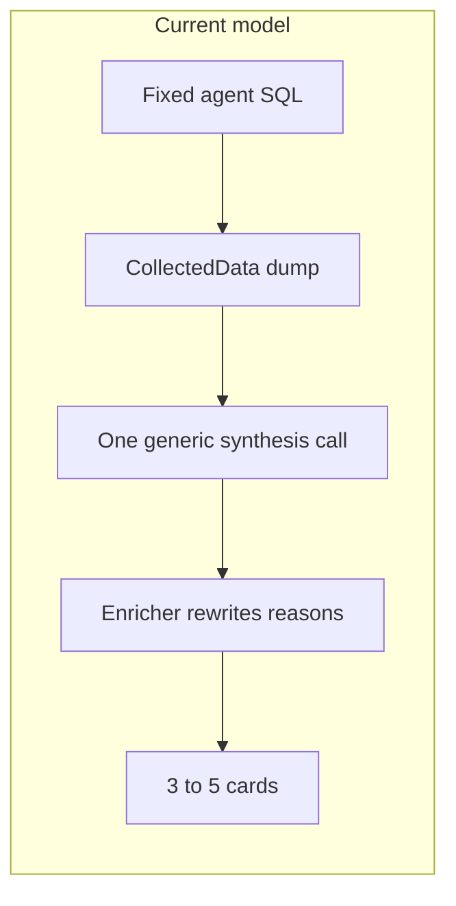
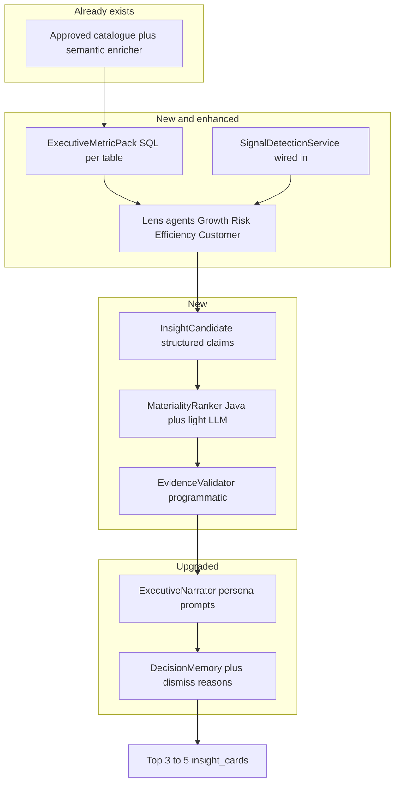

# Executive-Grade Insight Model

## The gap today

Your pipeline is structurally sound (warehouse SQL → small results → LLM), but **insight quality is capped by design**, not only by prompts.




**What works:** `[CatalogueSemanticEnricher](C:/kontexa/backend/src/main/java/com/example/BACKEND/catalogue/service/CatalogueSemanticEnricher.java)` at approval, strict anti-hallucination rules in `[AgentOrchestrator.buildSystemPrompt](C:/kontexa/backend/src/main/java/com/example/BACKEND/catalogue/agent/AgentOrchestrator.java)`, `[InsightNarrativeEnricher](C:/kontexa/backend/src/main/java/com/example/BACKEND/catalogue/agent/InsightNarrativeEnricher.java)`, `[DecisionMemoryService](C:/kontexa/backend/src/main/java/com/example/BACKEND/catalogue/agent/DecisionMemoryService.java)`.

**What limits executive value:**


| Limitation                                                                                                                                       | Effect on leaders                                                   |
| ------------------------------------------------------------------------------------------------------------------------------------------------ | ------------------------------------------------------------------- |
| One LLM pass invents "insights" from a data dump                                                                                                 | Feels like a smart intern, not a Sales/Product VP                   |
| Agents collect **descriptive** stats, not **decision** metrics                                                                                   | Missing WoW/MoM deltas, contribution %, concentration, "vs average" |
| No prioritization by business impact                                                                                                             | 3–5 cards of similar weight; noise competes with signal             |
| No programmatic claim verification                                                                                                               | Accuracy depends on prompt obedience only                           |
| No tenant business context                                                                                                                       | Same tone for e-commerce vs SaaS vs logistics                       |
| Specialized agents don't **own** insights                                                                                                        | Trend/Anomaly produce data; synthesis ignores agent expertise       |
| `[SignalDetectionService](C:/kontexa/backend/src/main/java/com/example/BACKEND/catalogue/agent/SignalDetectionService.java)` not in orchestrator | Misses "what changed since last run" — what execs care about first  |


**Target:** Insights a CEO/VP would forward to a leadership meeting — **specific, comparative, causal, actionable, prioritized**.

---

## How executives actually think (model this explicitly)

High-level operators don't ask "what's in the database?" They ask:

1. **What changed materially?** (vs last week/month/year, vs plan if available)
2. **Where is it coming from?** (segment, product, region, channel)
3. **How big is the problem or opportunity?** ($, %, share, runway)
4. **Why now?** (driver hypothesis grounded in data)
5. **What should we do?** (2–3 concrete moves with owner: Sales / Product / Ops / Finance)

Map each question to a **business lens** the system must run before writing cards:


| Lens           | Owner persona    | Example insight                                                            |
| -------------- | ---------------- | -------------------------------------------------------------------------- |
| **Growth**     | CRO / Sales VP   | "Enterprise pipeline up 22% MoM; APAC accounts for 80% of net new revenue" |
| **Risk**       | COO / Product VP | "Returns in Electronics doubled to 18% while Beauty stays at 4%"           |
| **Efficiency** | CFO              | "Fulfillment cost per order rose 11% as order volume fell 6%"              |
| **Customer**   | CPO              | "Churn proxy: repeat purchase rate down 9pts in Q2 cohort"                 |


Your system should **generate candidates per lens**, then **rank and keep only what matters**.

---

## Target architecture: Insight Operating System




---

## Pillar 1 — Better data foundation (accuracy + substance)

**Problem:** LLM can't sound like a VP if the input is raw trend rows without comparisons.

**Add `ExecutiveMetricPack`** (new service, runs in orchestrator per table before synthesis):

Pre-compute a fixed set of **decision metrics** via SQL (reuse `[TrendAgent](C:/kontexa/backend/src/main/java/com/example/BACKEND/catalogue/agent/agents/TrendAgent.java)` / `[KpiPerformanceAgent](C:/kontexa/backend/src/main/java/com/example/BACKEND/catalogue/agent/agents/KpiPerformanceAgent.java)` patterns):

- Primary KPI: current period, prior period, **delta %** (MoM/YoY from semantic enricher)
- **Contribution analysis**: top 3 segments by share of metric + change in share
- **Concentration**: top 20% segments = X% of total (Pareto)
- **Outliers vs baseline**: segment rate vs table average (already partially in synthesis examples)
- **Volume context**: record count trend (from DistributionAgent monthly)

Store as labeled `CollectedData` entries, e.g. `"EXEC: revenue MoM delta"`, `"EXEC: category contribution"`.

**Wire `SignalDetectionService`** into `[AgentOrchestrator](C:/kontexa/backend/src/main/java/com/example/BACKEND/catalogue/agent/AgentOrchestrator.java)`: lead synthesis with "what changed since baseline" — executives prioritize deltas.

**Scale alignment:** Use `[SCALE_MILLION_ROW_TABLES.md](C:/kontexa/backend/docs/SCALE_MILLION_ROW_TABLES.md)` windowed SQL for all EXEC queries.

---

## Pillar 2 — Structured insight candidates (not free-form cards)

**Problem:** One JSON synthesis call mixes discovery, ranking, and writing — errors compound.

**Introduce `InsightCandidate` record:**

```java
// claim, lens, impactScore, evidenceRefs, metricHighlights, sourceColumns, suggestedOwner
```

**Lens agents** (can start as Java + templates, LLM only for narrative):


| Agent                 | Input                                      | Output candidate types                               |
| --------------------- | ------------------------------------------ | ---------------------------------------------------- |
| `GrowthLensAgent`     | EXEC pack + trends                         | "Acceleration", "New segment winner", "Deceleration" |
| `RiskLensAgent`       | anomalies + signals + return/churn proxies | "Margin leak", "Quality spike", "Volume drop"        |
| `EfficiencyLensAgent` | cost/volume ratios if columns exist        | "Unit economics worsening"                           |
| `CustomerLensAgent`   | cohort/distribution shifts                 | "Retention risk", "Segment shift"                    |


Each candidate must include `**evidenceRefs`**: pointers to `CollectedData.label` + row keys/values used.

**Retire generic "generate 3–5 insights"** as the primary mechanism; synthesis becomes **narration of verified candidates** only.

---

## Pillar 3 — Materiality ranking (fewer, more important cards)

**Problem:** Executives want **3 decisions**, not 5 observations.

`**MaterialityRanker`** (mostly Java, optional LLM tie-break):

Score each candidate on:

- Absolute delta % (from EXEC pack)
- Share of business (concentration / contribution)
- Signal severity (`[SignalDetectionService](C:/kontexa/backend/src/main/java/com/example/BACKEND/catalogue/agent/SignalDetectionService.java)` HIGH/MEDIUM)
- Badge type weight (ALERT > OPPORTUNITY > INFO)
- Decision memory: boost lenses/badges user historically marked read; penalize dismissed patterns

**Keep top 3** (max 4 on high-signal weeks). Demote or drop INFO cards when stronger ALERT/OPPORTUNITY exist.

---

## Pillar 4 — Accuracy: evidence-bound claims (non-negotiable)

**Problem:** Prompts say "don't invent" but there is no enforcement.

**Add `InsightEvidenceValidator`** after ranking, before persist:

1. **Number extraction** — parse %, $, counts from title/reasons/metricHighlights
2. **Grounding check** — each number must appear in referenced `CollectedData` rows (tolerance for rounding)
3. **Label check** — category names must exist verbatim in dimension breakdown datasets
4. **Trend check** — require ≥2 periods in referenced time-series before words like "rose", "declined", "trend"
5. **Fail action** — drop card, or rewrite via small LLM call with only the matching evidence rows

Persist `[raw_evidence](C:/kontexa/backend/src/main/resources/insight_evidence_migration.sql)` + `sourceColumns` (already on entity) and **populate from `evidenceRefs`** automatically.

Optional v2: second LLM pass as **critic** ("list any claim not supported by evidence") — only for cards that pass programmatic checks.

---

## Pillar 5 — Professional, intuitive narrative (executive voice)

**Problem:** `[InsightNarrativeEnricher](C:/kontexa/backend/src/main/java/com/example/BACKEND/catalogue/agent/InsightNarrativeEnricher.java)` polishes bullets but doesn't restructure for decision-makers.

**Replace/extend with `ExecutiveNarrator`** using a fixed card schema:


| Field                | Executive pattern                                                               |
| -------------------- | ------------------------------------------------------------------------------- |
| **title**            | `[Metric] [direction] [delta] — [driver segment]` (max 12 words)                |
| **description**      | One sentence: **So What** (business consequence)                                |
| **metricHighlights** | 3 chips: **Size**, **Change**, **Where**                                        |
| **reasons**          | 2 bullets: **Why** (data-backed, past tense)                                    |
| **strategies**       | 2 bullets: **Now What** (owner + action + timeframe)                            |
| **agentName**        | Lens owner: `"Growth (Sales)"`, `"Risk (Product)"` not generic "Analysis agent" |


**Tenant business context** (new, at catalogue approval):

- `industry`, `businessModel` (B2B SaaS, retail, marketplace…)
- `northStarMetrics` (1–3 column names)
- `primarySegments` (which dimension columns matter)

Stored on client/tenant config → injected into every narrator prompt so strategies sound industry-appropriate.

**Prompt tone rules** (add to orchestrator + narrator):

- Lead with **impact**, not methodology
- No "the data shows"; use "Revenue fell 14% MoM"
- Strategies name **function** (Sales, Product, Finance) and **timeframe** (this quarter, next 30 days)
- Ban vague advice: "monitor", "investigate further", "consider analyzing"

---

## Pillar 6 — Learning loop (gets smarter per company)

Extend `[DecisionMemoryService](C:/kontexa/backend/src/main/java/com/example/BACKEND/catalogue/agent/DecisionMemoryService.java)`:

- Store **lens** + **insight pattern** (e.g. `returns_by_category`) on dismiss/read
- Feed ranker weights per client
- Optional: capture dismiss **reason** (frontend) — "not relevant", "wrong number", "already known"

Monthly `[ReportGenerationAgent](C:/kontexa/backend/src/main/java/com/example/BACKEND/catalogue/agent/ReportGenerationAgent.java)` should summarize **decisions implied**, not list all cards.

---

## Pillar 7 — Frontend: executive inbox UX

In `[UserDashboardPage.jsx](C:/kontexa/frontend/src/pages/UserDashboardPage.jsx)`:

- **Daily brief** strip: 1-sentence "3 things leadership should know"
- Sort by impact score, not generation order
- Show **Size / Change / Where** chips consistently
- Collapse INFO; surface ALERT/OPPORTUNITY first
- Optional dismiss reason → feeds decision memory

---

## Implementation phases

### Phase A — Quick wins (1–2 weeks, no new tables required)

- Add `ExecutiveMetricPack` queries (MoM delta, contribution top-3, vs average)
- Wire `SignalDetectionService` before per-table loop; pass signal summary into synthesis
- Rewrite synthesis prompt: lens-oriented, top-3 only, So What / Now What schema
- Upgrade `InsightNarrativeEnricher` to `ExecutiveNarrator` tone + owner in strategies
- Implement `InsightEvidenceValidator` v1 (numbers + labels + trend guard)

**Files:** `[AgentOrchestrator](C:/kontexa/backend/src/main/java/com/example/BACKEND/catalogue/agent/AgentOrchestrator.java)`, new `ExecutiveMetricPack.java`, new `InsightEvidenceValidator.java`, enricher

### Phase B — Candidate pipeline (2–3 weeks)

- `InsightCandidate` model + `GrowthLensAgent` / `RiskLensAgent` (template + data rules)
- `MaterialityRanker` — Java scoring, top-3 selection
- Synthesis becomes "narrate these candidates only"
- Auto-fill `raw_evidence` from evidenceRefs

### Phase C — Business context (1 week)

- Tenant profile: industry, north star metrics, primary segments (approval UI + API)
- Inject into all narrator/lens prompts

### Phase D — Full lens suite + learning (ongoing)

- Efficiency + Customer lenses
- Dismiss reason in API + frontend
- Report agent uses ranked candidates only
- Optional: critic LLM pass for HIGH-impact cards only

---

## What success looks like


| Metric                         | Target                                                 |
| ------------------------------ | ------------------------------------------------------ |
| User dismiss rate              | Down over 4 weeks (per client)                         |
| Claims with verified numbers   | 100% programmatically checked                          |
| Cards per run                  | ≤3 default, ≤5 only if multiple HIGH signals           |
| Read rate on ALERT/OPPORTUNITY | Up vs INFO                                             |
| Qualitative                    | Reads like a Monday leadership brief, not a BI tooltip |


---

## Relationship to scale work

Executive metrics are **more SQL**, but all must use windowed/aggregate patterns from [SCALE_MILLION_ROW_TABLES.md](C:/kontexa/backend/docs/SCALE_MILLION_ROW_TABLES.md). Better insights and 10M-row safety are complementary, not competing.

---

## Recommended doc to add locally

After approval, append a companion doc: `docs/EXECUTIVE_INSIGHT_MODEL.md` (mirror of this plan) next to the scale doc.