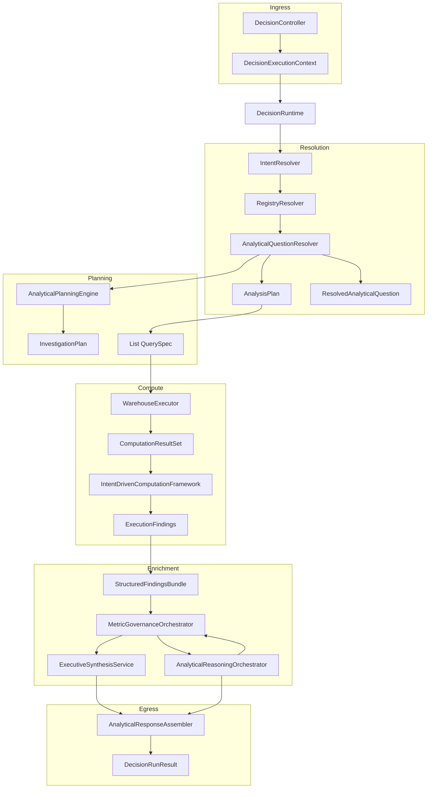
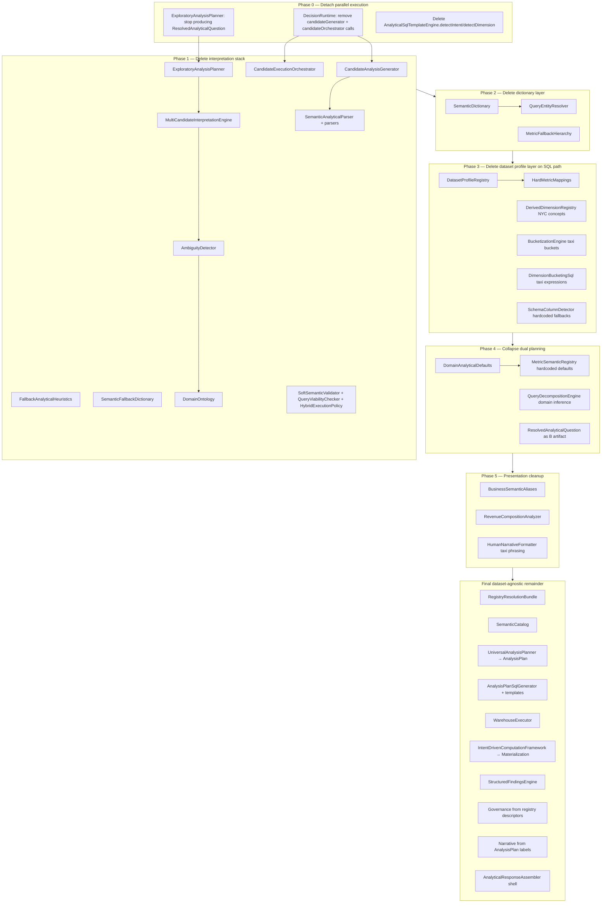

# Runtime Architecture Investigation

**Scope:** Generic execution path for **all** analytical requests via `DecisionRuntime.execute()`.  
**Method:** Static trace from `DecisionRuntime` constructor dependencies and `execute()` call order through Spring bean injection chains (2–4 levels).  
**Not in scope:** Question-specific traces, dataset-specific examples, fixes, or code changes.

**Entry point:** `POST /api/decision/v1/run` → `DecisionController` → `DecisionRuntime.execute(DecisionExecutionContext)`

**Context inputs (all requests):** `tenantId`, natural-language `question`, optional `meta` map.

---

## 1. Generic execution pipeline

Every analytical request follows the same staged orchestration. Stages run synchronously in order; failure throws `DecisionRuntimeException`.

| Stage | `ExecutionStage` enum | Primary producer | Primary artifact |
|-------|----------------------|------------------|------------------|
| 0 | (start) | `ExecutionLifecycleManager` | `ExecutionRun` |
| 1 | `INTENT_RESOLUTION` | `IntentResolver`, `PlaybookRouter` | `IntentResolution`, `Playbook` |
| 2 | `REGISTRY_RESOLUTION` | `RegistryResolver` | `RegistryResolutionBundle` |
| 2b | (embedded) | `AnalyticalQuestionResolver` | `SemanticResolution` (semantics, metrics, investigation, analysis plan, resolved question) |
| 3 | `ANALYTICAL_PLANNING` | `AnalyticalPlanningEngine` | `InvestigationPlan` |
| 3.5 | `SEMANTIC_ANALYTICAL_EXECUTION` | `CandidateAnalysisGenerator`, `DeterministicAnalyticalQueryPlanner` | `List<AnalyticalCandidate>`, `List<QuerySpec>` |
| 4 | `METRIC_PACK_PLANNING` | `MetricPackPlanner` | `MetricPackExecutionPlan` |
| 5 | `WAREHOUSE_COMPUTE` | `AnalyticalSqlExecutionService`, `WarehouseExecutor` | `ComputationResultSet` |
| 5a | (embedded) | `CandidateExecutionOrchestrator` | `SelectionResult` (may override materialization) |
| 5b | `ANALYTICAL_DEPTH_COMPUTATION` | `AnalyticalDepthEngine` | `AnalyticalDepthResult` |
| 6 | `DYNAMIC_ANALYTICAL_EXECUTION` | `IntentDrivenComputationFramework` | `ExecutionFindings` |
| 6b | `STRUCTURED_FINDINGS` | `StructuredFindingsEngine` | `StructuredFindingsBundle` |
| 7 | `EVIDENCE_ASSEMBLY` | `EvidenceAssembler` | `List<EvidenceObject>` |
| 7b | `EVIDENCE_COVERAGE` | `EvidenceCoverageChecker` | `EvidenceCoverageReport` |
| 8 | `MATERIALITY_RANKING` | `MaterialityRankingEngine` | `List<RankedEvidence>` |
| 9 | `REASONING_CONSTITUTION` | `ReasoningConstitutionEngine` | `ConstitutionReview` |
| 10 | `RESPONSE_CALIBRATION` | `ResponseCalibrationEngine` | `CalibrationResult` |
| 10b | (embedded) | `SemanticGroundingService` | grounded `StructuredFindingsBundle` |
| 10b2 | (embedded) | `AnalyticalVerificationOrchestrator`, `QuestionResultValidator` | `VerificationContext` |
| 10c | (embedded) | `MetricGovernanceOrchestrator` (pre-synthesis) | `GovernedFindings` |
| 10d | (embedded) | `AnalyticalReasoningOrchestrator` | `ReasoningResult` |
| 10e | (embedded) | `MetricGovernanceOrchestrator` (pre-presentation) | `GovernedPresentation` |
| 11 | `EXECUTIVE_SYNTHESIS` | `ExecutiveSynthesisService` | `InsightOutput` |
| 12 | (embedded) | `InsufficientEvidenceGuard`, `AnalyticalResponseAssembler` | `AnalyticalResponse` |
| done | (complete) | `ExecutionTraceEngine.finish` | `DecisionRunResult` |

**Parallel paths inside Stage 2b (every request):**

- **Path A (schema plan):** `QuestionInvestigationPlanner` → `UniversalAnalysisPlanner` → `AnalysisPlan`
- **Path B (legacy interpretation):** `ExploratoryAnalysisPlanner` → `ResolvedAnalyticalQuestion`
- **Path C (semantics):** `QuestionSemanticExtractor` → `MetricResolutionEngine` → `AnalyticalReasoningPlanner`

**SQL authority:** `DeterministicAnalyticalQueryPlanner.plan(AnalysisPlan, bundle)` — not `InvestigationPlan`, not candidates.

**Result authority conflict:** Stage 5a can replace materialized output from Path A with a candidate-scored interpretation from Path B.

---

## 2. Master dependency graph (generic)



---

## 3. Assumption injection inventory

Every location where non-registry, non-schema logic injects metrics, dimensions, domains, or ontologies.

| Injection type | Class | Mechanism | Hardcoded examples |
|----------------|-------|-----------|-------------------|
| **Dictionary** | `SemanticDictionary` | Static phrase→column map | `total_amount`, `fare_amount`, `trip_distance`, `pickup_zone`, `weekend_flag`, `tip_amount`, `revenue_per_mile` |
| **Dictionary** | `QueryEntityResolver` | Delegates to dictionary | All dictionary entries |
| **Dictionary** | `QuestionSemanticExtractor` | `matchWithWordBoundaries`, `matchFragment` fallback | Same as dictionary |
| **Ontology** | `DomainOntology` | `mappingsFor()` always returns NYC list | `total_amount`, `revenue_per_mile`, `fare_amount`, `volume`, `tip_amount` |
| **Ontology** | `AmbiguityDetector` | Keyword→metric candidates | `revenue_per_mile`, `fare_amount`, `total_amount`, `volume` |
| **Fallback dict** | `SemanticFallbackDictionary` | Phrase→metric/dimension/grouping | `weekend_flag`, `trip_distance_bucket`, `pickup_zone_bucket`, `tip_amount` |
| **Heuristic** | `FallbackAnalyticalHeuristics` | Weekend/tip/distance templates | `total_amount`, `weekend_flag`, `trip_distance` |
| **Heuristic** | `CandidateAnalysisGenerator` | `inferDimension`, `expandImpactCandidates` | `total_amount`, `fare_amount`, `trip_distance`, `pickup_zone`, `vendor_id`, `weekend_flag` |
| **Fallback metrics** | `MetricFallbackHierarchy` | Priority list when preferred missing | `total_amount`, `fare_amount`, `tip_amount`, `volume`, `passenger_count`, `trip_distance` |
| **Fallback metrics** | `ExploratoryAnalysisPlanner` | Default when no plan selected | `total_amount` |
| **Fallback metrics** | `SemanticAnalyticalParser.parseExploratory` | Default metric | `total_amount` |
| **Domain profile** | `DomainAnalyticalDefaults` | Question keyword → domain profile | `nyc_taxi`: `total_amount`, `trip_distance`, `revenue_per_mile` |
| **Domain profile** | `MetricSemanticRegistry.buildDefaults()` | Static metric contracts | Taxi metric keys and aggregations |
| **Dataset profile** | `DatasetProfileRegistry.resolve()` | Activates when `tableRef != null` | `total_amount`, `trip_distance`, `pickup_datetime`, `PULocationID`, `weekend_flag` |
| **Dataset profile** | `HardMetricMappings` | Constants used by profile + templates | `PRIMARY_REVENUE`, `DISTANCE_DIMENSION`, `TIME_DIMENSION`, `TIP_METRIC` |
| **Transform** | `DerivedDimensionRegistry` | Key/question → semantic concept | `weekend_flag`, `pickup_hour`, `trip_distance`, `airport` |
| **Transform** | `SemanticTransformationEngine` | `airport_fee` branch, `stepsForPlan` default metric | `total_amount`, `airport_fee` |
| **Transform** | `SchemaColumnDetector` | Timestamp/distance fallbacks | `pickup_datetime`, `trip_distance` |
| **Transform** | `DimensionBucketingSql` | Bucket expressions by column name | `trip_distance_bucket`, `weekend_flag`, `pickup_hour` |
| **SQL template** | `ComparisonSqlTemplate` | Missing time column fallback | `HardMetricMappings.TIME_DIMENSION` → `pickup_datetime` |
| **SQL template** | `TrendSqlTemplate` | Missing time column fallback | `pickup_datetime` |
| **Presentation** | `BusinessSemanticAliases` | Display label map | Taxi column aliases |
| **Presentation** | `PresentationLabelResolver` | Column→label | Taxi columns |
| **Presentation** | `StructuredFindingsEngine` | Null metric label default | `"Revenue"` |
| **Presentation** | `AnalyticalResponseAssembler` | Provisional defaults | `"Revenue"`, `"segment"` |
| **Governance** | `MetricSemanticRegistry.bindContributionAnalysis` | Domain revenue column | `domain.revenueColumn()` → often `total_amount` |
| **Intent** | `IntentResolver` | Keyword classification | No column binding (generic) |
| **Planning** | `QueryDecompositionEngine` | `DomainAnalyticalDefaults.inferMetric/inferDimension` | Domain profile columns |

**Dead on hot path (present in codebase, not called from `execute()`):**

- `AnalyticalSqlTemplateEngine.detectIntent()` / `detectDimension()`
- `RecoveryResponseBuilder` (injected into `DecisionRuntime`, never invoked in `execute()`)

---

## 4. Component registry (reachable from `DecisionRuntime.execute()`)

**Tag legend:** `SD`=schema-driven, `DS`=dataset-specific, `FB`=fallback, `HE`=heuristic, `PO`=presentation-only

**Unseen dataset column:** Can a dataset never seen before work **without Java changes**, assuming catalogue/registry is correctly populated for that dataset?

---

### 4.1 Runtime shell

| Class | Inputs | Outputs | Downstream | Tags | Unseen? | If NO — blocker |
|-------|--------|---------|------------|------|---------|-----------------|
| `DecisionRuntime` | `DecisionExecutionContext` | `DecisionRunResult` | API mapper | SD, HE | PARTIAL | Any downstream blocker |
| `ExecutionLifecycleManager` | `ctx`, `ExecutionRun`, stage | `ExecutionRun` | `DecisionRuntime` | — | YES | — |
| `ExecutionTraceEngine` | `runId`, plans, steps | `ExecutionTrace` | UI trace, assembler | PO | YES | — |
| `ExecutionDiagnosticSession` | run diagnostics | repair outcomes | trace, warehouse facts | — | YES | — |

---

### 4.2 Stage 1 — Intent & playbook

| Class | Inputs | Outputs | Downstream | Tags | Unseen? | Blocker |
|-------|--------|---------|------------|------|---------|---------|
| `IntentResolver` | `DecisionExecutionContext` | `IntentResolution` | `RegistryResolver`, all stages | HE | YES | — |
| `PlaybookRouter` | `IntentResolution` | `Playbook` | ranking weights, synthesis | HE | YES | — |
| `GrowthMomentumPlaybook` etc. | intent key | playbook config | `PlaybookRouter` | HE | YES | — |

---

### 4.3 Stage 2 — Registry

| Class | Inputs | Outputs | Downstream | Tags | Unseen? | Blocker |
|-------|--------|---------|------------|------|---------|---------|
| `RegistryResolver` | `IntentResolution` | `RegistryResolutionBundle` | entire pipeline | SD | YES* | `CatalogueApprovalService` if catalogue empty |
| `EntityRegistry` | `tenantId` | `List<EntityDescriptor>` | bundle | SD | YES* | `SchemaDiscoveryAdapter` |
| `MetricRegistry` | objective, tenant | `List<MetricDescriptor>` | bundle | SD | YES* | `CatalogueMetricAdapter` |
| `DimensionRegistry` | objective, tenant | `List<DimensionDescriptor>` | bundle | SD | YES* | `SchemaDiscoveryAdapter` |
| `ObjectiveRegistry` | objective key | `ObjectiveDescriptor` | bundle | HE, FB | YES | Falls back to `GENERAL_ANALYSIS` (key mismatch with `IntentResolver`) |
| `SchemaDiscoveryAdapter` | tenant | schema entities | registries | SD | YES* | Approved catalogue rows |
| `CatalogueMetricAdapter` | tenant | metric descriptors | `MetricRegistry` | SD | YES* | Catalogue enrichment |

---

### 4.4 Stage 2b — `AnalyticalQuestionResolver` subtree

| Class | Inputs | Outputs | Downstream | Tags | Unseen? | Blocker |
|-------|--------|---------|------------|------|---------|---------|
| `AnalyticalQuestionResolver` | intent, bundle | `SemanticResolution` | planning, SQL, candidates, presentation | SD, HE, FB | PARTIAL | B-path + dictionary |
| `QuestionInvestigationPlanner` | question, bundle | `QuestionInvestigation` | `UniversalAnalysisPlanner`, overlay | SD, HE | YES* | Empty bundle / catalogue |
| `SemanticCatalogBuilder` | bundle | `SemanticCatalog` | matchers, resolvers | SD | YES* | Bundle entities |
| `SchemaDrivenQuestionResolver` | question, catalog | `SchemaDrivenResolution` | investigation overlay | SD | YES | Empty catalog |
| `CatalogQuestionMatcher` | question, catalog | metric/dimension match | extractors, resolvers | SD | YES | Token overlap with column names |
| `SchemaDrivenMetricResolver` | question, bundle | `SchemaDrivenMetricResult` | extractor, metric engine | SD | YES | Catalogue metrics |
| `QuestionSlotExtractor` | question | slots | schema resolver | HE | YES | — |
| `RelationshipIntentDetector` | question | boolean / intent | planners | HE | YES | — |
| `DimensionResolver` | extraction, bundle, catalog | `ResolvedDimension` | investigation | SD, HE | YES* | Unresolved dimension for some intents |
| `InvestigationStepPlanner` | extraction, dimension | investigation steps | `QuestionInvestigation` | SD | YES | — |
| `QuestionSemanticExtractor` | question, bundle | `QuestionSemantics` | metric engine, overlay | SD, DS, HE | **NO** | `SemanticDictionary` / `QueryEntityResolver` |
| `QueryEntityResolver` | question | `ResolvedEntity` list | extractor, parsers, candidates | DS, HE | **NO** | `SemanticDictionary` |
| `SemanticDictionary` | question | phrase→column | `QueryEntityResolver` | DS | **NO** | Static NYC map |
| `MetricResolutionEngine` | semantics, bundle | `MetricResolution` | planner, candidates, validation | SD, FB | PARTIAL | `MetricSemanticRegistry` for strict binding |
| `MetricSemanticRegistry` | metric key / question | `MetricSemanticDefinition` | governance, resolution | SD, DS, FB | **NO** | `DomainAnalyticalDefaults`, hardcoded defaults |
| `DomainAnalyticalDefaults` | question, meta | `DomainProfile` | ontology, registry, decomposition | DS, HE | **NO** | `nyc_taxi` profile + keyword triggers |
| `AnalyticalReasoningPlanner` | semantics, resolution | `QuestionDrivenReasoningPlan` | planning, trace, rewriter | SD, HE | YES | — |
| `DerivedDimensionRegistry` | dimension key, question | `SemanticConcept` | reasoning, transforms | DS, HE | **NO** | Taxi-specific concepts |
| `VisualizationStrategyEngine` | semantics, resolution | viz strategy | reasoning planner | HE, PO | YES | — |
| `SemanticQueryRewriter` | question, table, query steps, bundle | `TransformationStep` list | trace | SD, FB | PARTIAL | `SemanticTransformationEngine` |
| `UniversalAnalysisPlanner` | question, bundle, investigation, resolution | `AnalysisPlan` | SQL planner | SD | YES* | Blocked plan if metric/dimension missing |
| `ExploratoryAnalysisPlanner` | intent, bundle, semantics, resolution, plan | `ResolvedAnalyticalQuestion` | `InvestigationPlan`, presentation | HE, FB, DS | **NO** | `MetricFallbackHierarchy`, candidates |
| `MultiCandidateInterpretationEngine` | intent, bundle | `CandidateSet` | exploratory planner | HE, FB, DS | **NO** | Heuristics + ontology |
| `CandidateAnalysisGenerator` | intent, bundle, semantics, resolution | `List<AnalyticalCandidate>` | runtime (×2), verification | HE, FB, DS | **NO** | Hardcoded impact templates |
| `FallbackAnalyticalHeuristics` | question | interpretation plans | candidate engines | HE, FB, DS | **NO** | `SemanticFallbackDictionary` |
| `SemanticFallbackDictionary` | question | fallback mappings | heuristics | DS, FB | **NO** | Static mappings |
| `SemanticAnalyticalParser` | question, bundle | `SemanticAnalysisPlan` | candidates | HE, DS, FB | **NO** | `QueryEntityResolver`, `total_amount` default |
| `ContributionQuestionParser` | question | contribution plan | parser | DS | **NO** | `QueryEntityResolver` |
| `DimensionImpactParser` | question | dimension impact plan | parser | DS | **NO** | `QueryEntityResolver` |
| `AmbiguityDetector` | question, intent | interpretation candidates | multi-candidate | HE, DS, FB | **NO** | `DomainOntology`, taxi metrics |
| `DomainOntology` | question | ontology mappings | ambiguity detector | DS | **NO** | Always NYC mappings |
| `MetricFallbackHierarchy` | preferred metric, bundle | resolved metric | exploratory, soft validator | FB, DS | **NO** | `total_amount` hierarchy |
| `SoftSemanticValidator` | assumption, bundle | validation outcome | exploratory planner | HE, FB | **NO** | `QueryViabilityChecker` |
| `QueryViabilityChecker` | assumption, bundle | viability | soft validator | FB | **NO** | `MetricFallbackHierarchy` |
| `HybridExecutionPolicy` | confidence, mode, plan | hybrid plan | exploratory planner | HE | PARTIAL | Depends on B inputs |
| `AnalyticalIntentClassifier` | intent | `AnalyticalIntentType` | multi-candidate, planning | HE | YES | — |

---

### 4.5 Stage 3 — Investigation planning

| Class | Inputs | Outputs | Downstream | Tags | Unseen? | Blocker |
|-------|--------|---------|------------|------|---------|---------|
| `AnalyticalPlanningEngine` | intent, `ResolvedAnalyticalQuestion`, reasoning plan | `InvestigationPlan` | depth, execution, findings, governance | HE, FB | PARTIAL | B-derived `ResolvedAnalyticalQuestion` |
| `QueryDecompositionEngine` | intent, resolved / intent type | `AnalyticalReasoningPlan` | investigation steps | HE, DS, FB | **NO** | `DomainAnalyticalDefaults.inferMetric/Dimension` |
| `MetricRequirementResolver` | intent type | metric requirements | plan | HE | YES | — |
| `ComparativeFrameworkBuilder` | intent type | framework | plan | HE | YES | — |
| `InvestigationPlanner` | intent type | `PlanDepth` | plan | HE | YES | — |

---

### 4.6 Stage 3.5 — SQL generation

| Class | Inputs | Outputs | Downstream | Tags | Unseen? | Blocker |
|-------|--------|---------|------------|------|---------|---------|
| `DeterministicAnalyticalQueryPlanner` | `AnalysisPlan`, bundle | `List<QuerySpec>` | sql execution, verification | SD | YES* | Non-executable `AnalysisPlan` |
| `AnalysisPlanSqlGenerator` | `AnalysisPlan`, bundle | `List<QuerySpec>` | deterministic planner | SD, FB | PARTIAL | Transform fallbacks |
| `SemanticTransformationEngine` | question, table, metric, dimension, intent, bundle | `SemanticTransformationResult` | sql generator, rewriter | SD, FB, DS | **NO** | `DatasetProfileRegistry`, derived NYC concepts |
| `DatasetProfileRegistry` | question, tableRef | `DatasetProfile` | transformation engine | DS, FB | **NO** | NYC profile when any table present |
| `HardMetricMappings` | (constants) | column names | profile, templates, detector | DS | **NO** | Static taxi columns |
| `SchemaColumnDetector` | bundle, profile | column candidates | transformation engine | SD, FB, DS | **NO** | `HardMetricMappings`, `pickup_datetime` bias |
| `TemporalDerivationEngine` | concept, timestamp col | `DerivedDimensionSpec` | transforms | SD, HE | PARTIAL | Needs timestamp in registry |
| `BucketizationEngine` | concept, numeric col | bucket spec | transforms | HE, DS | **NO** | Taxi bucket concepts |
| `DimensionBucketingSql` | dimension name | SQL expression | sql generator fallback | DS, FB | **NO** | Name-based taxi buckets |
| `AnalyticalSqlTemplateEngine` | `TemplateContext` | `QuerySpec` | sql generator, rewriter | SD | YES* | Context must have valid columns |
| `IntentAggregationStrategy` | intent, metric | aggregation | template engine | HE | YES | Ignores registry agg type in some cases |
| `ContributionSqlTemplate` | `TemplateContext` | SQL string | template engine | SD | YES | — |
| `RankingSqlTemplate` | ctx | SQL | template engine | SD | YES | — |
| `ComparisonSqlTemplate` | ctx | SQL | template engine | SD, FB | PARTIAL | `pickup_datetime` fallback |
| `TrendSqlTemplate` | ctx | SQL | template engine | SD, FB | PARTIAL | `pickup_datetime` fallback |
| `DistributionSqlTemplate` | ctx | SQL | template engine | SD | YES | — |
| `EfficiencySqlTemplate` | ctx | SQL | template engine | SD | YES | — |
| `RelationshipSqlTemplate` | ctx | SQL | template engine | SD | YES | — |
| `GroupedMetricSqlBuilder` | ctx | SQL | templates | SD | YES | — |
| `TemplateContext` | plan fields | context record | templates | SD | YES | — |

---

### 4.7 Stage 4–5 — Metric pack & warehouse

| Class | Inputs | Outputs | Downstream | Tags | Unseen? | Blocker |
|-------|--------|---------|------------|------|---------|---------|
| `MetricPackPlanner` | intent, bundle | `MetricPackExecutionPlan` | warehouse | SD | YES* | Pack definitions for tenant |
| `AnalyticalSqlExecutionService` | specs, question, tenant, runId | `List<QueryResult>` | merged results | SD, FB | YES* | SQL validity, connection |
| `SqlFallbackExecutionChain` | failed spec | alternate SQL | sql execution | FB | YES | — |
| `WarehouseExecutor` / `BigQueryWarehouseExecutor` | plan or SQL, tenant | `ComputationResultSet` | all compute stages | SD | YES* | `TenantCloudConnectionService` |
| `QueryExecutionDebugger` | results | debug rows | diagnostics | — | YES | — |

---

### 4.8 Stage 5a — Candidate override

| Class | Inputs | Outputs | Downstream | Tags | Unseen? | Blocker |
|-------|--------|---------|------------|------|---------|---------|
| `CandidateExecutionOrchestrator` | results, candidates, resolution | `SelectionResult` | materialization override | HE | PARTIAL | Taxi candidates if generated |
| `CandidateMaterializationExecutor` | rows, candidate | `MaterializedQueryResult` | orchestrator | SD | YES | — |
| `CandidateResultScorer` | candidate, materialized, resolution | scored candidate | orchestrator | HE | YES | — |
| `SchemaProfiler` | rows | `SchemaProfile` | materialization, IDCF | SD, HE | YES | — |
| `GroupByExecutor` | rows, grouping | grouped rows | materializers | SD | YES | — |
| `NumericDimensionBucketer` | numeric column | buckets | materializers | HE | YES | — |
| `PresentationLabelResolver` | column keys | labels | materializers, findings, UI | DS, PO | **NO** | Taxi alias table |

---

### 4.9 Stage 5b–6 — Depth & dynamic execution

| Class | Inputs | Outputs | Downstream | Tags | Unseen? | Blocker |
|-------|--------|---------|------------|------|---------|---------|
| `AnalyticalDepthEngine` | results, investigation plan | `AnalyticalDepthResult` | reasoning, assembler | SD, HE | YES | — |
| `IntentDrivenComputationFramework` | results, investigation plan | `ExecutionFindings` | findings, governance, verification | SD, HE | YES* | Needs warehouse rows |
| `IntentComputationMap` | intent, schema profile | `ComputationBlueprint` | IDCF | HE | YES | — |
| `EntityExpansionEngine` | rows, profile, blueprint | entities | IDCF | SD | YES | — |
| `DerivedMetricPlanner` | entities | enriched entities | IDCF | SD | YES | — |
| `StatisticalSignificanceGuard` | entities | filtered entities | IDCF | HE | YES | — |
| `AggregationIntelligenceEngine` | rows | aggregation intel | IDCF | SD | YES | — |
| `AnalyticalQueryMaterializer` | rows, profile, plan | `MaterializedQueryResult` | execution findings | SD | YES* | Empty rows |
| `DerivedDimensionMaterializer` | rows, dimension | materialized groups | materializer | SD | YES | — |
| `MaterializationPlanBuilder` | investigation plan | materialization plan | materializer | SD | YES | — |
| `GroupedWarehouseResultDetector` | rows | grouped detection | materializer | SD | YES | — |
| `ExecutablePlanValidator` | materialized result | validation | runtime logging | HE | YES | — |

---

### 4.10 Stage 6b–8 — Findings, evidence, ranking

| Class | Inputs | Outputs | Downstream | Tags | Unseen? | Blocker |
|-------|--------|---------|------------|------|---------|---------|
| `StructuredFindingsEngine` | execution findings, plan | `StructuredFindingsBundle` | grounding, governance, synthesis | SD, PO | YES* | Empty materialization |
| `ContributionFindingProducer` | materialized grouping | contribution finding | findings engine | SD, PO | YES | — |
| `RankingFindingProducer` | grouping | ranking finding | findings engine | SD, PO | YES | — |
| `EfficiencyFindingProducer` | grouping | efficiency finding | findings engine | SD, PO | YES | — |
| `TemporalPatternFindingProducer` | temporal grouping | temporal finding | findings engine | SD, PO | YES | — |
| `ComparativeFindingProducer` | grouping | comparative findings | findings engine | SD, PO | YES | — |
| `SemanticRelationshipValidator` | finding | validation | contribution producer | HE | YES | — |
| `EvidenceAssembler` | results, bundle | `List<EvidenceObject>` | ranking, synthesis | SD | YES | — |
| `EvidenceCoverageChecker` | plan, evidence | `EvidenceCoverageReport` | governance, assembler | HE | YES | — |
| `MaterialityRankingEngine` | evidence, weights | `List<RankedEvidence>` | constitution, synthesis | HE | YES | — |
| `ReasoningConstitutionEngine` | ranked, evidence, intent | `ConstitutionReview` | calibration, synthesis | HE | YES | — |
| `ResponseCalibrationEngine` | intent, ranked, evidence, constitution | `CalibrationResult` | synthesis | HE | YES | — |

---

### 4.11 Stage 10 — Verification & governance

| Class | Inputs | Outputs | Downstream | Tags | Unseen? | Blocker |
|-------|--------|---------|------------|------|---------|---------|
| `SemanticGroundingService` | findings bundle | grounded bundle | governance | PO | YES | — |
| `QuestionResultValidator` | semantics, resolution, findings, plan | validation result | runtime, verification | HE | YES | — |
| `AnalyticalVerificationOrchestrator` | findings, results, specs, candidates, resolved Q | `VerificationContext` | synthesis gate, assembler | HE | YES | — |
| `AnalyticalVerificationEngine` | materialized, results | verification report | orchestrator | HE | YES | — |
| `StatisticalNarrativeGuard` | narrative, context | guard result | orchestrator | HE, PO | YES | — |
| `MetricGovernanceOrchestrator` | findings / reasoning, execution context | governed bundles | synthesis, assembler | SD, HE, FB | PARTIAL | `MetricSemanticRegistry` |
| `AggregationValidityEngine` | metric, agg | validity | governance | SD | PARTIAL | Registry contracts |
| `ContributionCorrectnessValidator` | contribution finding | correctness | governance | SD | YES | — |
| `StatisticalAdequacyGuard` | sample stats | adequacy | governance | HE | YES | — |
| `FindingVerificationEngine` | findings, materialized | verified findings | governance | SD | YES | — |
| `AnalyticalConsistencyChecker` | reasoning, findings | consistency | governance | HE | YES | — |
| `InsightTrustScorer` | audits, coverage | trust score | governance | HE | YES | — |

---

### 4.12 Stage 10d–12 — Reasoning, synthesis, presentation

| Class | Inputs | Outputs | Downstream | Tags | Unseen? | Blocker |
|-------|--------|---------|------------|------|---------|---------|
| `AnalyticalReasoningOrchestrator` | findings, depth, plan | `ReasoningResult` | governance, assembler | PO, HE | YES* | Empty findings |
| `AnalyticalInsightPrioritizer` | findings | prioritized list | orchestrator | HE | YES | — |
| `StatisticalInterpretationEngine` | stats | interpretation | prioritizer | HE | YES | — |
| `FindingComparativeEnricher` | findings | enriched narratives | orchestrator | PO | YES | — |
| `NarrativeIntelligenceEngine` | findings | narratives | orchestrator | PO | YES | — |
| `InsightTemplateEngine` | finding | template text | narrative engine | PO | YES | — |
| `FactualLanguageGuard` | text | guarded text | narrative, assembler | HE, PO | YES | — |
| `VisualizationPlanner` | findings | `ChartSpec` | orchestrator, assembler | PO, HE | YES | — |
| `MetricBucketingEngine` | values | buckets | viz planner | HE | YES | — |
| `HumanNarrativeFormatter` | labels, values | prose | viz, presentation | PO, DS | **NO** | `BusinessSemanticAliases` |
| `ExecutiveSynthesisService` | ranked, evidence, plan, findings, … | `InsightOutput` | assembler | PO | YES* | LLM + findings |
| `InsufficientEvidenceGuard` | findings, reasoning, execution | evidence assessment | assembler | HE, FB | YES | — |
| `AnalyticalResponseAssembler` | all presentation inputs | `AnalyticalResponse` | API response | PO | YES* | Upstream emptiness |
| `ExecutivePresentationLayer` | reasoning, output | executive card | assembler | PO, DS | PARTIAL | Aliases |
| `BusinessSemanticAliases` | column key | display string | presentation chain | DS | **NO** | Static taxi map |
| `RevenueCompositionAnalyzer` | grouped rows | composition narrative | executive layer | DS, PO | **NO** | Revenue-specific logic |
| `ProvisionalFindingBuilder` | weak evidence context | provisional UI | assembler | FB, PO | YES | — |
| `TableSpecBuilder` / `TableResponseBuilder` | results, labels | table spec | assembler | PO | YES | — |
| `ResponseModePlanner` | context | response mode | assembler | HE | YES | — |
| `CorrelationExecutivePresenter` | correlation result | correlation UI | assembler | PO | YES | — |
| `AnalyticalNarrativeTemplates` | finding type | template | assembler | PO | YES | — |
| `EvidencePanelBuilder` | metrics | evidence panel | assembler | PO | PARTIAL | `MetricSemanticRegistry` labels |
| `NarrativeCompressor` | long text | compressed | assembler | PO | YES | — |

---

## 5. Dependency trees to final user response

Each tree ends at `DecisionRunResult` → API JSON (`InsightOutput` + `AnalyticalResponse`).

### Tree A — Schema SQL path (intended universal path)

```
RegistryResolutionBundle
  ↓ SemanticCatalogBuilder → SemanticCatalog
  ↓ QuestionInvestigationPlanner → QuestionInvestigation
  ↓ UniversalAnalysisPlanner
  ↓ AnalysisPlan
  ↓ DeterministicAnalyticalQueryPlanner
  ↓ AnalysisPlanSqlGenerator
  ↓ AnalyticalSqlTemplateEngine (+ SQL templates)
  ↓ AnalyticalSqlExecutionService
  ↓ WarehouseExecutor
  ↓ ComputationResultSet
  ↓ IntentDrivenComputationFramework → ExecutionFindings
  ↓ StructuredFindingsEngine → StructuredFindingsBundle
  ↓ MetricGovernanceOrchestrator
  ↓ AnalyticalReasoningOrchestrator → ReasoningResult
  ↓ ExecutiveSynthesisService → InsightOutput
  ↓ AnalyticalResponseAssembler → AnalyticalResponse
  ↓ DecisionRunResult
```

**Blockers on this tree alone:** `DatasetProfileRegistry` (in transform step), `MetricSemanticRegistry` (governance labels), presentation aliases.

### Tree B — Legacy interpretation path (runs in parallel every request)

```
RegistryResolutionBundle
  ↓ QuestionSemanticExtractor → SemanticDictionary
  ↓ ExploratoryAnalysisPlanner
  ↓ CandidateAnalysisGenerator → FallbackAnalyticalHeuristics
  ↓ ResolvedAnalyticalQuestion
  ↓ AnalyticalPlanningEngine → InvestigationPlan
  ↓ CandidateExecutionOrchestrator (may override Tree A materialization)
  ↓ AnalyticalResponseAssembler (labels from ResolvedAnalyticalQuestion)
  ↓ DecisionRunResult
```

**This tree is not required for SQL but is required today for `ResolvedAnalyticalQuestion` and can override results.**

### Tree C — Registry prerequisite (all trees)

```
tenantId
  ↓ EntityRegistry / MetricRegistry / DimensionRegistry
  ↓ RegistryResolutionBundle
  ↓ (all downstream)
```

**Blocker:** Catalogue must be approved and populated. No Java change needed per dataset if catalogue API is used.

---

## 6. Minimum component set preventing universal upload-and-ask

These are the **smallest set of classes** that, as currently implemented, prevent:

> Upload any dataset, register it in catalogue, ask any valid analytical question — without modifying Java.

Listed in causal order (upstream first).

| # | Component | Why it blocks |
|---|-----------|---------------|
| 1 | **`SemanticDictionary`** | Injects static column bindings before catalogue can win for matching phrases |
| 2 | **`QueryEntityResolver`** | Sole consumer of dictionary; propagates to semantics, investigation, candidates |
| 3 | **`DatasetProfileRegistry`** | Forces NYC column roles on every request with a `tableRef` |
| 4 | **`MetricFallbackHierarchy`** | Rewrites unresolved metrics to taxi hierarchy ending in `total_amount` |
| 5 | **`ExploratoryAnalysisPlanner`** | Produces authoritative `ResolvedAnalyticalQuestion` from B-path; hard `total_amount` fallback |
| 6 | **`CandidateAnalysisGenerator`** | Injects hardcoded metric/dimension hypotheses on every request |
| 7 | **`CandidateExecutionOrchestrator`** | Can replace correct schema-driven materialization with B hypothesis |
| 8 | **`DomainAnalyticalDefaults`** | Infers `nyc_taxi` domain from generic keywords (`fare`, `taxi`, `trip distance`) |
| 9 | **`MetricSemanticRegistry`** | Hardcoded taxi metric contracts; contribution binding uses domain revenue column |
| 10 | **`DerivedDimensionRegistry` + `BucketizationEngine` + `DimensionBucketingSql`** | Name-based taxi derivations in SQL transform fallback |
| 11 | **`BusinessSemanticAliases` + `PresentationLabelResolver`** | Mislabels unknown columns in UI/narrative (does not block SQL but blocks correct user-facing answer) |

**If only one could be removed first for maximum impact:** `CandidateExecutionOrchestrator` + `CandidateAnalysisGenerator` (stops wrong result override while keeping SQL path).

**If one upstream contaminator could be removed first:** `SemanticDictionary` (stops earliest poisoning of semantics feeding `UniversalAnalysisPlanner`).

**Prerequisite outside decision package:** Approved catalogue (`CatalogueApprovalService`, `SchemaDiscoveryAdapter`) — not a Java-per-dataset blocker if registration workflow exists.

---

## 7. Unseen dataset viability summary

| Layer | YES / NO / PARTIAL | Condition |
|-------|-------------------|-------------|
| Ingress + lifecycle | YES | — |
| Intent + playbook | YES | Keyword heuristics are domain-agnostic |
| Registry hydration | YES* | Catalogue populated for tenant |
| Schema investigation + AnalysisPlan | YES* | Bundle has entities + metrics; question matches catalog tokens |
| SQL generation (plan fields only) | YES* | Executable `AnalysisPlan`; no transform fallback |
| SQL generation (with transforms) | **NO** | `DatasetProfileRegistry` |
| Semantics extraction | **NO** | `SemanticDictionary` |
| Resolved question / investigation assumptions | **NO** | `ExploratoryAnalysisPlanner` + fallbacks |
| Candidate hypotheses | **NO** | `CandidateAnalysisGenerator` |
| Warehouse execution | YES* | Valid SQL + tenant connection |
| In-memory materialization | YES | Schema profiler on returned rows |
| Findings + depth | YES* | Non-empty materialization |
| Governance | PARTIAL | Generic fallback exists; contribution strict mode uses domain defaults |
| Presentation | PARTIAL | Works structurally; labels wrong without alias cleanup |
| End-to-end correct answer | **NO** | Multiple parallel contaminators |

---

## 8. Deletion graph

Shows removal order: what can be removed first, what that unlocks, and the final remaining architecture.



### Deletion waves (what becomes removable after each wave)

| Wave | Remove | Unlocks removal of | Remaining execution core |
|------|--------|-------------------|--------------------------|
| **0** | Runtime calls to candidates; dead `detectIntent/detectDimension` | Wave 1 entire interpretation package | A SQL + B metadata still present |
| **1** | `CandidateAnalysisGenerator`, `ExploratoryAnalysisPlanner`, heuristics, ontology, parsers, orchestrator | `MetricFallbackHierarchy`, `AmbiguityDetector`, validation harness | Schema plan + contaminated semantics |
| **2** | `SemanticDictionary`, `QueryEntityResolver`, dictionary loops in `QuestionSemanticExtractor` | `ContributionQuestionParser`, `DimensionImpactParser`, `FallbackAnalyticalHeuristics` deps | Catalog-only semantics |
| **3** | `DatasetProfileRegistry`, `HardMetricMappings`, NYC transform branches | Taxi bucket classes, template temporal fallbacks | Identity-column SQL from plan |
| **4** | `DomainAnalyticalDefaults` NYC profile, `MetricSemanticRegistry` static map, B-derived `ResolvedAnalyticalQuestion` | `QueryDecompositionEngine` domain inference | Single plan object chain |
| **5** | `BusinessSemanticAliases`, revenue-specific narrative | — | Registry humanization only |
| **Final** | — | — | See target pipeline below |

### Final dataset-agnostic architecture (after all waves)

```
DecisionExecutionContext
  → RegistryResolver → RegistryResolutionBundle
  → SemanticCatalogBuilder → SemanticCatalog
  → SchemaDrivenQuestionResolver + UniversalAnalysisPlanner → AnalysisPlan
  → MetricResolutionEngine (registry-only)
  → DeterministicAnalyticalQueryPlanner
  → AnalysisPlanSqlGenerator
      → SemanticTransformationEngine (registry column identity only)
      → AnalyticalSqlTemplateEngine
  → AnalyticalSqlExecutionService → WarehouseExecutor
  → IntentDrivenComputationFramework → MaterializedQueryResult
  → StructuredFindingsEngine
  → MetricGovernanceOrchestrator (registry contracts)
  → AnalyticalReasoningOrchestrator
  → ExecutiveSynthesisService
  → AnalyticalResponseAssembler
  → DecisionRunResult
```

**Classes that survive in the final architecture** (representative, not exhaustive):

- Runtime: `DecisionRuntime`, `ExecutionLifecycleManager`, `ExecutionTraceEngine`
- Registry: `RegistryResolver`, `EntityRegistry`, `MetricRegistry`, `DimensionRegistry`, adapters
- Semantics: `SemanticCatalogBuilder`, `CatalogQuestionMatcher`, `SchemaDrivenQuestionResolver`, `SchemaDrivenMetricResolver`, `UniversalAnalysisPlanner`, `MetricResolutionEngine`, `RelationshipIntentDetector`
- SQL: `DeterministicAnalyticalQueryPlanner`, `AnalysisPlanSqlGenerator`, `AnalyticalSqlTemplateEngine`, template classes, slim `SemanticTransformationEngine`
- Compute: `AnalyticalSqlExecutionService`, `WarehouseExecutor`, `IntentDrivenComputationFramework`, materialization subgraph
- Output: `StructuredFindingsEngine`, governance (registry-driven), `AnalyticalReasoningOrchestrator`, `ExecutiveSynthesisService`, `AnalyticalResponseAssembler`

**Classes eliminated entirely** (no role in final architecture):

`SemanticDictionary`, `QueryEntityResolver`, `DomainOntology`, `HardMetricMappings`, `DatasetProfileRegistry`, `MetricFallbackHierarchy`, `FallbackAnalyticalHeuristics`, `SemanticFallbackDictionary`, `CandidateAnalysisGenerator`, `CandidateExecutionOrchestrator`, `ExploratoryAnalysisPlanner`, `MultiCandidateInterpretationEngine`, `AmbiguityDetector`, `SemanticAnalyticalParser`, `SoftSemanticValidator`, `QueryViabilityChecker`, `HybridExecutionPolicy`, `DomainAnalyticalDefaults` (as NYC inferencer), `BusinessSemanticAliases`, `RevenueCompositionAnalyzer`, and taxi-specific branches of `DerivedDimensionRegistry`, `BucketizationEngine`, `DimensionBucketingSql`.

---

## 9. Architectural diagnosis (generic)

| Property | Current state |
|----------|---------------|
| Single SQL authority | **Partial** — `AnalysisPlan` generates SQL, but transforms and candidates compete |
| Single semantic authority | **No** — catalogue, dictionary, ontology, heuristics run in parallel |
| Single planning artifact | **No** — `AnalysisPlan`, `InvestigationPlan`, `ResolvedAnalyticalQuestion`, `QuestionInvestigation` coexist |
| Registry as sole column source | **No** — dictionary and profile registry override or precede catalogue |
| Presentation from execution truth | **Partial** — labels often from B-path assumptions, not `AnalysisPlan` |
| Valid analytical question definition | **Implicit** — no unified gate; partial gates on `AnalysisPlan.executable()` and materialization |

---

## Related documents

- [architecture-b-deletion-plan.md](./architecture-b-deletion-plan.md) — Architecture B entry points and class-by-class deletion answers
- [dataset-agnostic-architecture-audit.md](./dataset-agnostic-architecture-audit.md) — Full pipeline audit with violation classification
