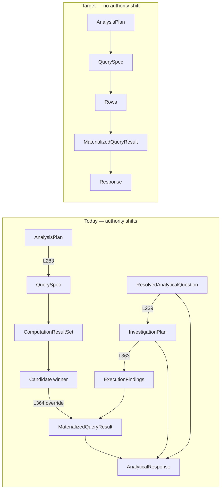

# Single-Authority Handoff Analysis

Starting from `DecisionRuntime.execute()` only.  
Goal path: **Question → AnalysisPlan → SQL → Rows → MaterializedResult → Response**

No deletions, no cleanup proposals — only **where authority changes today** and **minimal runtime handoffs** to make `AnalysisPlan` the sole upstream artifact.

---

## Executive summary

### 1. Where upstream is ignored and another object becomes authoritative

| Handoff | Lines | Ignored | Authoritative instead |
|---------|-------|---------|------------------------|
| **H1** | L216 vs L283 | `AnalysisPlan` for trace/labels | `ResolvedAnalyticalQuestion` |
| **H2** | L239–240 | `AnalysisPlan` | `InvestigationPlan` (from `resolvedQuestion`) |
| **H3** | L248 | `AnalysisPlan.intent` | `InvestigationPlan.intentType` |
| **H5** | L301–324 | Template-only SQL | `MetricPackPlanner` specs merged into same rows |
| **H7** | L363 | `AnalysisPlan` (which SQL ran) | `InvestigationPlan` for materialization |
| **H8** | L364–366 | IDCF `MaterializedQueryResult` | Candidate `winningMaterialization()` |
| **H11–H14** | L409–566 | `AnalysisPlan` | `InvestigationPlan` + `ResolvedAnalyticalQuestion` for findings/response |

**Root split** at `AnalyticalQuestionResolver.resolveFull` — both `analysisPlan` and `resolved` are created; `DecisionRuntime` uses `resolved` for planning (L216→L239) and `analysisPlan` only for SQL (L283).

### 2. Five artifacts → final answer

| Artifact | Reaches final answer? | How |
|----------|----------------------|-----|
| **`AnalysisPlan`** | **Indirect only** | L283→SQL→rows; never passed to assembler or mapper |
| **`InvestigationPlan`** | **Yes** | Materialization L363; findings L409; reasoning L493; assembler L282–392 |
| **`ResolvedAnalyticalQuestion`** | **Yes** | Builds `InvestigationPlan` L239; labels/flags in assembler L315–379; governance L508 |
| **`ExecutionFindings`** | **Yes** | Findings bundle, synthesis, assembler, executive card |
| **`MaterializedQueryResult`** | **Yes** | Inside `ExecutionFindings`; gates `StructuredFindingsEngine` L70–74; correlation/chart in assembler |

### 3. Minimal runtime changes (handoff points only — no deletions)

| Handoff | Change in `DecisionRuntime.execute()` |
|---------|--------------------------------------|
| **A** L215–216 | Bind `AnalysisPlan analysisPlan` only; do not use `resolvedQuestion` for planning/presentation |
| **B** L239–240 | Pass `analysisPlan` into planning/materialization instead of `planningEngine.plan(..., resolvedQuestion, ...)` |
| **C** L301–324 | Execute **only** `analyticalSpecs`; skip metric-pack merge |
| **D** L251–252, L335–350, L364–374 | Do not call candidate generator/orchestrator or `withMaterializedResult` |
| **E** L363 | `executionEngine.execute(results, analysisPlan)` — **requires** `IntentDrivenComputationFramework` + `AnalyticalQueryMaterializer` to accept `AnalysisPlan` |
| **F** L409, L428, L484, L493, L527, L565 | Pass `analysisPlan` instead of `investigationPlan` / `resolvedQuestion` into findings, governance, reasoning, assembler |

**Single critical callee handoff:** L363 — materialization must read `AnalysisPlan`, not `InvestigationPlan`.

**Target chain:**

```
analysisPlan → analyticalSpecs → templateResults → executionEngine.execute(results, analysisPlan)
  → MaterializedQueryResult → findingsEngine → responseAssembler(analysisPlan, executionFindings)
```

### Quick reference — authority change lines

| Line | Event |
|------|-------|
| L216 | `resolvedQuestion` becomes planning authority |
| L239 | `InvestigationPlan` from `resolvedQuestion`, not `analysisPlan` |
| L283 | `AnalysisPlan` becomes SQL authority (template) |
| L301 | Second SQL authority (`MetricPackPlanner`) |
| L324 | Merged rows |
| L340 | `resolvedQuestion` may be rewritten by candidate |
| L363 | `InvestigationPlan` becomes materialization authority |
| L364 | Candidate may replace `MaterializedQueryResult` |
| L409 | `InvestigationPlan` routes structured findings |
| L565 | Assembler uses `InvestigationPlan` + `ResolvedAnalyticalQuestion` + `ExecutionFindings` |

---

## 1. Authority substitutions (upstream ignored → downstream authoritative)

Each row is a **handoff** in `DecisionRuntime.execute()` where a prior artifact exists but a **different** artifact controls the next stage.

| # | Handoff line(s) | Upstream exists | Ignored for next stage | Becomes authoritative | Mechanism |
|---|-----------------|-----------------|------------------------|----------------------|-----------|
| **H1** | L215–L216 vs L283–284 | `SemanticResolution` contains `analysisPlan()` and `resolved()` | `AnalysisPlan` ignored for planning/trace labels | `ResolvedAnalyticalQuestion` | L216 binds `resolvedQuestion`; L222–231 logs assumption metric/grouping from `resolvedQuestion`, not `analysisPlan` |
| **H2** | L239–240 | `AnalysisPlan` (from L215) | `AnalysisPlan` not passed to planner | `InvestigationPlan` | `planningEngine.plan(intent, resolvedQuestion, reasoningPlan)` — inputs are `ResolvedAnalyticalQuestion` + `QuestionDrivenReasoningPlan`, not `AnalysisPlan` |
| **H3** | L247–248 | `AnalysisPlan.intent()` (logged L274–281) | `AnalysisPlan` intent | `InvestigationPlan.intentType()` | Trace step `intent_type` uses `investigationPlan.intentType().name()` |
| **H4** | L251–252 | `AnalysisPlan` | `AnalysisPlan` | `List<AnalyticalCandidate>` | Parallel hypothesis path; not used for SQL but later competes for materialization |
| **H5** | L283–284 vs L301–322 | `AnalysisPlan` → `analyticalSpecs` | Template SQL only partial authority | `MetricPackExecutionPlan` / `metricSpecs` | Second SQL source; L321–324 merges `metricResults` into same `ComputationResultSet` as template rows |
| **H6** | L335–350 | `AnalysisPlan` SQL rows | N/A (side path) | `CandidateExecutionOrchestrator.SelectionResult` | Parallel re-interpretation of merged rows; may mutate `resolvedQuestion` L340–343 |
| **H7** | L363 vs L283 | `AnalysisPlan` (drove which SQL ran) | `AnalysisPlan` | `InvestigationPlan` | `executionEngine.execute(results, investigationPlan)` — materialization grouping from `InvestigationPlan`, not SQL plan |
| **H8** | L364–366 | `ExecutionFindings.materializedResult()` from IDCF | IDCF materialization | `MaterializedQueryResult` from candidate winner | `withMaterializedResult(candidateSelection.winningMaterialization())` replaces only `materializedResult` field |
| **H9** | L289–296, L382–390 | `AnalysisPlan` / `analyticalSpecs` | Partial | `MetricResolution` + `InvestigationPlan` | `detectFirstEmptyStage` / `logPipelineCheckpoint` use `metricResolution` and `investigationPlan`, not `analysisPlan` |
| **H10** | L392–396 | `AnalysisPlan.tableRef()` | Assigned local `tableRef` | **Nothing** | Variable never read — dead handoff |
| **H11** | L409+ | `AnalysisPlan` | `AnalysisPlan` | `InvestigationPlan` | `findingsEngine.produce(executionFindings, investigationPlan)`; coverage L428; governance L484; reasoning L493; synthesis L527 |
| **H12** | L463–465 | `AnalysisPlan` | `AnalysisPlan` | `analyticalCandidates` + `resolvedQuestion` | Verification receives candidate list and resolved question |
| **H13** | L508 | `AnalysisPlan` | `AnalysisPlan` | `resolvedQuestion.executionMode()` | `metricGovernance.governBeforePresentation(..., resolvedQuestion.executionMode())` |
| **H14** | L561–566 | `AnalysisPlan` | `AnalysisPlan` for presentation metadata | `InvestigationPlan` + `ResolvedAnalyticalQuestion` + `ReasoningResult` | `responseAssembler.assemble(..., investigationPlan, executionFindings, resolvedQuestion, ...)` |

### Creation point where parallel artifacts diverge (root split)

```60:76:C:\kontexa\backend\src\main\java\com\example\BACKEND\catalogue\decision\clarification\AnalyticalQuestionResolver.java
AnalysisPlan analysisPlan = universalAnalysisPlanner.plan(
        intent.question(), bundle, investigation, resolution, transformSteps);
ResolvedAnalyticalQuestion resolved = exploratoryPlanner.plan(
        intent, bundle, semantics, resolution, plan);
return new SemanticResolution(resolved, semantics, resolution, plan, investigation, analysisPlan);
```

`DecisionRuntime` consumes **both** branches: `resolved()` at L216, `analysisPlan()` at L283–284 only.

---

## 2. Influence on final answer (five artifacts)

**Final answer** = HTTP payload from `DecisionResponseMapper.toRunResponse` (`executive_card`, `findings`, `chart_spec`, `narrative`, etc.) built from `DecisionRunResult(analytical, insight, verification)` L576.

`AnalysisPlan` is **not** a field on `AnalyticalResponse` or `DecisionRunResult`; it influences the answer only **indirectly** (SQL → rows) unless wired explicitly.

### `AnalysisPlan`

| Location | Role in final answer | Direct / indirect |
|----------|----------------------|-------------------|
| `DecisionRuntime` L283–284 | Generates `analyticalSpecs` → warehouse rows | **Indirect** (SQL → rows → materialization → findings → response) |
| `DecisionRuntime` L274–281 | Log only | None |
| `DecisionRuntime` L392–396 | Dead assignment | None |
| `AnalyticalResponseAssembler` | **Not referenced** | None today |
| `DecisionResponseMapper` | **Not referenced** | None today |

**Proof:** `AnalysisPlan` never passed past L284 except unread `tableRef` L392–396.

---

### `InvestigationPlan`

| Location | Influence |
|----------|-----------|
| `DecisionRuntime` L239–240 | Created; drives all post-SQL analytical stages except template SQL |
| L248, L292–293, L296 | Trace / checkpoint intent |
| L355 | `depthEngine.analyse(results, investigationPlan)` → chart fallback in assembler |
| L363 | **Materialization grouping** via `IntentDrivenComputationFramework` → `AnalyticalQueryMaterializer` |
| L385–386, L428, L484, L493, L527 | Findings routing, coverage, governance, reasoning, synthesis |
| `AnalyticalResponseAssembler` L282–283, L338, L353–354, L384–392 | Intent type, evidence panel, executive layer, response mode, table spec |
| `DecisionResponseMapper` | Indirect via `analytical` |

---

### `ResolvedAnalyticalQuestion`

| Location | Influence |
|----------|-----------|
| `DecisionRuntime` L216 | Source for `InvestigationPlan` (H2) |
| L222–231, L602–611 | Trace seeding only |
| L339–343 | **Mutated** if candidate wins — assumption metric/grouping can change |
| L465 | `verificationOrchestrator.verifyBeforeSynthesis(..., resolvedQuestion, ...)` |
| L508 | `governBeforePresentation(..., resolvedQuestion.executionMode())` |
| `AnalyticalResponseAssembler` L273–274 | Confidence penalty |
| L315–319 | Provisional finding labels (`primaryMetricLabel`, `grouping`) |
| L342–347, L357–358, L376–379 | Assumption, alternatives, exploratory flags on `AnalyticalResponse` |
| `DecisionResponseMapper` L129–132 (debug) | `analytical_assumption`, clarifications |

---

### `ExecutionFindings`

| Location | Influence |
|----------|-----------|
| `DecisionRuntime` L363 | Created from warehouse rows + `InvestigationPlan` |
| L364–366, L372–374 | `materializedResult` may be replaced by candidate |
| L368, L397–399 | Validation |
| L409 | `findingsEngine.produce(executionFindings, ...)` → `StructuredFindingsBundle` |
| L463–464, L477, L484, L505, L521–522, L527, L547 | Verification, governance, synthesis gate, assembler |
| `AnalyticalResponseAssembler` L315–321, L328–330, L338, L353–355, L388–396, L408–418 | Provisional findings, chart, evidence panel, executive card, correlation UI |
| `DecisionResponseMapper` | Via `analytical.findings()`, `evidence_panel`, `executive_card` |

---

### `MaterializedQueryResult`

| Location | Influence |
|----------|-----------|
| `ExecutionFindings.materializedResult()` | Container after L363–366 |
| `StructuredFindingsEngine` L70–74 | **Gate** — empty bundle if null/empty |
| `DecisionRuntime` L387, L521–522 | Pipeline checkpoint; synthesis `hasExecutableData` |
| `buildWarehouseFacts` L729–767 | Debug facts only |
| `AnalyticalResponseAssembler` L328–330, L408–418 | Chart fallback; correlation analysis type |
| `DecisionResponseMapper` | Indirect via findings / executive_card / correlation_analysis |

**Authority for content:** after H8, either IDCF output or candidate `winningMaterialization()` — whichever won `hasWinner()` at L364.

---

## 3. Minimal runtime changes for single-authority path

Target: every handoff after Stage 2b reads **`AnalysisPlan`** (and derivatives: `QuerySpec`, rows, `MaterializedQueryResult`, `AnalyticalResponse`) — not `InvestigationPlan` / `ResolvedAnalyticalQuestion` / candidates.

Changes are **only wiring at handoff points** (classes may remain; they are simply not invoked or not authoritative).

### Handoff A — Stage 2b output (H1, H2 root)

**Today:** L215 → use `resolvedQuestion` at L216, `analysisPlan` only at L284.

**Minimal change at `DecisionRuntime` L215–216:**

```java
SemanticResolution semanticResolution = questionResolver.resolveFull(intent, bundle);
AnalysisPlan analysisPlan = semanticResolution.analysisPlan();
// Do not bind resolvedQuestion as planning authority
```

**Stop calling** as authority inputs: L216 `resolvedQuestion` for L239; L222 `seedSemanticTrace(resolvedQuestion)` can use `analysisPlan` fields instead.

*Callee note:* `resolveFull` still creates `ResolvedAnalyticalQuestion` internally unless resolver is changed later — but **DecisionRuntime must not consume it** for planning, materialization, or presentation.

---

### Handoff B — Planning (H2, H3, H11)

**Today:** L239–240 `planningEngine.plan(intent, resolvedQuestion, reasoningPlan)`.

**Minimal change at L239–240:**

Pass `analysisPlan` into planning/materialization instead of `resolvedQuestion`:

- Either: `planningEngine.plan(intent, analysisPlan)` (requires overload — **one callee signature**)
- Or: inline `InvestigationPlan` built **only** from `analysisPlan` fields at L239 (intent, metric, dimension from `AnalysisPlan` — no `ResolvedAnalyticalQuestion`)

Until then, **H7 remains**: SQL from `AnalysisPlan`, materialization from `InvestigationPlan` derived from `ResolvedAnalyticalQuestion`.

---

### Handoff C — SQL (H5)

**Today:** L301–324 executes `metricSpecs` and merges into `results`.

**Minimal change at L298–324:**

```java
// Execute only template SQL from AnalysisPlan
List<QueryResult> templateResults = sqlExecutionService.executeTemplateBatch(
        analyticalSpecs, intent.question(), ctx.tenantId(), runId);
ComputationResultSet results = new ComputationResultSet(
        runId, templateResults, Map.of());
```

Skip L301–320 metric pack execution and L321–322 merge. Rows then trace **only** `AnalysisPlan` → `analyticalSpecs`.

---

### Handoff D — Candidates (H4, H6, H8)

**Today:** L251–252 generate; L335–337 select; L364–366 override materialization; L340–343 mutate `resolvedQuestion`.

**Minimal change:** Remove these **calls** from `execute()` (not class deletion):

| Remove / skip | Lines |
|---------------|-------|
| `candidateGenerator.generate(...)` | L251–252 |
| `candidateOrchestrator.executeAndSelect(...)` | L335–337 |
| `withMaterializedResult(candidateSelection...)` | L364–366, L372–374 |
| `resolvedQuestion.withWinningCandidate(...)` | L339–343 |

Pass empty candidate list to verification if signature requires it, or narrow verification overload.

**Restores:** `MaterializedQueryResult` authority stays with IDCF output from `AnalysisPlan`-driven rows only (once H7 fixed).

---

### Handoff E — Materialization (H7) — **required callee handoff**

**Today:**

```363:363:C:\kontexa\backend\src\main\java\com\example\BACKEND\catalogue\decision\runtime\DecisionRuntime.java
ExecutionFindings executionFindings = executionEngine.execute(results, investigationPlan);
```

```123:124:C:\kontexa\backend\src\main\java\com\example\BACKEND\catalogue\decision\execution\framework\IntentDrivenComputationFramework.java
MaterializedQueryResult materializedResult =
        materializer.materialize(allRows, profile, plan);
```

`AnalyticalQueryMaterializer.materialize(..., InvestigationPlan plan)` reads `plan.reasoningPlan().metricBinding().groupingColumn()` — not `AnalysisPlan`.

**Minimal runtime + callee change:**

```java
// DecisionRuntime L363
ExecutionFindings executionFindings = executionEngine.execute(results, analysisPlan);
```

```java
// IntentDrivenComputationFramework.execute — second parameter AnalysisPlan
materializer.materialize(allRows, profile, analysisPlan);
```

```java
// AnalyticalQueryMaterializer — grouping from analysisPlan.dimension() / groupingAlias()
```

This is the **single critical handoff** aligning materialization with SQL.

---

### Handoff F — Findings → response (H11, H12, H13, H14)

**Today:** downstream stages take `investigationPlan` and `resolvedQuestion`.

**Minimal `DecisionRuntime` substitutions:**

| Line | Today | Single-authority |
|------|-------|------------------|
| L409 | `findingsEngine.produce(executionFindings, investigationPlan)` | `produce(executionFindings, analysisPlan)` |
| L428, L484, L493, L527 | `investigationPlan` | `analysisPlan` (or adapter) |
| L463–465 | `resolvedQuestion`, `analyticalCandidates` | omit / pass `analysisPlan` labels only |
| L508 | `resolvedQuestion.executionMode()` | derive from `analysisPlan.executable()` or fixed mode |
| L561–566 | `investigationPlan`, `resolvedQuestion` | `analysisPlan` + `executionFindings` only |

**`AnalyticalResponseAssembler.assemble`:** add `AnalysisPlan analysisPlan` parameter; use `analysisPlan.primaryMetricLabel()`, `dimensionLabel()`, `intent()` instead of `resolvedQuestion.assumption()` and `investigationPlan.intentType()`.

---

## 4. Single-path handoff sequence (after minimal changes)

```
L215  questionResolver.resolveFull → extract analysisPlan only (ignore resolved for authority)
L283  deterministicPlanner.plan(analysisPlan, bundle) → analyticalSpecs
L312  sqlExecutionService.executeTemplateBatch(analyticalSpecs) → templateResults
L323  results = ComputationResultSet(templateResults only)
L363  executionEngine.execute(results, analysisPlan) → ExecutionFindings
      └─ materializer.materialize(rows, profile, analysisPlan) → MaterializedQueryResult
L409  findingsEngine.produce(executionFindings, analysisPlan) → StructuredFindingsBundle
L492  reasoningOrchestrator.enrich(synthesisBundle, depthResult, analysisPlan)
L561  responseAssembler.assemble(..., analysisPlan, executionFindings, ...)
L576  DecisionRunResult → DecisionResponseMapper
```

**Parallel paths eliminated at runtime (not deleted):**

- `ResolvedAnalyticalQuestion` → not consumed after L215
- `InvestigationPlan` from `resolvedQuestion` → replaced by `analysisPlan` adapter
- `MetricPackPlanner` → not executed
- `CandidateAnalysisGenerator` / `CandidateExecutionOrchestrator` → not called
- `MaterializedQueryResult` override → only IDCF path

---

## 5. Handoff summary diagram



---

## 6. Exact line index of authority changes (quick reference)

| Line | Event |
|------|-------|
| **L216** | `resolvedQuestion` becomes planning authority (displaces `analysisPlan`) |
| **L239** | `InvestigationPlan` created from `resolvedQuestion`, not `analysisPlan` |
| **L283** | `AnalysisPlan` becomes SQL authority (template branch) |
| **L301** | `MetricPackPlanner` becomes second SQL authority |
| **L324** | Merged rows — template + metric pack |
| **L340** | `resolvedQuestion` may be rewritten by candidate winner |
| **L363** | `InvestigationPlan` becomes materialization authority |
| **L364** | Candidate may replace `MaterializedQueryResult` |
| **L409** | `InvestigationPlan` routes structured findings |
| **L565** | `InvestigationPlan` + `ResolvedAnalyticalQuestion` + `ExecutionFindings` assemble response |

**Minimum edits in `DecisionRuntime.java` to enforce single authority:** skip L251–252, L301–322 merge, L335–350, L364–374; replace L239 and L363 inputs with `analysisPlan`; replace L565 presentation inputs with `analysisPlan`. **One required callee chain:** `IntentDrivenComputationFramework` + `AnalyticalQueryMaterializer` must accept `AnalysisPlan` at the H7 handoff.

---

## Related

- [runtime-artifact-authority-proof.md](./runtime-artifact-authority-proof.md)
